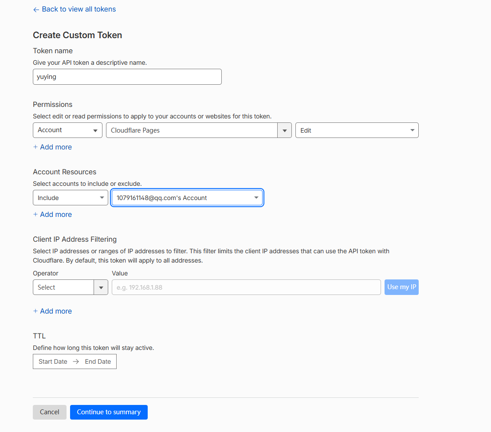
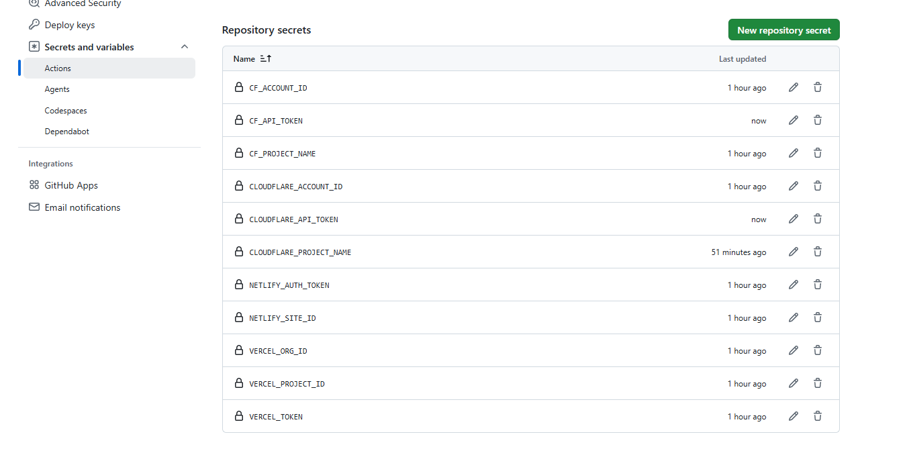

# 免费静态托管部署指引（国内可访问）

本知识库为 mkdocs 静态站点，构建产物在 `site/` 目录。以下三家平台均**免费**且对国内访问相对友好，
均通过连接 GitHub 仓库实现 push 自动部署。

> 统一构建命令（CI 与各平台一致，封装在 `package.json` 的 `build:site`）：
> `npm ci && npm run vendor:sync && mkdocs build --strict`
> 输出目录：`site`

---

## 方案 A：GitHub Actions 一处 push 四处上线（推荐）

仓库已内置 `.github/workflows/deploy.yml`，**构建一次产物**，并行部署到：

- GitHub Pages（Actions 内置）
- Cloudflare Pages（wrangler CLI）
- Vercel（vercel CLI）
- Netlify（netlify-cli）

各平台 Job 在部署前会执行 **Check required secrets** 步骤：若对应 Secret 缺失，会显式 `::error::`
并 `exit 1` 使该 Job 失败（不会静默跳过），方便你从日志快速定位漏配项。因此请**一次配齐**想启用的
平台所需的全部 Secret。

### 需要配置的 Secrets（必须配在「Repository secrets」，不是 Environment secrets）

进入仓库 **Settings → Secrets and variables → Actions → Secrets 标签页 → New repository secret**，
逐条添加下面这些（名称必须完全一致，区分大小写）。Cloudflare 使用官方 `CLOUDFLARE_*` 前缀：

| Secret 名 | 值是什么 | 去哪拿（精确路径） |
|-----------|----------|-------------------|
| `CLOUDFLARE_API_TOKEN` | Cloudflare API Token | dash.cloudflare.com → 右上头像 → **My Profile → API Tokens → Create Token** → 选模板 **"Cloudflare Pages:Edit"**（或自定义权限 `Account:Cloudflare Pages:Edit`）→ 复制 Token |

{: style="max-width:720px" }

将 Token 复制后，回到 GitHub 仓库 → **Settings → Secrets and variables → Actions → New repository secret**，按上面表格逐条新增以下几项（注意必须放在 **Repository secrets**，不能放 Environment secrets，否则工作流读不到）：

{: style="max-width:720px" }

| `CLOUDFLARE_ACCOUNT_ID` | 账户 ID | dash.cloudflare.com 右侧栏 **"Account ID"**（首页右上，或 My Profile 页）；为 **32 位十六进制**，不要填账户名或邮箱 |
| `CLOUDFLARE_PROJECT_NAME` | Pages 项目名 | 首次部署由 wrangler 自动创建，项目名即此处填的值（如 `knowledge-front-yuying`，合法字符即可，无需预先建站） |
| `VERCEL_TOKEN` | Vercel 访问令牌 | vercel.com → 右上头像 → **Settings → Tokens → Create** → 复制 Token |
| `VERCEL_ORG_ID` | 团队 ID | vercel.com → 项目 **Settings → General** 页底部 **"Team ID"**；或个人账号在 `npx vercel teams ls` 输出 |
| `VERCEL_PROJECT_ID` | 项目 ID | vercel.com → 项目 **Settings → General** 页底部 **"Project ID"**（先在 Vercel 导入该 GitHub 仓库建好项目） |
| `NETLIFY_AUTH_TOKEN` | Netlify 个人访问令牌 | app.netlify.com → 右上头像 → **User settings → Applications → New access token** → 复制 |
| `NETLIFY_SITE_ID` | 站点 ID | app.netlify.com 进入站点 → **Site settings → Site details → Site ID**（需先在 Netlify 建好站点；工作流的自动建站在 CI 中易卡死，建议手动建站后填此 ID） |

> ⚠️ 若 Secret 配在 **Environment secrets**（某个环境名下），工作流读不到，必须配在 **Repository secrets**。
> Cloudflare 系列**必须**使用 `CLOUDFLARE_` 前缀（`CLOUDFLARE_API_TOKEN` / `CLOUDFLARE_ACCOUNT_ID` /
> `CLOUDFLARE_PROJECT_NAME`），旧版 `CF_*` 已不再读取；配错名字会导致 step 报 `::error::缺少 ... Secret` 并失败。

---

## 方案 B：各平台后台直接连 GitHub 自动部署（备选/独立）

若不想用 Actions 统一部署，也可在各平台后台连接本仓库。

> ⚠️ 方案 B 由各平台**云端自行构建**，云端默认没有 Python/mkdocs 环境，直接填 `mkdocs build`
> 会报 `127 command not found`（正是此前踩过的坑）。若坚持用方案 B，需在各平台构建命令中先安装
> Python 依赖（见上方各家 "Build command" 实际写法：
> `pip install mkdocs-material pymdown-extensions mkdocs-minify-plugin && npm ci && npm run vendor:sync && mkdocs build --strict`）。
> 推荐优先使用方案 A（由 Actions 统一构建后上传产物，最省心）。

### 1. Cloudflare Pages（国内速度通常最快最稳）

1. 登录 https://dash.cloudflare.com/ → **Workers & Pages** → **Create** → **Pages** → **Connect to Git**
2. 授权并选择仓库 `1079161148/knowledge-front-yuying`
3. 构建设置：
   - **Framework preset**: `None`
   - **Build command**: `pip install mkdocs-material pymdown-extensions mkdocs-minify-plugin && npm ci && npm run vendor:sync && mkdocs build --strict`
   - **Build output directory**: `site`
4. 部署完成后获得 `https://knowledge-front-yuying.pages.dev`
5. 也可使用 `wrangler.toml`（仓库已提供），通过 `npx wrangler pages deploy site` 手动部署

### 2. Vercel

1. 登录 https://vercel.com/ → **Add New** → **Project** → 导入 GitHub 仓库
2. 构建设置：
   - **Framework Preset**: `Other`
   - **Build Command**: `pip install mkdocs-material pymdown-extensions mkdocs-minify-plugin && npm ci && npm run vendor:sync && mkdocs build --strict`
   - **Output Directory**: `site`
3. 仓库根已包含 `vercel.json`，Vercel 会自动读取
4. 部署后获得 `https://knowledge-front-yuying.vercel.app`

### 3. Netlify

1. 登录 https://app.netlify.com/ → **Add new site** → **Import an existing project** → 连接 GitHub
2. 构建设置：
   - **Build command**: `pip install mkdocs-material pymdown-extensions mkdocs-minify-plugin && npm ci && npm run vendor:sync && mkdocs build --strict`
   - **Publish directory**: `site`
3. 仓库根已包含 `netlify.toml`，Netlify 会自动读取
4. 部署后获得 `https://<随机>.netlify.app`

---

## 备注

- 三家均免费、支持自动 HTTPS、全球 CDN、push 触发部署。
- 国内访问速度参考：Cloudflare Pages ≈ 最快最稳；Vercel / Netlify 次之（个别地区偶尔限速）。
- 用方案 A 时，GitHub Pages 由 Actions 部署，三家由各自 CLI 部署，互不冲突。
- 如需自定义域名，三家都支持绑定（Cloudflare / Vercel / Netlify 后台 Custom domains）。
