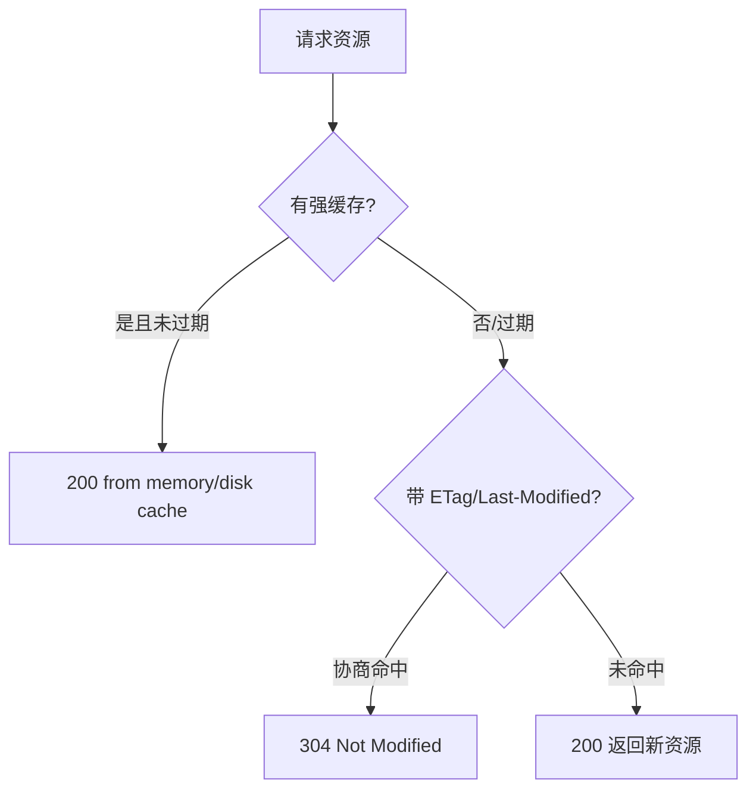

# 🌐 浏览器原理深化：从输入 URL 到页面渲染（网络通识）

> 接续 [浏览器渲染与性能总纲](../performance.md)。本篇补齐"网络层"——面试八股最密集的 URL→渲染全链路、DNS、TCP/HTTPS、HTTP 缓存、HTTP/2-3。依据 **WHATWG 导航时序**、**W3C Resource Timing**、**IETF RFC（HTTP/1.1 RFC7230、HTTP/2 RFC7540、HTTP/3 RFC9114）**、**MDN**、**web.dev**。
>
> 适用：中级搞懂排错（为什么慢/跨域/缓存不生效）、高级做性能与架构决策、后端理解前端视角的网络。

---

## 一、输入 URL 到页面渲染（全链路）

1. **URL 解析**：拆分协议/主机/端口/路径。
2. **DNS**：域名→IP（缓存→本地 hosts→递归查询）。
3. **TCP 三次握手**：SYN → SYN/ACK → ACK，建立可靠连接。
4. **TLS 握手**（HTTPS）：证书校验、密钥协商（1-RTT 或 0-RTT）。
5. **HTTP 请求/响应**：见缓存章节，可能 304 直接复用。
6. **渲染**：解析 HTML 建 DOM，CSS 建 CSSOM，合成渲染树→布局→绘制→合成（详见 [性能总纲](../performance.md)）。

!!! danger "死角 1：HTTPS 也有握手成本"
    首次访问多一次 TLS 往返（RTT）。用 `preconnect` / `TLS 1.3`（1-RTT，0-RTT 复用）降低；HTTP/3 基于 QUIC 把握手与传输合并更快。

---

## 二、DNS（域名系统）

- 查询顺序：**浏览器缓存 → 系统缓存(hosts) → 本地 DNS → 根 → 顶级域 → 权威**。
- `TTL` 决定缓存时长；CDN 靠 DNS 调度就近节点。
- `DNS prefetch`：`<link rel="dns-prefetch" href="//cdn.x.com">` 提前解析。

!!! tip "排错"
    `DNS_PROBE_FINISHED_NXDOMAIN` = 域名不存在/解析失败；`ERR_NAME_NOT_RESOLVED` 同理。

---

## 三、TCP / HTTPS 握手要点

| 概念 | 说明 |
|------|------|
| 三次握手 | 确认双方收发能力，防历史连接 |
| 四次挥手 | 全双工关闭，各自 FIN/ACK |
| HTTPS | HTTP + TLS，加密(防窃听)+认证(防冒充)+完整性(防篡改) |
| 证书链 | 浏览器内置根 CA → 中间 CA → 站点证书 |

!!! danger "死角 2：HTTP 是明文，HTTPS 才加密"
    内网/老旧接口若用 HTTP，账号密码可被中间人抓包。生产必上 HTTPS（HSTS 强制）。

---

## 四、HTTP 缓存（前端最该懂的排错点）

| 策略 | 头 | 特点 |
|------|------|------|
| 强缓存 | `Cache-Control: max-age=3600`、`Expires` | 不发请求，直接用 |
| 协商缓存 | `ETag` / `Last-Modified` | 发请求，304 复用 |
| 指纹 | `app.a1b2c3.js` | 内容哈希命名，长缓存 + 内容变即换名 |

!!! danger "死角 3：缓存不更新的元凶"
    静态资源用 `Cache-Control: max-age=31536000, immutable` + **内容哈希文件名**；HTML 用 `no-cache` 保证每次协商。否则改了 JS 用户还跑旧版。

!!! warning "安全关联"
    缓存可被投毒（Cache Poisoning），配合不当 Vary/Key 放大风险，见 [前端安全全集](../security/index.md)（OWASP）。

---

## 五、HTTP/1.1 → 2 → 3

| 版本 | 关键改进 | 短板 |
|------|----------|------|
| HTTP/1.1 | 持久连接、管线化 | 队头阻塞、多连接开销 |
| HTTP/2 | 多路复用、头部压缩、服务端推送 | TCP 层队头阻塞 |
| HTTP/3 | 基于 QUIC(UDP)、0-RTT、无 TCP 阻塞 | 部署/兼容成本 |

!!! tip "优化落点"
    HTTP/2 下**少合并文件**（多路复用已解决请求数问题），改用细粒度缓存；域名分片反而有害。

---

## 六、网络通识自检清单

- [ ] 能口述 URL→渲染 全链路
- [ ] 说清 DNS 查询顺序与 prefetch
- [ ] 三次握手 / TLS 握手各自解决什么
- [ ] 强缓存 vs 协商缓存、304 含义
- [ ] 会用内容哈希 + Cache-Control 解决"改了不更新"
- [ ] 知道 HTTP/2 多路复用使"雪碧图/域名分片"过时

> 衔接：渲染与性能见 [性能总纲](../performance.md)（web.dev）；跨域请求细节见 [前后端交互](../js/ajax-http.md)；HTTPS/证书安全见 [前端安全全集](../security/index.md)。
