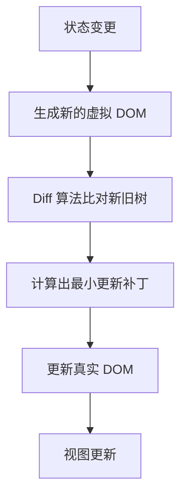

# 🚀 进阶篇

> 在「基础语法」之上，深入框架设计思想与底层机制。内容结合 **ECMA-262**、**MDN** 与各框架官方文档。

---

## 1. 组合式 API vs Options API vs React Hooks

**核心问题：如何复用与组织逻辑。**

- **Vue2 Options API**：逻辑按选项（data/methods/computed）拆分，复用靠 `mixins`（易命名冲突、来源不清晰）。
- **Vue3 组合式 API**：用 `setup` + 组合函数（composable）按"功能"聚合逻辑，类型推导好。
- **React Hooks**：函数组件内用 `useState/useEffect/自定义 Hook` 复用逻辑，规则是"调用顺序稳定"。

=== "Vue 3 组合式 (composable)"
    ```js
    // useCounter.js
    import { ref, computed } from 'vue'
    export function useCounter(init = 0) {
      const count = ref(init)
      const double = computed(() => count.value * 2)
      const inc = () => count.value++
      return { count, double, inc }
    }
    ```

=== "React 自定义 Hook"
    ```js
    // useCounter.js
    import { useState, useMemo } from 'react'
    export function useCounter(init = 0) {
      const [count, setCount] = useState(init)
      const double = useMemo(() => count * 2, [count])
      const inc = () => setCount(c => c + 1)
      return { count, double, inc }
    }
    ```

=== "Vue 2 Options + mixins"
    ```js
    // 逻辑复用靠 mixins，易命名冲突
    export default {
      data() { return { count: 0 } },
      computed: { double() { return this.count * 2 } },
      methods: { inc() { this.count++ } }
    }
    ```

### 可运行 Demo：逻辑复用（Vue 3 composable）

<iframe src="demos/advanced-composable.html" width="100%" height="220" style="border:1px solid #2c5364;border-radius:8px"></iframe>

---

## 2. 渲染机制 / 虚拟 DOM / Diff

**概念**：框架不直接操作真实 DOM，而是维护一棵 **虚拟 DOM**（JS 对象树）。状态变化后生成新树，与旧树做 **Diff**，仅把最小差异 **Patch** 到真实 DOM，从而提升性能。



=== "Vue 3 (patch)"
    ```js
    // 编译产物类似：
    // _createElementVNode('div', { onClick: inc }, ctx.count)
    // 运行时通过 patch 比对 vnode，更新变化的节点
    ```

=== "React (reconcile)"
    ```jsx
    // 状态变更触发重新渲染，Fiber 架构增量比对
    function App() {
      const [count, setCount] = useState(0)
      return <button onClick={() => setCount(c => c + 1)}>{count}</button>
    }
    ```

!!! tip "key 的作用"
    列表渲染务必给每项稳定 `key`。Diff 时框架用 key 判断"是同一条还是新的一条"，避免错位更新。`index` 作为 key 在增删/排序时会导致状态错乱。

---

## 3. 性能优化

=== "Vue 3"
    ```
    - shallowRef / shallowReactive：跳过深层响应式
    - v-memo：缓存子树，避免无效重渲染
    - defineAsyncComponent：路由级组件懒加载
    - 派生值用 computed 缓存
    - 大列表用虚拟滚动（vue-virtual-scroller）
    ```

=== "React"
    ```
    - React.memo：包裹组件，避免父组件渲染导致子组件无谓渲染
    - useMemo / useCallback：缓存耗时计算与函数引用
    - 列表使用稳定 key
    - 代码分割：React.lazy + Suspense
    - 大列表用虚拟滚动（react-window）
    ```

---

## 4. TypeScript 深入

=== "工具类型"
    ```ts
    type User = { id: number; name: string; age?: number }
    type PartialUser = Partial<User>      // 全部可选
    type PickName = Pick<User, 'id' | 'name'> // 挑选字段
    type ReadonlyUser = Readonly<User>    // 全部只读
    ```

=== "泛型与条件类型"
    ```ts
    type Awaited<T> = T extends Promise<infer U> ? U : T
    // Awaited<Promise<string>> => string

    function identity<T>(v: T): T { return v }

    // 实战：API 响应封装
    type ApiRes<T> = { code: number; data: T; msg: string }
    ```

---

## 5. SSR / SSG

**概念**：服务端渲染（SSR）在服务器生成 HTML 直出，利于首屏与 SEO；静态站点生成（SSG）在构建时预渲染为静态文件。

=== "Next.js (App Router)"
    ```tsx
    // app/page.tsx —— 服务端组件默认在服务器运行
    export default async function Page() {
      const res = await fetch('https://api.example.com/data')
      const data = await res.json()
      return <main>{data.title}</main>
    }
    ```

=== "Nuxt 3"
    ```ts
    // server/api/hello.ts
    export default defineEventHandler(() => ({ message: 'SSR 数据' }))
    // 页面组件中：const { data } = await useFetch('/api/hello')
    ```

!!! warning "SSR 注意事项"
    - 服务端没有 `window` / `document`，访问浏览器 API 需在 `onMounted` / `useEffect` 或客户端守卫中。
    - 注意"水合（hydration）"不匹配：服务端与客户端的首屏 HTML 必须一致。

---

## 6. 踩坑（注意事项）

!!! warning "常见坑"
    - **Vue3** `reactive` 对象整体替换（`state = {...}`）会丢失响应性，应改属性或用 `ref`。
    - **React** 在 `useEffect` 依赖数组里遗漏依赖，导致闭包拿到旧值（使用 `eslint-plugin-react-hooks` 校验）。
    - **Hooks 规则**：不能在条件/循环里调用 Hook，否则顺序错乱。
    - **TS** 滥用 `any` 会让类型保护形同虚设；优先用 `unknown` + 类型收窄。

---

## 7. 学习经验

!!! tip "经验"
    - 先理解"为什么需要虚拟 DOM / 组合式"，再看 API，记忆更牢。
    - 对比学习：把"逻辑复用"在 Vue composable 与 React Hook 各写一遍，差异立刻清晰。
    - 性能优化不要过早：先写正确代码，用 Profiler / DevTools 找到瓶颈再优化。

---

## 8. 总结

| 主题 | Vue 方案 | React 方案 |
|------|----------|-----------|
| 逻辑复用 | composable | 自定义 Hook |
| 更新机制 | patch / 响应式追踪 | Fiber reconcile / 不可变 |
| 性能 | v-memo / shallowRef | memo / useMemo |
| 全栈渲染 | Nuxt 3 | Next.js |

> 下一板块预告：**工程化**（包管理 / 构建工具 / 模块化 / 代码规范 / Monorepo / CI）。
