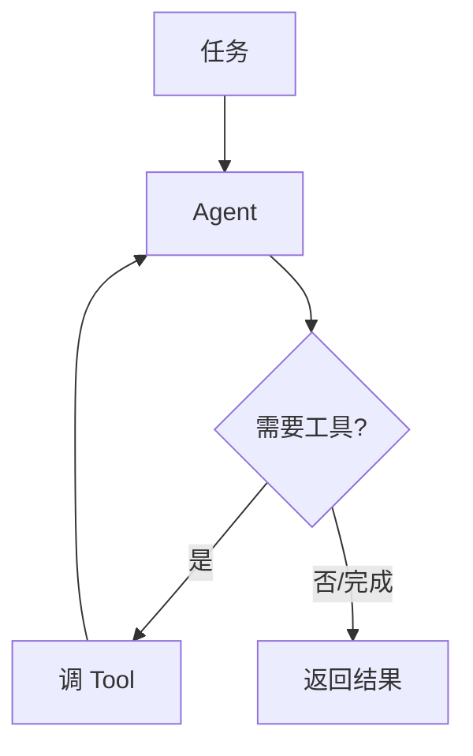
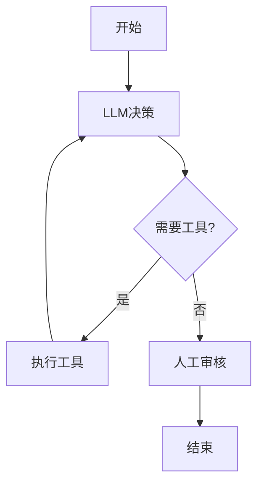

# 🕸️ AI Agent 与编排（Agents SDK / LangGraph）

> 本页讲清"AI Agent 到底是什么、怎么用官方框架编排"。覆盖两大主流官方方案：**OpenAI Agents SDK**（轻量多 Agent）与 **LangGraph**（有状态图编排），以及如何选。以官方文档为准。

依据：[OpenAI Agents SDK (TS)](https://openai.github.io/openai-agents-js/) · [LangGraph](https://langchain-ai.github.io/langgraph/) · [Vercel AI SDK Agents](https://ai-sdk.dev/docs/ai-sdk-core/agents)。

> 📌 **适用版本 / 更新日期**：OpenAI Agents SDK `v0.x` + LangGraph `v0.2.x` + Vercel AI SDK `v4`；最后更新 **2026-08**。

---

## 1. Agent 的本质（一句话）

> Agent = LLM + 循环（决定下一步）+ 工具（能动手）+ 记忆（记得上下文）。

普通"聊天"是**一步**调用模型；**Workflow** 是**预设路径**的多步；**真正的 Agent** 是模型**自己决定**下一步做什么、调哪个工具、循环到任务完成。



!!! danger "最容易混淆的点"
    "带工具的聊天" ≠ "自主 Agent"。如果路径是你写死的（先查天气再总结），那叫 **Workflow**；如果模型在运行时自己判断"还要不要再查一次/换工具"，那才接近 **Autonomous Agent**。

---

## 2. OpenAI Agents SDK（轻量、少抽象、provider-agnostic）

官方定位：lightweight, easy-to-use, very few abstractions, provider-agnostic（支持 OpenAI 及更多）。核心原语：

| 原语 | 作用 |
|------|------|
| **Agents** | 一个带模型+工具+指令的 Agent |
| **Handoff 交接** | 一个 Agent 把任务转给另一个 |
| **Guardrails 护栏** | 输入/输出安全检查 |
| **Tracing 追踪** | 内置调用链路记录（调试必备） |
| **Tools** | 函数工具（含 MCP 工具） |

=== "最小 Agent（官方范式）"
    ```ts
    import { Agent, run } from '@openai/agents'

    const agent = new Agent({
      name: '助手',
      instructions: '你是严谨的中文助手，需要时用工具。',
      tools: [getWeather], // 见 function-calling.md 的工具定义
    })

    const result = await run(agent, '北京现在天气怎么样，适合出门吗？')
    console.log(result.finalOutput)
    ```

=== "Handoff 多 Agent 协作"
    ```ts
    const triage = new Agent({
      name: '分诊',
      instructions: '根据用户问题转给对应专家',
      handoffs: [weatherExpert, orderExpert],
    })
    // 模型自己决定转给天气专家还是订单专家
    ```

!!! tip "为什么少抽象是优点"
    框架不替你隐藏 LLM 行为，你能清楚看到"模型每一步在想什么"。调试 Agent 时，**可见性 > 黑盒自动化**。

---

## 3. LangGraph（有状态图编排，可控性强）

官方定位：low-level orchestration framework / runtime for **stateful, multi-actor** LLM applications。用"图"显式表达流程：

- **Node 节点**：一个步骤（调模型 / 调工具 / 条件判断）
- **Edge 边**：节点间转移（可条件分支 / 循环）
- **State 状态**：在节点间传递的数据
- **Checkpointer 检查点**：持久化状态，支持断点恢复 / 人机协同
- **Human-in-the-loop**：在关键节点暂停等人确认



!!! warning "LangGraph 不是"更简单"的选择"
    它给你**最大控制权**，代价是你要自己设计图。适合：长流程、需回溯、需人工介入、需精确状态管理的复杂 Agent。简单任务用它反而重。

---

## 4. 选型决策表

| 你的场景 | 选 |
|----------|----|
| 简单多步 / 多 Agent 交接 | **OpenAI Agents SDK** |
| 全栈 TS 应用（含 UI） | **Vercel AI SDK**（含 agents API） |
| 复杂有状态 / 需人机协同 / 精确控制 | **LangGraph** |
| 仅接外部系统标准 | **MCP Server**（见[mcp.md](mcp.md)） |

!!! tip "可以组合"
    用 Agents SDK 做编排，内部工具通过 MCP 接外部系统；复杂子流程用 LangGraph 包成单个节点。框架是手段不是宗教。

---

## 5. Agent 的"记忆"实现

| 记忆类型 | 实现 |
|----------|------|
| 短期（本轮对话） | 消息历史传入模型 |
| 长期（跨会话） | 存入向量库/数据库，需要时检索拼入 |
| 工作记忆（当前任务） | LangGraph State / Agents SDK 的 context |

!!! danger "记忆泄露坑"
    长期记忆要**按用户隔离 + 权限校验**，否则 A 用户的历史被 B 用户检索到 = 越权（见[安全](best-practices.md)）。

---

## 6. 下一步

- 到底该不该上 Agent（官方准则）→ [Workflow vs Agent](workflow-vs-agent.md)
- 动手做 → [实战：从0搭 AI Agent](project-ai-agent.md)
