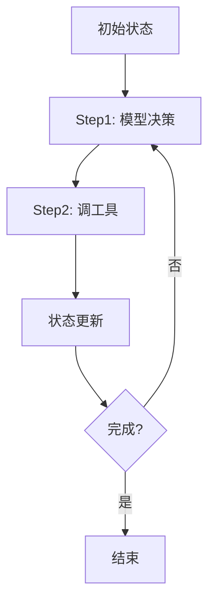

# 🧠 智能体状态管理与可视化

> Agent 不是一次性调用，而是"带状态的多步循环"。本页讲清 Agent 的状态怎么管、怎么持久化、怎么可视化（让人看懂它在想什么）。以 LangGraph State / OpenAI Agents SDK context / Tracing 官方能力为准。

> 📌 **适用版本 / 更新日期**：LangGraph `v0.2.x` + OpenAI Agents SDK `v0.x`；最后更新 **2026-08**。

---

## 1. 什么是 Agent 状态



状态 = 跨步骤保留的数据：`messages`（对话）、`scratchpad`（思考）、`tool_results`、`user_context`、自定义业务字段。

!!! danger "状态管理两大坑"
    1. **状态污染**：多用户共用同一个 Agent 实例 → 串台。每个请求必须独立状态（或按 threadId 隔离）。
    2. **无持久化**：进程重启/超时，进行到一半的 Agent 丢失，用户要重来。

---

## 2. 两种主流状态模型

### 2.1 LangGraph：显式 State + Checkpointer

官方用 TypedState + Reducer 显式定义状态，Checkpointer 把状态落库（内存/Postgres/Redis），支持断点恢复、人机协同。

```ts
// 思路（以官方 API 为准）
const graph = StateGraph({ messages: { value: [], reduce: (a,b)=>a.concat(b) } })
graph.addNode('llm', llmNode)
graph.addNode('tool', toolNode)
graph.addEdge('llm', 'tool')
const app = graph.compile({ checkpointer: new MemorySaver() })
// 按 threadId 隔离 + 可恢复
await app.invoke(input, { configurable: { thread_id: 'u-123' } })
```

!!! tip "Human-in-the-loop"
    Checkpointer 让你在关键节点 `__interrupt__` 暂停，等人确认再 `invoke` 继续——审批流/危险操作必备。

### 2.2 OpenAI Agents SDK：context 对象

用 `context`（普通 TS 对象）在步骤间传数据，Tracing 自动记录链路。

```ts
const agent = new Agent({ name: '助手' })
const ctx = { userId: 'u-123', order: null }
const r = await run(agent, '查我的订单', { context: ctx })
```

---

## 3. 可视化（让人看懂 Agent）

| 手段 | 工具 | 作用 |
|------|------|------|
| **Tracing** | OpenAI Agents SDK 内置 / LangSmith | 记录每次决策的模型输入/输出/工具/耗时 |
| **状态快照 UI** | 自研面板读 State | 展示当前 messages / scratchpad |
| **流程图** | 把 Graph 定义渲染成图 | 静态结构可视化 |
| **LangGraph Studio** | 官方可视化工具 | 调试图、单步执行、看状态 |

!!! danger "没有可视化的 Agent = 黑盒"
    自主循环里任一步出错，靠 `console.log` 无法还原。Tracing 是调试命脉（见[可观测](ai-observability.md)）。

!!! tip "给前端同学的捷径"
    你本就擅长做 UI——给 Agent 做一个"实时步骤时间线"组件（监听 Tracing 事件流），把模型决策、工具调用、结果按时间轴渲染，体验远超纯文本。这也是 AI 应用的差异化竞争力。

---

## 4. 持久化与隔离清单

- [ ] 每个用户/会话独立状态（threadId）
- [ ] 状态持久化（Checkpointer / 数据库），支持恢复
- [ ] 危险节点人工确认（interrupt）
- [ ] Tracing 全量记录可查
- [ ] 状态按权限隔离，防越权读取

> 衔接：[记忆与上下文窗口管理](memory-context.md) · [AI 可观测](ai-observability.md)
