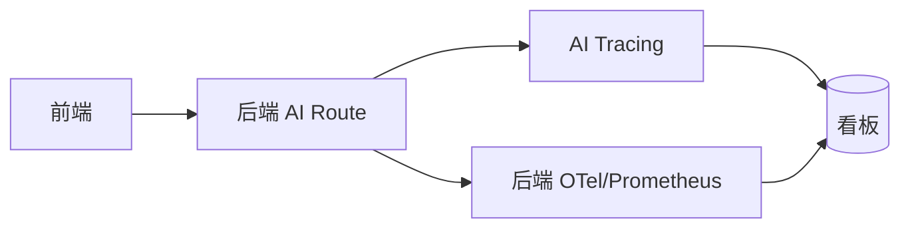

# 🔭 AI 可观测性

> AI 应用比传统应用难调试：同样的输入，模型可能因温度/上下文微小差异给出不同结果。可观测性 = Tracing + Metrics + 日志，让你"看见" Agent 每一步。本页讲清落地，可联动 [后端可观测性](../backend/observability.md)。

> 📌 **适用版本 / 更新日期**：OpenTelemetry Tracing + 各 SDK 内置 Tracing（如 OpenAI Agents SDK）；范式稳定；最后更新 **2026-08**。

---

## 1. 三大支柱

| 支柱 | 在 AI 场景的具体内容 |
|------|----------------------|
| **Tracing 追踪** | 每次调用：模型决策、工具调用、I/O、耗时、token |
| **Metrics 指标** | token 成本、P95 延迟、错误率、工具成功率、Eval 分 |
| **Logging 日志** | 结构化日志，关联 requestId / threadId |

!!! danger "没有 Tracing 不做 Agent"
    自主循环任一步出错，靠 `console.log` 无法还原链路。Tracing 是调试命脉。

---

## 2. Tracing 落地

### OpenAI Agents SDK（内置）

```ts
import { setTracingEnabled } from '@openai/agents'
setTracingEnabled(true)
// 每次 run() 自动记录 span：agent、tool、generation、handoff
```

### 通用：OpenTelemetry + LangSmith

```ts
// 用 OTel 标准埋点，接入后端 Prometheus/Grafana（见 backend/observability.md）
import { trace } from '@opentelemetry/api'
const span = trace.getTracer('ai').startSpan('agent.run')
span.setAttribute('model', 'gpt-4o-mini')
// ... run ...
span.end()
```

!!! tip "前端同学的优势"
    你擅长做面板——把 Tracing 事件流渲染成"实时步骤时间线"组件，比纯文本日志直观十倍（见[状态可视化](agent-state-viz.md)）。

---

## 3. Metrics 与成本看板

- **成本**：按 `usage`（prompt+completion token）× 单价，按用户/功能维度聚合。
- **质量**：把 [Eval](eval.md) 分数接入看板，监控漂移。
- **健康**：P95 延迟、429 限流次数、工具失败率告警。

!!! warning "成本监控必做"
    没有成本看板，某天账单暴涨才发现。按 userId 维度设预算告警。

---

## 4. 与后端可观测性联动

AI 应用的可观测 = AI 层（Tracing/Metrics）+ 后端层（链路/日志/指标）。两者用同一 `requestId` 串联：



> 后端指标/链路细节见：[后端可观测性](../backend/observability.md)

---

## 5. 踩坑

!!! danger "可观测高频坑"
    1. 只在本地 `console.log`，生产无 Tracing。
    2. 日志记录了密钥/PII（脱敏！）。
    3. 成本无分用户监控 → 无法定位异常消耗。
    4. Tracing 与后端日志无关联 ID → 排查要两头翻。

> 衔接：[最佳实践-可观测](best-practices.md) · [Eval](eval.md)
