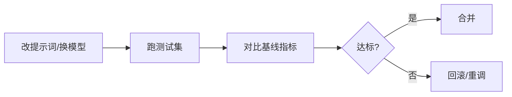

# 📊 Eval 评估体系

> "没有 Eval 的 AI 应用 = 盲飞。"本页讲清怎么落地评估：测试集、RAG 评估、LLM-as-judge、回归测试。这是资深岗硬门槛，也是市面培训最忽略的一块。以 Ragas / 官方评估实践为准。

> 📌 **适用版本 / 更新日期**：Ragas `0.2.x` / LLM-as-judge（范式稳定）；最后更新 **2026-08**。

---

## 1. 为什么要 Eval

手测 3 个问题"看起来对"就上线，真实用户一问就翻车：幻觉、召回错、格式崩。Eval = 用**量化指标 + 测试集**持续衡量质量，改提示词/模型后能对比前后。

!!! danger "上线前必须 Eval"
    RAG / Agent 效果无法靠感觉保证。至少 20-50 条代表性测试集，定期自动跑。

---

## 2. 评估维度

| 维度 | 含义 | 适用 |
|------|------|------|
| **Faithfulness 忠实度** | 答案是否基于给定资料、不编造 | RAG 必测 |
| **Answer Relevancy 相关性** | 是否回答了对的问题 | 通用 |
| **Context Recall 召回率** | 相关资料是否被检索到 | RAG 必测 |
| **Context Precision** | 召回里相关的排前面没 | RAG |
| **Tool Accuracy** | 工具调用是否正确 | Agent |
| **Task Success** | 任务最终是否完成 | Agent |

---

## 3. RAG 评估（Ragas 思路）

```ts
import { evaluate } from 'ragas'
// 准备数据集：question / ground_truth / context / answer
const dataset = [
  { question: '退款多久到账？', ground_truth: '3-5 个工作日', context: [...], answer: '...' },
]
const result = await evaluate(dataset, {
  metrics: ['faithfulness', 'answer_relevancy', 'context_recall'],
})
console.log(result)
```

!!! tip "指标不是越高越好，要看业务"
    政策问答忠实度必须高；创意生成相关性可放宽。按场景定阈值。

---

## 4. LLM-as-Judge（用模型当评委）

没有标准答案时，用一个强模型按 rubric 打分：

```ts
const judge = await generateText({
  model: anthropic('claude-opus-4'),
  system: '你是严格评委，按 1-5 分评估答案的准确性与完整性，只输出分数和理由。',
  prompt: `问题:${q}\n答案:${ans}`,
})
```

!!! warning "评委模型也有偏"
    LLM-as-judge 有位置偏、冗长偏。重要评估加**人工抽检**交叉验证，别全信自动分。

---

## 5. 回归测试（提示词/模型变更护栏）



!!! danger "Eval 三大坑"
    1. 测试集太小 / 不具代表性 → 指标失真。
    2. 只在开发期跑一次，上线后不监控（生产数据漂移）。
    3. 只信自动分，无人工抽检 → 偏误累积。

---

## 6. 最小落地清单

- [ ] 建 20-50 条测试集（覆盖边界/异常）
- [ ] 选指标（RAG: 忠实度+召回； Agent: 工具准确率+任务成功率）
- [ ] 自动化脚本，CI 里跑
- [ ] 人工抽检交叉验证
- [ ] 生产监控指标漂移

> 衔接：[RAG](rag.md) · [最佳实践-质量](best-practices.md)
