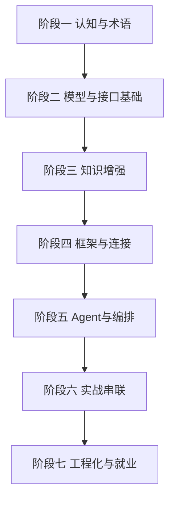

# 🤖 AI 应用开发 · 学习路线总览

> 面向前端同学（以及任何会 TS/JS 的工程师）的 **AI 应用 / AI Agent 开发**完整学习资料。从"为什么前端要转 AI"到"能独立交付一个生产级 AI Agent"，按**最佳学习路线**分七个阶段组织。所有技术定义以**官方文档为准**（OpenAI / Anthropic / Vercel AI SDK / LangChain / Model Context Protocol），不编造、不堆概念、每篇带踩坑。

---

## 🗺️ 最佳学习路线（照这个顺序读）

| 阶段 | 目标 | 学完你能 |
|------|------|----------|
| **一 · 认知与术语** | 搞懂背景、术语、提示工程 | 不被名词忽悠，会写有效提示词 |
| **二 · 模型与接口基础** | 调模型 / 流式 / 工具 / 轻量 SDK | 让 AI 说话、流式、调你的函数 |
| **三 · 知识增强** | RAG / 向量 / 记忆 | 做出基于私有知识的问答 |
| **四 · 框架与连接** | LangChain.js / MCP | 用框架编排、标准化接外部系统 |
| **五 · Agent 与编排** | Agent / 状态 / 多 Agent / 浏览器 | 让 AI 自主干复杂活 |
| **六 · 实战串联** | 做出可运行项目 | 交付 AI 聊天 + AI Agent |
| **七 · 工程化与就业** | Eval/可观测/成本/私有化/路线/JD | 生产级交付 + 对照招聘 |

!!! tip "建议路径"
    - **零基础转行**：一 → 二 → 三 → 四 → 五 → 六 → 七，8-12 周可达"能交付 Agent"。
    - **已有前端**：直接一（背景对齐）→ 二，工程能力平移极快。
    - **赶面试**：一 + [JD 映射](jd-mapping.md) + [Workflow vs Agent](workflow-vs-agent.md)。

---

## 阶段一 · 认知与术语（为什么转 + 术语 + 提示）

- **[AI 专业术语速查（含前端转 AI 背景）](terminology.md)** ⭐ 起点：行业拐点、前端优势迁移、全套术语对照表。
- **[Prompt Engineering 提示工程](prompt-engineering.md)** ⭐ 与模型沟通的基础功：清晰指令 / 分隔符 / XML / 思维链 / 少样本，10 个高频坑。

## 阶段二 · 模型与接口基础（调得通）

- **[模型 API 与流式响应](model-api-streaming.md)**：三种调用形态、SSE/ReadableStream、错误重试、成本计算。
- **[结构化输出与工具调用（Function Calling）](function-calling.md)** ⭐ 核心：模型不执行函数、多步调用、JSON 强制、工具安全。
- **[Vercel AI SDK 轻量专题](vercel-ai-sdk.md)**：TS 优先、框架无关、useChat 流式、模型路由。

## 阶段三 · 知识增强（让 AI 懂你的数据）

- **[RAG 检索增强生成](rag.md)**：原理 + 落地 + 进阶（hybrid/rerank）+ Eval。
- **[向量数据库与 Embedding](vector-db.md)**：embedding 是什么、相似度、pgvector/Qdrant/Milvus 选型。
- **[记忆与上下文窗口管理](memory-context.md)**：短期/长期记忆、裁剪策略、窗口优化、越权隔离。

## 阶段四 · 框架与连接（工程化）

- **[LangChain.js 专题](langchain-js.md)**：统一抽象 Runnable/Chain/Agent、何时选、版本坑。
- **[MCP 模型上下文协议](mcp.md)** ⭐ 官方标准：AI 的"USB-C 口"，Host/Client/Server，自己写 Server。

## 阶段五 · Agent 与编排（自主干活）

- **[AI Agent 与编排](agent-orchestration.md)**：Agents SDK（轻量）/ LangGraph（有状态图）选型。
- **[智能体状态管理与可视化](agent-state-viz.md)**：状态隔离/持久化/Checkpointer/Human-in-loop/Tracing 可视化。
- **[多 Agent 协作](multi-agent.md)**：Handoff / Orchestrator-Worker，可运行思路 + 死循环坑。
- **[浏览器自动化与沙箱](browser-automation-sandbox.md)**：Playwright/Puppeteer、视图喂模型、沙箱隔离铁律。
- **[Workflow vs Agent](workflow-vs-agent.md)** ⭐ 官方准则：多数情况不需要 Agent，逐级复杂度决策。

## 阶段六 · 实战串联（做出可运行项目）

- **[实战：从 0 搭 AI 聊天应用](project-ai-chat.md)**：Next.js + AI SDK + useChat 流式闭环。
- **[实战：从 0 搭 AI Agent](project-ai-agent.md)**：工具 + 记忆 + MCP + 护栏 + Tracing，交付 Agent。

## 阶段七 · 工程化与就业（生产级 + 路线 + JD）

- **[Eval 评估体系](eval.md)** ⭐ 资深硬门槛：测试集、Ragas、LLM-as-judge、回归。
- **[AI 可观测性](ai-observability.md)**：Tracing + Metrics + 日志，联动后端可观测。
- **[成本优化](cost-optimization.md)**：模型路由 / 缓存 / 批处理 / 裁剪，附代码。
- **[模型私有化部署](deployment-private.md)**：Ollama / vLLM 最小落地、选型、显存坑。
- **[学习路线（初级→资深）](learning-roadmap.md)**：五阶段递进，每阶段对应可交付能力。
- **[招聘 JD 需求拆解与能力映射](jd-mapping.md)**：JD 关键词拆解、能力矩阵、简历/面试考点。
- **[AI 应用开发最佳实践与避坑](best-practices.md)** ⭐ 安全/成本/质量/可观测上线自查清单。

---

## 一句话定位

> 本专题目标：让**任意一个程序员学完都能直接开发一个 AI 应用 / AI Agent**——有实战、有避坑、有对照招聘、有官方依据，覆盖初级→专家全层级。

---

## 与前后端知识的衔接

- AI 应用的后端部分（代理 / 部署 / 限流 / 缓存）：见 [后端/服务端](../backend/index.md)。
- AI 应用的安全（XSS / 注入 / CORS）：见 [前端安全全集](../security/index.md)。
- 前端基础（React / 流式 / 状态管理）：本专题直接复用，无需重学。
