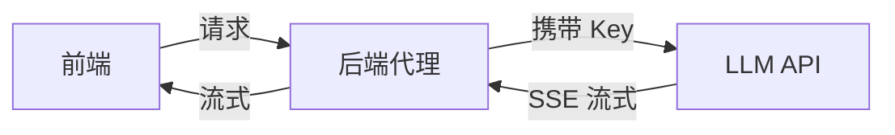

# 🤖 AI 前端领域

> 前沿方向：AI 辅助编码、前端接入大模型（LLM）、Vercel AI SDK 实战、低代码 + AI。

---

## 1. AI 辅助编码工作流

=== "GitHub Copilot"
    ```
    # 在函数上方写注释，Copilot 续写实现
    // 防抖函数：在停止触发 wait 毫秒后执行
    function debounce(fn, wait) { /* Copilot 补全 */ }
    ```

=== "Claude / Cursor"
    ```
    # 用自然语言让 Agent 改代码
    "把这段 Vue2 选项式 API 改成 Vue3 组合式 API"
    "给这个组件加一个 loading 态与错误边界"
    ```

!!! tip "心法"
    AI 是"副驾"，不是"司机"。明确意图 + 给上下文 + 人工 review，效率最高。

---

## 2. 前端接入大模型（LLM）

**安全架构（关键）**：API Key 绝不能放前端，必须经**后端代理**转发。



**流式输出（SSE）**：用 `fetch` + `ReadableStream` 逐段读取，实现"打字机"效果。

---

## 3. Vercel AI SDK 实战

=== "服务端 Route（Next.js）"
    ```ts
    // app/api/chat/route.ts
    import { openai } from '@ai-sdk/openai'
    import { streamText } from 'ai'
    export async function POST(req: Request) {
      const { messages } = await req.json()
      const result = streamText({ model: openai('gpt-4o'), messages })
      return result.toDataStreamResponse()
    }
    ```

=== "客户端 useChat（React）"
    ```tsx
    'use client'
    import { useChat } from 'ai/react'
    export default function Chat() {
      const { messages, input, handleInputChange, handleSubmit } = useChat()
      return (
        <form onSubmit={handleSubmit}>
          <input value={input} onChange={handleInputChange} />
          {messages.map(m => <p key={m.id}><b>{m.role}:</b> {m.content}</p>)}
        </form>
      )
    }
    ```

---

## 4. 低代码 + AI

- **自然语言生成页面**：输入"一个带搜索的用户表格"，AI 生成组件代码。
- **组件智能推荐**：根据设计稿（Figma）自动生成前端代码（如 Figma to Code）。
- **AI 填充 Mock 数据**：自动生成逼真测试数据。

!!! warning "注意"
    自动生成的代码务必人工审查可访问性、性能与安全（避免 XSS / 注入）。

---

## 5. 实战：AI 聊天界面

完整链路 = 前端 `useChat` + 后端 `streamText` 代理 + LLM。下方 Demo 用纯前端**模拟流式输出**，直观感受交互：

<iframe src="demos/ai-chat.html" width="100%" height="240" style="border:1px solid #2c5364;border-radius:8px"></iframe>

---

## 6. 踩坑（注意事项）

!!! warning "常见坑"
    - **Key 泄露**：把 LLM Key 写进前端代码并提交，等于公开泄露，立即吊销。
    - **流式中断**：未正确处理 `AbortController`，用户取消时后端仍在跑。
    - **Token 超限**：长对话不截断历史，触发模型上下文上限。
    - **XSS**：直接 `dangerouslySetInnerHTML` 渲染模型输出有风险，需消毒。

---

## 7. 学习经验

!!! tip "经验"
    - 先理解"为什么需要后端代理 + 流式"，再上手 AI SDK，事半功倍。
    - 从最小可用聊天 Demo 做起，逐步加历史、工具调用（function calling）、RAG。
    - 把 AI 当"代码生成器 + 参谋"，核心架构能力仍是王道。

---

## 8. 总结

| 方向 | 关键点 |
|------|--------|
| 辅助编码 | Copilot / Claude / Cursor |
| 接入 LLM | 后端代理 + SSE 流式 |
| AI SDK | Vercel AI SDK（useChat / streamText） |
| 低代码 + AI | 自然语言生成页面 |
| 实战 | 聊天界面（前端 + 代理 + 模型） |

> 下一板块预告：**面试专题**（Vue / React / JS / 工程化 / 网络 真题 + 答案）。
