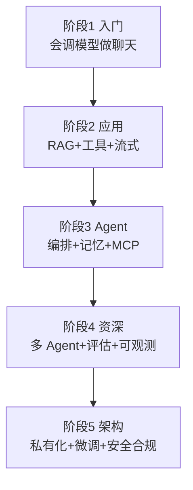

# 🗺️ 学习路线（初级 → 资深程序员）

> 一套**按层级递进**、且"学完能直接开发一个 AI 应用 / AI Agent"的路线。以官方文档为唯一准则，超越市面机构"堆概念"式大纲——这里每个阶段都对应可交付能力。前端同学可直接平移已有工程能力。

> 📌 **适用版本 / 更新日期**：最后更新 **2026-08**。

---

## 总览：七阶段递进（与导航一致）

---

## 阶段 1 · 入门（零基础 / 初级前端）

**目标**：能跑通一个流式聊天应用。

- [ ] 理解 [AI 术语](terminology.md)：LLM / Token / 上下文窗口 / 流式
- [ ] 跑通 [模型 API 与流式响应](model-api-streaming.md)：单次调用 + 流式（useChat）
- [ ] 理解 API Key 不能进前端（安全红线）
- [ ] 做完 [实战：AI 聊天应用](project-ai-chat.md)

**可交付**：一个带流式输出的智能问答页面。
**≈ 市面岗位**：AI 应用开发助理 / 前端转 AI 入门。

!!! tip "阶段1 不学"
    暂不用碰 Agent / LangGraph / 微调。先把"调模型 + 流式 UI"做熟。

---

## 阶段 2 · 应用工程师（初级 → 中级）

**目标**：让 AI 基于私有知识回答、能调你的接口。

- [ ] [RAG](rag.md)：切片 / 向量化 / 召回 / 带引用
- [ ] [向量数据库](vector-db.md)：pgvector / Qdrant 选型
- [ ] [结构化输出与工具调用](function-calling.md)：Function Calling 三原则
- [ ] 上下文裁剪（滑动窗口 / 摘要）
- [ ] 结构化输出（generateObject）

**可交付**：一个"基于公司文档的智能客服"。
**≈ 市面岗位**：AI 应用开发工程师 / RAG 工程师。

!!! danger "阶段2 关键坑"
    不做 Eval 就上线 RAG = 盲飞。至少建 20-50 条测试集。

---

## 阶段 3 · Agent 开发（中级 → 高级）

**目标**：能交付自主干活的 Agent。

- [ ] [Workflow vs Agent](workflow-vs-agent.md)：先判断要不要用 Agent（官方准则）
- [ ] [AI Agent 与编排](agent-orchestration.md)：Agents SDK / LangGraph 选型
- [ ] [MCP](mcp.md)：写一个 MCP Server 暴露内部工具
- [ ] [实战：AI Agent](project-ai-agent.md)：工具 + 记忆 + 护栏 + Tracing
- [ ] Guardrail 安全护栏

**可交付**：一个带多工具、有记忆、接 MCP 的运维/客服 Agent。
**≈ 市面岗位**：AI Agent 开发工程师 / 大模型应用工程师。

!!! warning "阶段3 铁律"
    没有 Tracing 不上 Agent；没有 Guardrail 不接危险工具。

---

## 阶段 4 · 资深（高级 → 资深）

**目标**：能设计可落地的多 Agent 系统 + 质量保障。

- [ ] 多 Agent 编排（Handoff / Orchestrator-Worker）
- [ ] 评估体系 Eval（Ragas / 自动+人工）
- [ ] 可观测性（Tracing + Metrics + 日志联动）
- [ ] 成本优化（模型路由 / 缓存 / 批处理）
- [ ] 性能（并发 / 流式延迟 / 超时）
- [ ] 安全深化（注入防护 / 越权 / 密钥管理）

**可交付**：生产级多 Agent 系统，有评估、有监控、有成本看板。
**≈ 市面岗位**：资深 AI 应用架构 / Tech Lead。

---

## 阶段 5 · 架构 / 私有化（资深 → 专家）

**目标**：能根据业务做技术决策。

- [ ] 模型选型与私有化部署（开源模型 + vLLM / Ollama）
- [ ] 微调 Fine-tuning / LoRA（按需，非必须）
- [ ] 向量库大规模运维（分片 / 混合检索）
- [ ] 合规与数据主权（私有化 / 脱敏）
- [ ] AI 安全合规（监管、审计、可解释）

**可交付**：企业级 AI 平台架构方案。
**≈ 市面岗位**：AI 平台架构师 / AI 技术负责人。

!!! tip "阶段5 真相"
    多数应用**不需要微调**。RAG + 好提示词 + 工具，覆盖 90% 需求。微调是最后手段（数据够、场景专、预算足才做）。

---

## 与前端能力的映射（为什么你能成）

| 你已有的 | 直接复用 |
|----------|----------|
| React/Vue 状态管理 | Agent UI / 流式消息 |
| fetch / 流式 | SSE 流式输出 |
| 接口设计 / 联调 | Tool API / MCP Server |
| 构建部署 | AI 应用上线 |
| 用户体验 | 可控/可中止/可纠错的 AI 交互 |

---

## 学习节奏建议

- **每天 1-2 小时，8-12 周可达阶段 3（能交付 Agent）**。
- 顺序：阶段1 → 2 → 3 必须顺序走；4/5 按工作需要补。
- 每个阶段"做完实战页"再进下一阶段，别跳。

> 对照招聘要求 → [JD 需求拆解与能力映射](jd-mapping.md)
