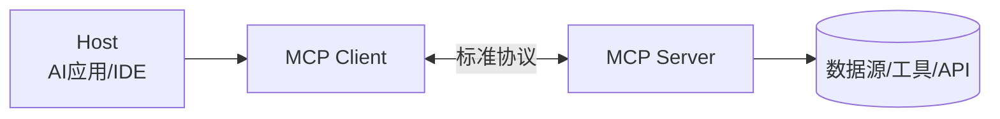

# 🔌 MCP 模型上下文协议（官方标准）

> MCP（Model Context Protocol）是 2024 年底由 Anthropic 提出、已被 Claude / ChatGPT / Cursor / VSCode 等广泛支持的**开源标准**。官方定位：AI 应用的"USB-C 端口"——把 AI 连接到数据源、工具、工作流的标准方式。本页讲清它是什么、为什么重要、怎么用、怎么自己写一个。

依据：[modelcontextprotocol.io](https://modelcontextprotocol.io/introduction) 官方文档。

> 📌 **适用版本 / 更新日期**：MCP 协议规范（2024-11 发布，持续演进）；TypeScript SDK `v1.x`；最后更新 **2026-08**。

---

## 1. 官方定义与价值

> MCP is an open standard for connecting AI applications to external systems. （官方定义）

- **它解决什么问题**：过去每个 AI 应用要接一个外部系统，就得写一套私有适配（N 个应用 × M 个工具 = N×M 集成）。MCP 把它变成"**一次构建，到处集成**"（MCP Server 写一次，所有支持 MCP 的 Client 都能用）。
- **类比**：USB-C——电子设备接口统一后，充电器/硬盘/显示器通用。MCP 让 AI 与外部系统的"接口"统一。

!!! tip "对前端的含义"
    你给公司内部的"订单系统 / 工单系统 / 数据库"包一层 **MCP Server**，任何支持 MCP 的 AI 客户端（Cursor、Claude Desktop、自研 Agent）都能直接调用它——不用为每个 AI 产品重写一遍对接。

---

## 2. 架构：Host / Client / Server



| 角色 | 是什么（官方） | 例子 |
|------|----------------|------|
| **Host** | 运行 LLM、想连外部系统的 AI 应用 | Claude Desktop、Cursor、VSCode、你的 Agent |
| **MCP Client** | Host 内负责连 Server 的组件 | Host 内置，一般不用自己写 |
| **MCP Server** | 暴露数据/工具给 AI 的程序 | 你写的"查订单 Server"、官方 filesystem server |

!!! warning "Host vs Client 易混"
    Host 是"整个 AI 应用"，Client 是它里面负责握手的部件。你通常**只写 Server**，Client 由 Host 提供。

---

## 3. MCP Server 能暴露什么

| 能力 | 说明 | 类比 |
|------|------|------|
| **Tools** | AI 可调用执行的函数（如"发邮件"） | 给 AI 的"动作" |
| **Resources** | 可被读取的数据（如"某文件内容"） | 给 AI 的"资料" |
| **Prompts** | 预置的提示词模板 | 给 AI 的"套路" |

!!! danger "安全红线"
    MCP Server 一旦被授权，AI 就能执行它暴露的工具。恶意/未审计的 Server = 让 AI 拥有危险能力。**只接可信来源的 Server，工具要最小权限**。

---

## 4. 自己写一个 MCP Server（最小示例，官方 SDK 思路）

以 TypeScript SDK（`@modelcontextprotocol/sdk`）为例：

```ts
import { McpServer } from '@modelcontextprotocol/sdk/server/mcp.js'
import { StdioServerTransport } from '@modelcontextprotocol/sdk/server/stdio.js'
import { z } from 'zod'

const server = new McpServer({ name: 'order-server', version: '1.0.0' })

// 暴露一个 Tool：查订单
server.tool(
  'query_order',
  { orderId: z.string().describe('订单号') },
  async ({ orderId }) => {
    const order = await db.orders.find(orderId) // 你的业务逻辑
    return {
      content: [{ type: 'text', text: JSON.stringify(order) }],
    }
  },
)

// 暴露一个 Resource：读取配置文档
server.resource('config', 'config://app', async (uri) => ({
  contents: [{ uri: uri.href, text: '...' }],
}))

const transport = new StdioServerTransport()
await server.connect(transport)
```

!!! tip "为什么这比"写个 HTTP 工具"高级"
    你的 Server 遵循标准协议，**Cursor / Claude Desktop / 自研 Agent 都能直接发现并调用它**，无需为每个 Host 定制对接。这是 MCP 的核心价值。

---

## 5. 在 Agent 里用 MCP（接官方 Client）

OpenAI Agents SDK、Vercel AI SDK 均已支持 MCP。以 Agents SDK 思路为例：

```ts
import { MCPServerStdio } from '@openai/agents'

const mcp = await MCPServerStdio({
  name: 'order-server',
  command: 'node',
  args: ['./order-server.js'],
})
// 把 mcp 的工具挂到 Agent，模型即可调用
agent.tools = [...agent.tools, ...(await mcp.listTools())]
```

> 具体 API 以各 SDK 官方文档为准（OpenAI Agents SDK / Vercel AI SDK 的 MCP 章节）。

---

## 6. 何时用 MCP vs 直接写 Tool

| 场景 | 选 |
|------|----|
| 工具要被多个 AI 产品共用 | **MCP Server** |
| 只在自己一个应用里用 | 直接 SDK Tool 即可 |
| 想接入 Cursor/Claude 生态 | **MCP Server**（免改造） |

!!! tip "务实建议"
    自研 Agent 内部先用 SDK 原生 Tool 跑通；当"同一个能力要被多个 Host 复用"或"想被 Cursor 等直接调用"时，再包成 MCP Server。不要为了 MCP 而 MCP。

---

## 7. 下一步

- 多 Agent / 自主任务编排 → [AI Agent 与编排](agent-orchestration.md)
- 何时该上 Agent（别滥用）→ [Workflow vs Agent](workflow-vs-agent.md)
