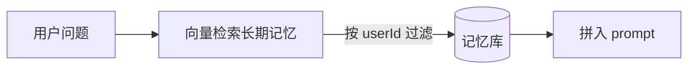

# 💾 记忆与上下文窗口管理

> 模型"看完就忘"，上下文窗口有限且按 token 计费。记忆与上下文管理决定了**成本、效果、是否越权**。本页讲清短期/长期记忆、上下文裁剪策略、窗口优化、隔离安全。以官方实践为准。

> 📌 **适用版本 / 更新日期**：概念与范式稳定；最后更新 **2026-08**。

---

## 1. 两类记忆

| 类型 | 是什么 | 实现 |
|------|--------|------|
| **短期记忆** | 本轮对话历史 | messages 数组传入模型 |
| **长期记忆** | 跨会话记住的用户/业务信息 | 向量库 / 数据库，检索后拼入 |

!!! danger "最大误解"
    "模型记得之前聊过"是错觉——每次调用都是**独立**的，所谓记忆是你把历史重新拼进 prompt。忘记拼 = 模型失忆。

---

## 2. 上下文窗口：有限且贵

- 窗口 = 单次能看到的最大 token。超出被截断（末尾或中间丢失）。
- 输入 + 输出都计费。每轮重发全历史 → 成本随轮数线性增长。

!!! warning "Lost in the middle"
    长上下文里，放**开头和结尾**的信息模型最关注，中间易忽略。关键信息别塞一大段中间。

---

## 3. 上下文裁剪策略（成本与效果平衡）

| 策略 | 做法 | 取舍 |
|------|------|------|
| **滑动窗口** | 只留最近 N 轮 | 简单，但忘早期约定 |
| **摘要压缩** | 旧对话交给模型总结成一段 | 省 token，摘要可能丢细节 |
| **检索式记忆** | 长期记忆存向量库，按需召回相关片段 | 精准，需 RAG 基建 |
| **关键事实抽取** | 把"用户偏好/约定"抽成结构化存库 | 稳定，需抽取逻辑 |

=== "滑动窗口 + 摘要思路"
    ```ts
    function buildContext(history: Msg[], max = 20) {
      if (history.length <= max) return history
      const old = history.slice(0, -max)
      const recent = history.slice(-max)
      const summary = await summarize(old) // 调模型总结
      return [{ role: 'system', content: `早期摘要: ${summary}` }, ...recent]
    }
    ```

!!! tip "务实组合"
    短期用滑动窗口保新鲜，长期用向量检索保准确，关键约定用结构化抽取保稳定。三者结合最稳。

---

## 4. 长期记忆与越权



!!! danger "记忆越权坑（严重）"
    长期记忆检索**必须按 userId 隔离 + 权限校验**，否则 A 用户的历史被 B 用户检索到 = 数据泄露。工具执行时也要再校验"只能读自己的数据"（见[安全](best-practices.md)）。

---

## 5. 成本联动

- 裁剪直接降 token 成本（详见[成本优化](cost-optimization.md)）。
- 大上下文 ≠ 好效果；精准检索（RAG）比堆窗口更有效（见[RAG](rag.md)）。

---

## 6. 踩坑汇总

!!! danger "记忆/上下文高频坑"
    1. 历史无限堆积 → 超窗口 + 成本爆炸。
    2. 关键信息塞上下文中间被遗忘。
    3. 长期记忆不按用户隔离 → 越权。
    4. 摘要过度压缩丢关键约束。
    5. 把密钥/PII 存进记忆库 → 二次泄露。

> 衔接：[RAG](rag.md) · [向量数据库](vector-db.md) · [Vercel AI SDK](vercel-ai-sdk.md)
