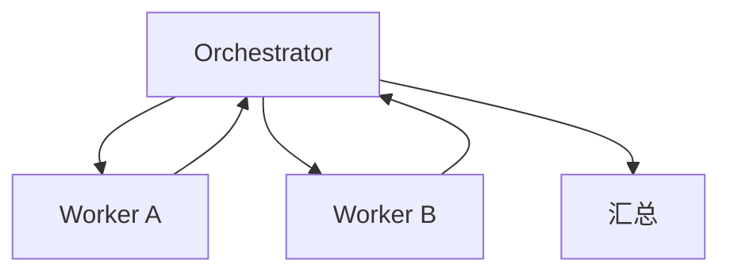

# 🕸️ 多 Agent 协作

> 单 Agent 处理复杂任务会"注意力分散、上下文爆炸"。多 Agent = 把任务分给专精的子 Agent，由调度者编排。本页讲清两种官方模式：Handoff（OpenAI Agents SDK）与 Orchestrator-Worker（Anthropic Workflow），附可运行思路。以官方原语为准。

依据：[OpenAI Agents SDK Handoffs](https://openai.github.io/openai-agents-js/) · [Anthropic Building Effective Agents](https://www.anthropic.com/engineering/building-effective-agents)

> 📌 **适用版本 / 更新日期**：OpenAI Agents SDK `v0.x`（Handoff 原语）+ Anthropic Orchestrator-Worker 范式；最后更新 **2026-08**。

---

## 1. 为什么要多 Agent

| 问题 | 多 Agent 解法 |
|------|---------------|
| 单 Agent 提示词太长、角色冲突 | 拆成"分诊 + 专家"各司其职 |
| 上下文窗口被杂任务占满 | 子 Agent 各自维护小上下文 |
| 任务类型差异大 | 不同 Agent 用不同模型/工具 |

!!! warning "先问要不要多 Agent"
    按 [Workflow vs Agent](workflow-vs-agent.md)：路径固定用单 Agent + Workflow 即可；只有"任务需动态分派"才上多 Agent。过早拆分增加通信成本与调试难度。

---

## 2. 模式一：Handoff（OpenAI Agents SDK）

一个 Agent 把任务**转交**给另一个专精 Agent。

```ts
import { Agent, run } from '@openai/agents'

const weatherExpert = new Agent({
  name: '天气专家', instructions: '只回答天气相关问题', tools: [getWeather],
})
const orderExpert = new Agent({
  name: '订单专家', instructions: '只处理订单查询', tools: [queryOrder],
})
const triage = new Agent({
  name: '分诊', instructions: '根据问题转给对应专家',
  handoffs: [weatherExpert, orderExpert],
})
const r = await run(triage, '北京天气怎样，另外查下订单 A123')
// 模型自己决定先转天气还是订单，可多跳
```

!!! tip "Handoff 优势"
    主 Agent 不用懂所有细节，只负责"派活"。子 Agent 上下文干净、工具专一，准确率高。

---

## 3. 模式二：Orchestrator-Worker（Anthropic Workflow）

调度者**动态**拆解任务，派给 worker，汇总结果。



!!! warning "Worker 隔离"
    每个 Worker 独立状态、独立工具权限。别共享可变状态，否则竞态 + 难调试。

---

## 4. 多 Agent 踩坑

!!! danger "多 Agent 高频坑"
    1. **死循环交接**：A 转 B、B 转 A。必须设最大跳数 / 终止条件。
    2. **上下文丢失**：交接时不传必要背景 → 子 Agent 缺信息。显式传 summary。
    3. **权限扩散**：子 Agent 拿了父 Agent 的全部工具 → 越权风险。按需最小授权。
    4. **无 Tracing**：多跳链路不记录 → 出问题无法还原（见[可观测](ai-observability.md)）。
    5. **过度拆分**：2 个简单任务拆 5 个 Agent，通信开销 > 收益。

---

## 5. 何时用哪种

| 场景 | 选 |
|------|----|
| 按类型分流（客服/专家） | **Handoff** |
| 一个大任务动态拆子任务 | **Orchestrator-Worker** |
| 路径固定可预知 | **单 Agent + Workflow**（不上多 Agent） |

> 衔接：[AI Agent 与编排](agent-orchestration.md) · [状态管理与可视化](agent-state-viz.md)
