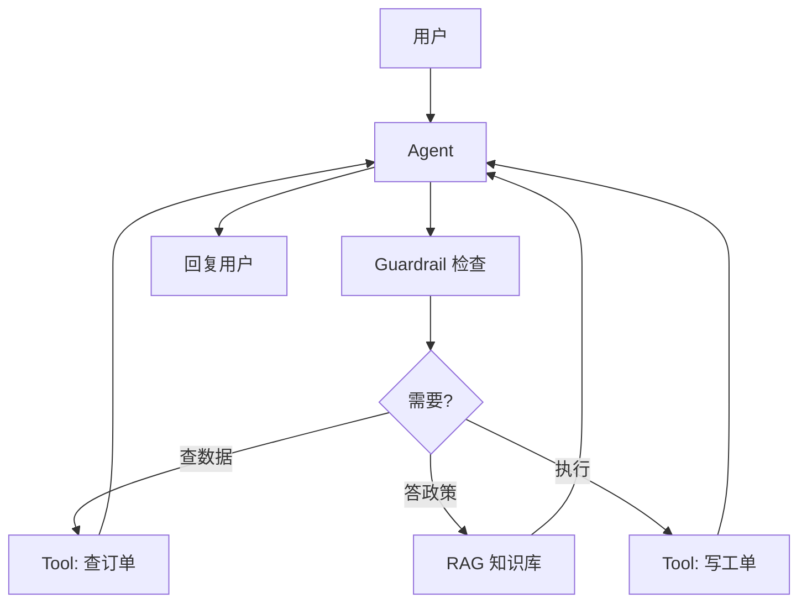

# 🤖 实战：从 0 搭一个 AI Agent（工具 + 记忆 + MCP）

> 把前几篇（LLM / RAG / MCP / Agent 编排）串成一个**能自主干活的 Agent**：带多工具、有记忆、可接 MCP、有护栏。学完本页，你具备交付"AI Agent 应用"的能力——这正是 2026 招聘市场最稀缺的方向。

依据：[OpenAI Agents SDK (TS)](https://openai.github.io/openai-agents-js/) 官方范式。

> 📌 **适用版本 / 更新日期**：本文使用 **OpenAI Agents SDK (`@openai/agents` `v0.x`)**，最后更新 **2026-08**。
> ⚠️ **风格边界**：本篇与《实战：AI 聊天应用》用的不是同一套 SDK。聊天篇用 Vercel AI SDK（`ai`/`streamText`），
> 本篇用 OpenAI Agents SDK（`@openai/agents` 的 `agent`/`run`/`MCPServerStdio`）。**同一项目里只选一套**，
> 不要混用两套工具定义与运行循环，否则消息格式与工具调用对不上。可运行最小示例见 `demos/ai-runtime/`。

---

## 1. 这个 Agent 能做什么

场景：**"智能运维小助手"**——用户用中文问，它自己决定：
- 查订单（工具）→ 判断状态
- 查知识库（RAG）→ 回答政策
- 需要操作时，先护栏检查权限 → 再执行
- 多轮对话记住上下文（记忆）



---

## 2. 定义工具（你的代码执行）

```ts
import { tool } from '@openai/agents'
import { z } from 'zod'

const queryOrder = tool({
  name: 'query_order',
  description: '根据用户ID或订单号查询订单状态',
  parameters: z.object({ orderId: z.string() }),
  execute: async ({ orderId }) => {
    return await db.orders.findByOrderId(orderId)
  },
})

const createTicket = tool({
  name: 'create_ticket',
  description: '为用户创建售后工单',
  parameters: z.object({
    userId: z.string(),
    reason: z.string(),
  }),
  execute: async ({ userId, reason }) => {
    return await db.tickets.create({ userId, reason, status: 'OPEN' })
  },
})
```

!!! tip "工具描述决定 Agent 智商"
    模型靠 `description` 选工具。写清"何时用、参数是什么"，比换更强模型更有效。

---

## 3. 记忆（短期 + 长期）

```ts
// 短期：每轮把历史传入
let thread = []
async function chat(userMsg: string) {
  thread.push({ role: 'user', content: userMsg })
  const result = await run(agent, thread)
  thread.push({ role: 'assistant', content: result.finalOutput })
  return result.finalOutput
}

// 长期：从向量库检索用户历史工单拼入 system
const history = await retrieveUserHistory(userId)
agent.instructions = `参考该用户历史：${history}`
```

!!! danger "记忆越权坑"
    长期记忆检索必须**按 userId 隔离**，并在工具里校验"只能查自己的订单"。否则跨用户泄露（见[安全](best-practices.md)）。

---

## 4. 护栏 Guardrail（上线必加）

```ts
// 输入护栏：拦截敏感指令注入
agent.inputGuardrails = [{
  name: 'no_injection',
  execute: async ({ input }) => {
    if (/忽略之前所有指令/.test(input)) {
      throw new Error('检测到提示注入，已拦截')
    }
    return { tripwireTriggered: false }
  },
}]
```

!!! warning "护栏不是装饰"
    没有护栏的 Agent 接了"发邮件/写数据库"工具，一次提示注入就能造成真实破坏。工具能力越强，护栏越要严。

---

## 5. 接 MCP（复用已有 Server）

```ts
import { MCPServerStdio } from '@openai/agents'
const mcp = await MCPServerStdio({
  name: 'internal-tools',
  command: 'node',
  args: ['./mcp-server.js'],
})
agent.tools = [...agent.tools, ...(await mcp.listTools())]
```

> 这段让 Agent 自动获得 MCP Server 暴露的全部工具，不用改 Agent 代码（见 [MCP](mcp.md)）。
> 若你用的是 Vercel AI SDK，MCP 接入写法不同（`experimental_createMCPClient` + `@ai-sdk/mcp`），
> 不要照搬上面的 `MCPServerStdio`——这属于另一套 SDK 的 API。

---

## 6. 可观测：Tracing（调试命脉）

OpenAI Agents SDK **内置 Tracing**。上线前务必打开：

- 每次调用记录：模型决策、工具调用、输入输出、耗时、token。
- 没有 tracing， Agent 出问题你只能盲猜。

!!! danger "没有 Tracing 不做 Agent"
    这是与"普通聊天"最大的工程差异：自主循环里任何一步出错，靠日志肉眼无法还原。Tracing 是不可省的基础设施。

---

## 7. 完整运行骨架

```ts
import { Agent, run, tool } from '@openai/agents'
import { z } from 'zod'

const agent = new Agent({
  name: '运维小助手',
  instructions: '你是售后助手，优先查数据再回答，必要时创建工单。',
  tools: [queryOrder, createTicket],
  inputGuardrails: [noInjection],
})

const result = await run(agent, '帮我查订单 A123 的状态，并解释退款政策')
console.log(result.finalOutput)
```

---

## 8. 交付清单（对照招聘 JD）

- [ ] 多工具调用 ✅
- [ ] 上下文 / 记忆管理 ✅
- [ ] RAG 知识问答 ✅
- [ ] MCP 接入外部系统 ✅
- [ ] Guardrail 安全护栏 ✅
- [ ] Tracing 可观测 ✅
- [ ] 错误处理 / 超时 / 幂等 ✅

> 满足以上，你已具备**AI Agent 应用开发工程师**的核心交付能力。对照 → [JD 映射](jd-mapping.md)
