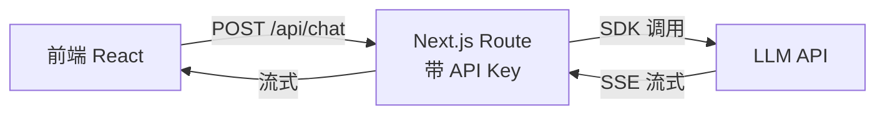

# 💬 实战：从 0 搭一个 AI 聊天应用

> 把 [模型 API 与流式响应](model-api-streaming.md) 的知识串成一个**可运行**的流式聊天应用：前端 React + 后端 Next.js 代理 + 模型。这是 AI 应用开发的"最小闭环"，做完你就具备交付基础 AI 产品的能力。

技术栈：Next.js（App Router）+ Vercel AI SDK + React `useChat`。以官方范式为准。

> 📌 **适用版本 / 更新日期**：Vercel AI SDK `v4` + `@ai-sdk/openai v1` + Next.js `14/15 App Router`；最后更新 **2026-08**。
> 可运行最小示例见仓库 `demos/ai-runtime/`（单一 SDK 风格，避免与 OpenAI Agents SDK 混用）。

---

## 1. 架构（必须这样分层）



!!! danger "铁律"
    API Key 只在后端。前端永远不直接连模型。Key 泄露 = 账户被盗刷。

---

## 2. 初始化项目

```bash
npx create-next-app@latest ai-chat --ts --app --no-tailwind
cd ai-chat
npm i ai @ai-sdk/openai @ai-sdk/react zod
# 后端建 .env.local
echo "OPENAI_API_KEY=sk-..." > .env.local
```

---

## 3. 后端：流式聊天接口

```ts
// app/api/chat/route.ts
import { openai } from '@ai-sdk/openai'
import { streamText } from 'ai'

export const maxDuration = 30

export async function POST(req: Request) {
  const { messages } = await req.json()
  const result = streamText({
    model: openai('gpt-4o-mini'),
    system: '你是一个简洁专业的中文助手。',
    messages,
  })
  return result.toDataStreamResponse()
}
```

!!! warning "maxDuration"
     Serverless 默认超时短，流式长回答会被截断。设 `maxDuration`（平台上限内）。

---

## 4. 前端：聊天 UI（useChat）

```tsx
// app/page.tsx
'use client'
import { useChat } from '@ai-sdk/react'

export default function Page() {
  const { messages, input, handleInputChange, handleSubmit, isLoading, stop } =
    useChat()
  return (
    <div style={{ maxWidth: 640, margin: '40px auto' }}>
      {messages.map(m => (
        <div key={m.id} style={{ margin: '8px 0' }}>
          <b>${m.role}:</b> {m.content}
        </div>
      ))}
      <form onSubmit={handleSubmit}>
        <input
          value={input}
          onChange={handleInputChange}
          placeholder="问问点什么…"
          style={{ width: '80%' }}
        />
        {isLoading ? (
          <button type="button" onClick={stop}>停止</button>
        ) : (
          <button type="submit">发送</button>
        )}
      </form>
    </div>
  )
}
```

!!! tip "体验细节（超越玩具）"
    - **停止按钮**：用 `stop()` 中断，`AbortController` 已内置，省 token。
    - **loading 态**：`isLoading` 给反馈。
    - **错误边界**：catch 网络错误，提示用户重试。

---

## 5. 加工具调用（让它能"干活"）

在 route 里加一个工具，模型可自主调用：

```ts
import { tool } from 'ai'
import { z } from 'zod'

const calc = tool({
  description: '简单的四则运算计算器',
  parameters: z.object({ expr: z.string() }),
  execute: async ({ expr }) => {
    // ⚠️ 真实项目别直接 eval，这里仅演示
    return { result: Function('"use strict";return (' + expr + ')')() }
  },
})

export async function POST(req: Request) {
  const { messages } = await req.json()
  const result = streamText({
    model: openai('gpt-4o-mini'),
    tools: { calc },
    messages,
    maxSteps: 5, // 允许多步工具调用
  })
  return result.toDataStreamResponse()
}
```

!!! danger "execute 安全"
    演示用 `Function` 执行表达式仅作原理说明，**生产禁用 eval**。真实工具要白名单/沙箱/权限校验。

---

## 6. 上线清单

- [ ] Key 在环境变量，未提交仓库（`.env.local` 已 gitignore）
- [ ] 有停止/超时处理
- [ ] 历史裁剪防上下文溢出
- [ ] 输出渲染做了 XSS 消毒
- [ ] 有基础错误提示

> 到此你已交付一个**能用的 AI 应用**。可运行最小示例（流式聊天）→ `demos/ai-runtime/chat-stream.mjs`。
> 想升级成"能自主干复杂活的" → [实战：从 0 搭 AI Agent](project-ai-agent.md)
