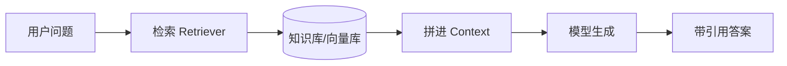

# 📚 RAG 检索增强生成（原理 + 落地）

> RAG（Retrieval-Augmented Generation）是 AI 应用**最务实、最高频**的能力：让模型基于"你给的资料"回答，而不是凭记忆瞎编。本页讲清原理与可落地实现，以官方范式为准。

> 📌 **适用版本 / 更新日期**：概念与范式稳定；最后更新 **2026-08**。

---

## 1. 为什么需要 RAG

模型有知识截止日期、会幻觉、不懂你的私有数据（公司文档/产品手册/代码库）。RAG 的解法：



!!! danger "幻觉的根因"
    模型"知道"的是训练时的统计规律，不在上下文里的"事实"它也会自信编造。**把事实塞进上下文（RAG）= 治本；靠提示词命令"别瞎编"= 不治本。**

---

## 2. RAG 全流程（5 步）

| 步骤 | 做什么 | 关键决策 |
|------|--------|----------|
| ① 文档加载 | 读 PDF/MD/网页/数据库 | 用官方 Loader（LangChain / LlamaIndex） |
| ② 切片 Chunking | 拆成段 | 大小 200-1000 token，重叠 10-20% |
| ③ 向量化 Embedding | 每段 → 向量 | 同模型 embedding 才能比 |
| ④ 入库 | 存向量库 | pgvector / Qdrant / Milvus |
| ⑤ 检索+生成 | 问题向量化→召回 topK→拼上下文→生成 | topK=3~8，带引用 |

!!! warning "切片是效果命门"
    - 切太碎：语义断裂，检索召回片段答不全。
    - 切太整：噪声多，塞爆上下文。
    - 按"自然边界"（标题/段落）切，比固定字数好。

---

## 3. 最小可运行 RAG（Vercel AI SDK + pgvector 思路）

=== "检索（伪代码，官方范式）"
    ```ts
    import { embed, generateText } from 'ai'
    import { openai } from '@ai-sdk/openai'

    // 1) 问题向量化
    const { embedding } = await embed({
      model: openai.embedding('text-embedding-3-small'),
      value: question,
    })
    // 2) 向量库召回 topK（SQL: ORDER BY embedding <=> $1 LIMIT 5）
    const chunks = await db.query(
      'SELECT content FROM docs ORDER BY embedding <=> $1 LIMIT 5',
      [embedding],
    )
    // 3) 拼上下文生成
    const { text } = await generateText({
      model: openai('gpt-4o-mini'),
      system: '只根据下方资料回答，资料没有就明说不知道。',
      prompt: `资料：\n${chunks.map(c => c.content).join('\n---\n')}\n\n问题：${question}`,
    })
    ```

!!! tip "引用来源（工程必做）"
    返回时带上命中的 chunk 来源链接，既是可信度证明，也方便用户核对——这是"超越玩具 Demo"的关键细节。

---

## 4. 进阶 RAG 技术（按性价比排序）

1. **Hybrid Search 混合检索**：向量（语义）+ 关键词（BM25）融合，弥补纯向量对专名/编号召回差。
2. **Rerank 重排**：召回 top20 再用小模型重排取 top5，精度显著提升。
3. **Metadata 过滤**：先按时间/部门/权限过滤再检索，减少噪声。
4. **Query 改写**：把口语问题改写成检索友好查询。
5. **GraphRAG**：把实体关系建图，适合强关联知识（复杂度高，非必需）。

!!! danger "别一上来堆高级"
    先用"朴素 RAG + 好切片 + 带引用"跑通，评估效果（见 Eval），再针对性加 hybrid / rerank。过早优化是最大浪费。

---

## 5. 评估 Eval（上线前必须）

- **召回率**：相关问题是否真的被检索到。
- **回答相关性 / 忠实度**：答案是否基于资料、不幻觉。
- 工具：Ragas、持续人工抽检。

!!! warning "没有 Eval 的 RAG = 盲飞"
    手测几个问题"看起来对"就上线，真实用户一问就翻车。至少建一个小测试集（20-50 条）定期跑。

---

## 6. 下一步

- 向量怎么存/怎么选 → [向量数据库与 Embedding](vector-db.md)
- RAG + 工具 + 多步 = Agent → [AI Agent 与编排](agent-orchestration.md)
