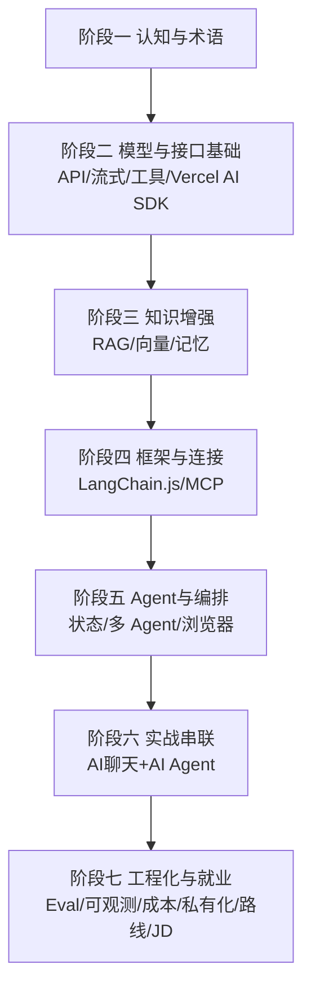

# 🤖 AI 专业术语速查（含前端转 AI 背景）

> 本页是 AI 应用开发专题的**术语对齐起点**：先讲清楚"前端为什么要在 2025-2026 转 AI、现状如何、该补什么"，再用一套对照表把 AI 高频术语讲透。所有技术定义以**官方文档为准**（OpenAI / Anthropic / Vercel AI SDK / LangChain / Model Context Protocol 官网），不编造。

> 📌 **适用版本 / 更新日期**：行业概览与术语（概念稳定）；最后更新 **2026-08**。具体 API 以各篇"适用版本"标注为准。

---

## 一、前端转 AI 的背景与现状：为什么需要转

### 1.1 行业拐点（事实，非焦虑营销）

- **大模型能力外溢到"应用层"**：2023 年 ChatGPT 引爆后，竞争焦点从"训练大模型"快速转移到"用大模型做出好用的产品"。训练是少数大厂/实验室的事，**应用开发是千千万万工程师的事**。
- **AI 应用开发的门槛被前端栈拉平**：Vercel AI SDK、OpenAI Agents SDK、LangChain 等主流工具**优先支持 TypeScript/JavaScript**（前端母语）。前端同学不需要先学 Python 就能直接做 AI 应用。
- **岗位需求结构性变化**：2026 年招聘市场，"AI 应用开发 / RAG / Agent 工程师"成为务实入行高薪方向（详见 [JD 映射](jd-mapping.md)）。传统"纯切图/写页面"岗位被 AI 辅助编码压缩，而"会做 AI 产品的全栈"稀缺。

!!! danger "认知纠偏（重要）"
    - ❌ 转 AI = 去搞算法 / 训练模型 / 读论文。→ **错**。应用层 95% 工作是用现成模型 API + 工程化，不需要训模型。
    - ❌ 必须精通 Python 和数学。→ **错**。TS/JS 生态已完整，数学只需"理解概念"不必推导公式。
    - ❌ 前端经验没用。→ **错**。UI/交互/状态管理/流式渲染/前后端联调，正是 AI 应用（尤其带界面的 Agent）的核心竞争力。

### 1.2 前端的"天然优势"迁移表

| 前端已有能力 | 在 AI 应用里的直接用处 |
|--------------|------------------------|
| 组件化 / 状态管理（Vue/React） | 构建聊天 UI、流式消息、工具调用可视化 |
| 异步 / 流式（fetch + ReadableStream） | SSE 流式输出（打字机效果）天然会 |
| 前后端联调 / 接口设计 | 设计 Agent 的工具 API、MCP Server |
| 构建工具 / 部署（Vite/Next/Docker） | 把 AI 应用打包上线 |
| 用户体验 / 交互细节 | AI 应用的"可控感、可中止、可纠错"体验 |

!!! tip "一句话结论"
    前端转 AI 应用开发，不是"从零转行"，而是**把已有工程能力平移到一个新领域**，补的是"模型怎么调、上下文怎么管、工具怎么接"这一层，成本高但可行、且市场稀缺。

---

## 二、AI 应用开发核心术语（对照表）

> 标注 📘 为官方来源概念。术语按"模型 → 交互 → 记忆 → 工具 → 编排 → 部署"组织。

### 2.1 模型与推理（基础）

| 术语 | 一句话定义 | 前端类比 / 避坑 |
|------|------------|----------------|
| **LLM 大语言模型** | 基于海量文本训练、能续写/理解自然语言的模型（如 GPT、Claude、Gemini、DeepSeek、通义千问） | 类似"超强补全引擎"，但会幻觉 |
| **多模态 Multimodal** | 模型能处理文本+图像+音频+视频 | 前端传图给模型做视觉理解 |
| **推理 Inference** | 把输入给模型、拿到输出的过程（区别于训练） | 你只做推理，不做训练 |
| **Token** | 模型计费与上下文的基本单位（≈中文 1-2 字 / 英文 ~4 字符） | 💰 成本按 token 算，长上下文贵 |
| **上下文窗口 Context Window** | 模型单次能"看到"的最大 token 数 | 超出会被截断，需摘要/裁剪历史 |
| **Temperature 温度** | 控制输出随机性（0 稳、1 发散） | 代码/事实用低温度，创意用高温度 |
| **System Prompt 系统提示** | 设定角色/规则的隐藏指令 | 比 user prompt 优先级高，定边界 |

!!! warning "Token 计费坑"
    输入 + 输出都计费。带长历史的多轮对话循环调用，成本会悄悄爆炸——必须做历史裁剪（见 [模型 API 与流式响应](model-api-streaming.md)）。

### 2.2 交互范式

| 术语 | 定义 | 官方/避坑 |
|------|------|-----------|
| **Prompt 提示词** | 给模型的指令文本 | 写清"角色+任务+格式+约束"四要素 |
| **Few-shot / 零样本** | 给少量示例 / 不给示例 | 结构化输出优先用"输出格式约束"而非堆示例 |
| **Function Calling 函数调用** 📘 | 模型按约定"决定调用哪个函数并填参"，由你执行 | 模型**只生成调用意图**，真正执行在你代码里 |
| **Tool Use 工具使用** 📘 | 与 Function Calling 同义，OpenAI/Anthropic 通用表述 | 工具定义要写清"何时用、参数 schema" |
| **Streaming 流式** 📘 | 边生成边返回（SSE/ReadableStream） | 前端 `useChat` 原生支持，体验关键 |
| **Structured Output 结构化输出** | 强制模型返回 JSON / 指定 schema | 用 provider 的 JSON mode 或工具"强制调用" |

!!! danger "Function Calling 最大误解"
    模型**不会**真的执行函数！它只返回 `{name, arguments}`。谁来执行？**你的后端代码**。所以"让 AI 查数据库"= AI 决定查 → 你代码查 → 把结果喂回模型。这是 Agent 能力的根基。

### 2.3 记忆与知识

| 术语 | 定义 | 避坑 |
|------|------|------|
| **RAG 检索增强生成** 📘 | 先检索相关资料，拼进上下文再让模型回答，减少幻觉 | 检索质量 >> 模型选择，垃圾进垃圾出 |
| **Embedding 向量化** | 把文本转成高维向量，用于语义相似度 | 同模型 embedding 才能比，别混用 |
| **向量数据库 Vector DB** | 存向量、做相似度检索（pgvector/Milvus/Qdrant） | 小规模用 pgvector 即可，别一上来堆集群 |
| **向量召回 Recall** | 检索返回的相关文档比例 | 召回不足 = 答非所问 |
| **知识库 Knowledge Base** | 被 RAG 检索的文档集合 | 切片 chunk 大小直接影响效果 |

### 2.4 工具与外部连接

| 术语 | 定义 | 官方/避坑 |
|------|------|-----------|
| **MCP 模型上下文协议** 📘 | 开源标准，把 AI 应用连到外部系统（数据/工具/工作流），"AI 的 USB-C 口" | 见 [MCP 专题](mcp.md)，一次构建到处集成 |
| **MCP Server** | 暴露数据/工具给 AI 的程序 | 你给业务系统包一层 MCP 即可被任意客户端用 |
| **MCP Client** | 连接 MCP Server 的 AI 应用 | Cursor/Claude Desktop 都是 client |
| **Tool 工具** | Agent 可调用的函数（查天气/查订单/发邮件） | 工具越多越要写清描述，否则模型乱调 |

### 2.5 编排与 Agent

| 术语 | 定义 | 官方/避坑 |
|------|------|-----------|
| **Workflow 工作流** 📘 | 预设路径、可预测的 LLM 调用链 | Anthropic：多数场景 workflow 就够了 |
| **AI Agent 智能体** 📘 | 能自主决策下一步、循环调用工具直到完成任务 | 比 workflow 难控，按需上（见 [Workflow vs Agent](workflow-vs-agent.md)） |
| **Orchestration 编排** | 把多个步骤/子 Agent 组织起来 | LangGraph/Agents SDK 干这事 |
| **Handoff 交接** 📘 | 一个 Agent 把任务转给另一个（OpenAI Agents SDK 原语） | 多 Agent 协作的核心机制 |
| **Guardrail 护栏** 📘 | 输入输出安全检查（OpenAI Agents SDK 原语） | 防越权/注入/敏感泄露 |
| **Memory 记忆** | Agent 跨轮/跨会话记住信息 | 短期=对话历史，长期=存库 |

### 2.6 可观测与评估

| 术语 | 定义 | 避坑 |
|------|------|------|
| **Tracing 追踪** 📘 | 记录每次调用的链路（OpenAI Agents SDK 内置） | 没有 tracing 别做 Agent，排查靠猜 |
| **Eval 评估** | 系统性测试 AI 输出质量 | 上线前必须做，不能只靠手测 |
| **Hallucination 幻觉** | 模型编造不实内容 | RAG + 引用来源 + 工具验证来缓解 |
| **Prompt Injection 提示注入** | 用户输入恶意指令劫持模型 | 见 [最佳实践](best-practices.md) 安全章 |

---

## 三、技术选型速查（官方为准）

| 需求 | 首选（官方维护） | 备注 |
|------|------------------|------|
| TS 全栈 AI 应用 | **Vercel AI SDK**（ai-sdk.dev） | 框架无关 hooks，支持多 provider |
| 多 Agent 编排（轻量） | **OpenAI Agents SDK**（openai.github.io/openai-agents-js） | provider-agnostic，少抽象 |
| 复杂有状态图编排 | **LangGraph**（langchain） | 显式状态/循环图，可控性强 |
| 连接外部系统标准 | **MCP**（modelcontextprotocol.io） | 已被 Claude/Cursor/VSCode 支持 |
| 向量检索 | pgvector / Qdrant / Milvus | 小项目 pgvector 起步 |

!!! tip "选型心法（Anthropic 官方建议）"
    最成功的 Agent 实现**不是**用最复杂的框架。优先：单次调用 → workflow → 才到 Agent。框架只是编排手段，核心仍是"提示词 + 工具 + 上下文管理"。

---

## 四、本专题学习路线总览（7 阶段）

> 与导航菜单完全一致。完整路线图见 [AI 应用开发 · 学习路线总览](index.md)。

- 零基础从本页 → [模型 API 与流式响应](model-api-streaming.md)。
- 想直接看架构 → [Workflow vs Agent](workflow-vs-agent.md)。
- 想对照招聘 → [JD 映射](jd-mapping.md)。

> 下一步：[模型 API 与流式响应（API / 流式）](model-api-streaming.md) 与 [结构化输出与工具调用](function-calling.md)
