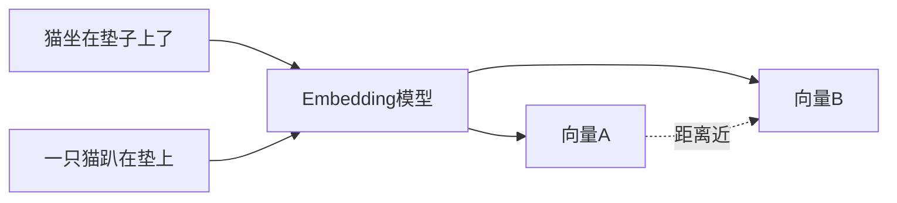
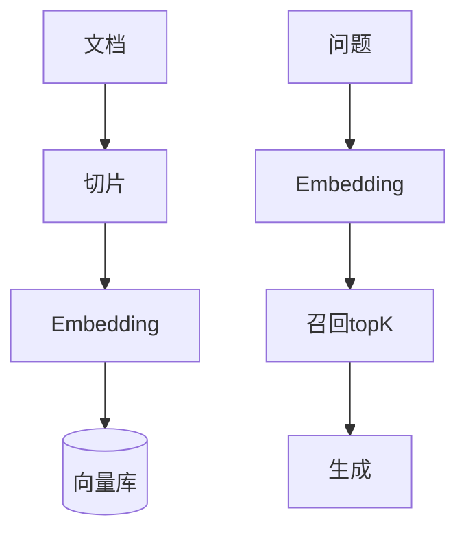

# 🔢 向量数据库与 Embedding

> RAG 的"记忆体"。本页讲清 Embedding 是什么、向量库怎么选、相似度怎么算，以及不同规模下的务实选型。以官方文档与社区共识为准。

> 📌 **适用版本 / 更新日期**：概念稳定，不绑定具体库；最后更新 **2026-08**。

---

## 1. Embedding 是什么（不玄学）

Embedding = 把一段文本映射成一个**高维浮点向量**（如 1536 维）。语义相近的文本，向量在空间里距离近。比较距离 = 比较语义相似度。



!!! tip "关键规则"
    - **同模型才可比**：用 A 模型 embed 的向量，不能和 B 模型的向量比距离。
    - **维度固定**：同一模型输出维度一致（如 text-embedding-3-small = 1536 维）。
    - 中文场景优先选对中文友好的模型（OpenAI / 智源 / 阿里通义等均有）。

---

## 2. 相似度度量

| 度量 | 说明 | 注意 |
|------|------|------|
| **余弦相似度 Cosine** | 夹角，最常用 | 向量需归一化 |
| **内积 IP** | 夹角+模长 | 模长有信息时更准 |
| **欧氏距离 L2** | 直线距离 | pgvector `<=>` 算子默认用此 |

!!! warning "归一化坑"
    用余弦相似度前必须归一化向量，否则结果失真。多数 SDK embed 默认已归一化，自建流程要确认。

---

## 3. 向量库选型（按规模务实）

| 规模 / 场景 | 首选 | 理由 |
|------------|------|------|
| 已有 Postgres，< 千万级 | **pgvector** | 不引入新组件，SQL 一把梭 |
| 纯向量、要轻量 | **Qdrant** | Rust 写，单机强，API 友好 |
| 超大规模 / 分布式 | **Milvus** | 水平扩展，运维成本也高 |
| 托管 / 不想运维 | 云厂商向量服务 | 阿里云 / 腾讯云 / Pinecone |

!!! danger "选型陷阱"
    - 小项目别一上来 Milvus 集群——运维成本 >> 收益。
    - pgvector 在数据量大时要建 **IVFFlat / HNSW 索引**，否则全表扫描慢。

=== "pgvector 建表 + 索引（官方范式）"
    ```sql
    CREATE EXTENSION IF NOT EXISTS vector;
    CREATE TABLE docs (
      id BIGSERIAL PRIMARY KEY,
      content TEXT,
      embedding vector(1536)
    );
    -- HNSW 索引，提速召回
    CREATE INDEX ON docs USING hnsw (embedding vector_cosine_ops);
    -- 召回 top5
    SELECT content FROM docs
    ORDER BY embedding <=> $1::vector LIMIT 5;
    ```

---

## 4. 写入与更新流程



!!! tip "增量更新"
    文档变更要**重新 embed 对应 chunk**并 upsert，否则知识库过期。建一个 `doc_version` 字段便于对账。

---

## 5. 成本与性能

- Embedding 调用也计费（通常比生成便宜得多）。
- 批量 embed 比逐条快且省。
- 向量维度不是越高越好，够用即可（高维占存储、慢检索）。

---

## 6. 下一步

- RAG 怎么用向量库 → [RAG 检索增强生成](rag.md)
- 工具/外部系统标准连接 → [MCP 模型上下文协议](mcp.md)
