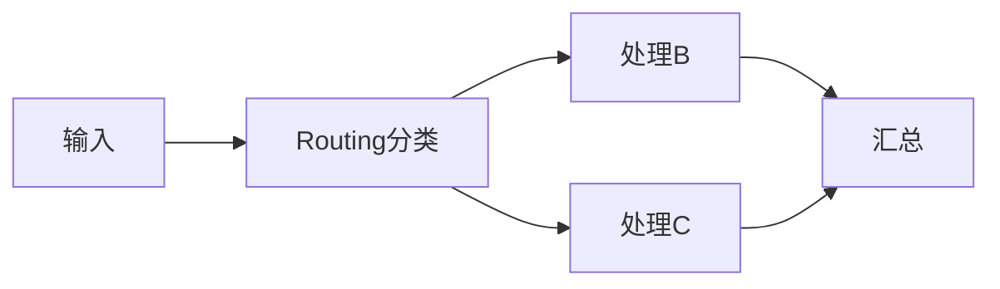
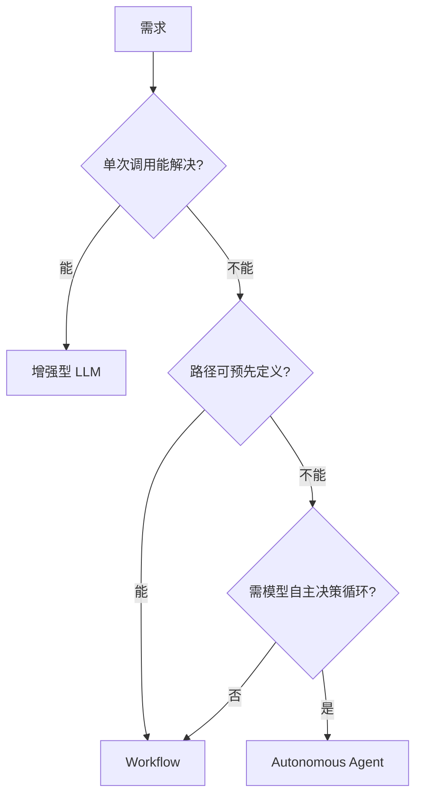

# ⚖️ Workflow vs Agent（Anthropic 官方准则）

> 这是避免"为了 Agent 而 Agent"的最重要一页。依据 Anthropic 官方工程博客 **《Building Effective Agents》**（2024-12）。核心结论：**大多数情况下，你不需要 Agent。**

来源：[anthropic.com/engineering/building-effective-agents](https://www.anthropic.com/engineering/building-effective-agents)

> 📌 **适用版本 / 更新日期**：Anthropic《Building Effective Agents》准则（2024-12 发布，范式稳定）；最后更新 **2026-08**。

---

## 1. 官方核心框架：复杂度逐级上升

Anthropic 把 LLM 应用按复杂度分为：

```
增强型 LLM（单次调用 + 工具）
      ↓
Workflow（预设路径的多步）
      ↓
Autonomous Agent（模型自主决策循环）
```

> 原文要点：**"The most successful implementations weren't using complex frameworks... they were using simple, composable patterns."** 最成功的实现并非用复杂框架，而是简单、可组合的模式。

!!! danger "最大误区（市面机构不说的真相）"
    培训课爱一上来教"智能体编排"，但官方明确：**多数产品用单次调用或 Workflow 就够了**。过早上 Agent = 不可控 + 成本高 + 难调试。先问："这一步真的需要模型自己决策吗？"

---

## 2. 增强型 LLM（80% 场景够了）

单次调用 + 工具（Function Calling）+ 检索（RAG）+ 记忆。没有"自主循环"，路径由你写死。

- 适用：客服问答、文档摘要、表单抽取、代码补全。
- 优势：可控、可预测、好测试、便宜。

!!! tip "先到这里"
    你做完 [模型 API 与流式响应](model-api-streaming.md) + [RAG](rag.md)，就已经能交付大部分"AI 应用"了。**别焦虑没学 Agent**。

---

## 3. Workflow（预设路径，Anthropic 列了 5 种）

官方定义的 5 类 Workflow 模式：

| Workflow | 说明 | 例子 |
|----------|------|------|
| **Prompt Chaining** | 一步步串起来，每步喂下一步 | 先提纲→再成文 |
| **Routing** | 先分类，再分给不同处理 | 投诉/咨询分流 |
| **Parallelization** | 同一任务多路并行再汇总 | 多视角评审 |
| **Orchestrator-Worker** | 一个调度者动态派子任务 | 改多个文件 |
| **Evaluator-Optimizer** | 生成→评估→再优化 | 代码自审循环 |



!!! warning "Workflow 的特征"
    路径**你预先定义**，模型在固定节点"填空"，不自由决策走向。这恰恰是它可控的原因。

---

## 4. Autonomous Agent（仅在必要时）

模型**运行时自主**决定步骤、调用工具、循环直到完成。适用：

- 开放性强、无法预知路径的任务（如"调研 X 并产出报告"）。
- 需要多轮工具交互、动态规划。

代价：不可完全预测、token 成本高、需强可观测（Tracing）、需护栏（Guardrail）。

!!! danger "何时才上 Agent（官方暗示）"
    只有当 **Workflow 写死路径会失效**（因为路径依赖运行时信息、无法事前穷举）时，才升级到 Agent。否则用 Workflow。

---

## 5. 决策流程图（照这个选）



!!! tip "落地顺序建议"
    1. 先用 **增强型 LLM**（单次 + RAG + Tool）做 MVP。
    2. 路径固定 → 升级 **Workflow**（Agents SDK / LangGraph 编排）。
    3. 真需要自主 → 才上 **Autonomous Agent**，并配齐 Tracing + Guardrail。

---

## 6. 为什么这条准则超越市面培训

市面机构为卖课，把"智能体"当万能银弹。官方（Anthropic/OpenAI 同源思路）反复强调：**简单模式优先、框架只是编排手段、成功靠可组合而非复杂**。

> 记住：**用户要的是"问题被解决"，不是"用没用 Agent"。** 用最简单能交付的方案，是工程师成熟度标志。

---

## 7. 下一步

- 动手搭 Workflow/Agent → [实战：从0搭 AI Agent](project-ai-agent.md)
- 学路线与 JD → [学习路线](learning-roadmap.md)
