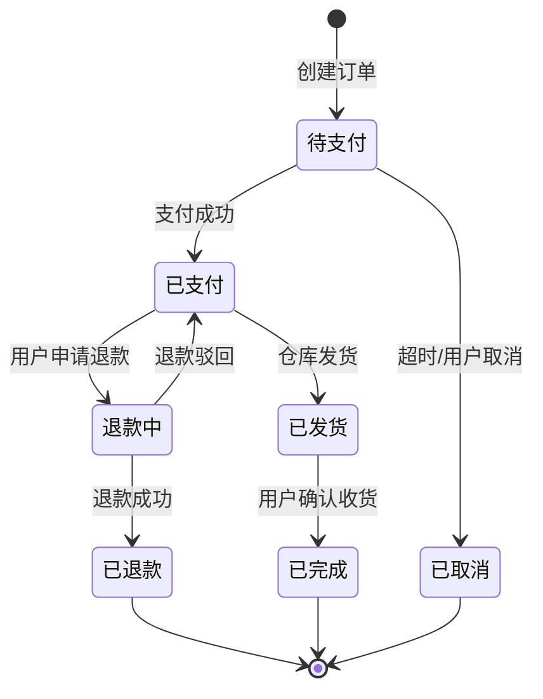
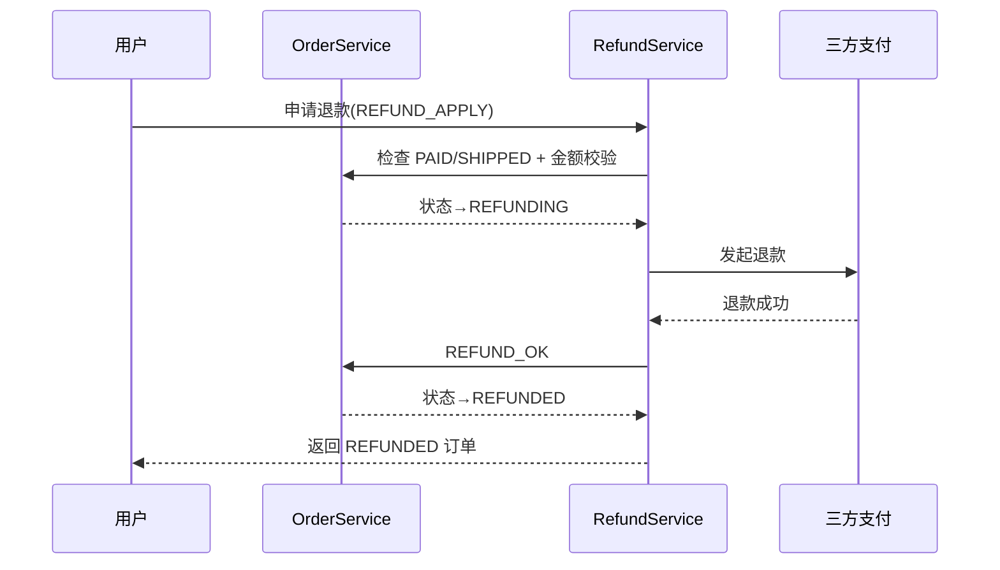

# 🧩 业务建模实战（实体 / 状态机 / API 设计）

> 大多数人"会写接口，但写不出好业务"。本章不教框架，而是教你把**真实业务**翻译成**可落地的后端结构**：怎么拆实体、怎么画状态机、怎么从状态机推导出 API、怎么避免常见的建模灾难。这是从"能跑"到"能维护、能扩展"的分水岭。

---

## 1. 为什么需要业务建模


!!! danger "不做建模直接开写的典型灾难"
    - 所有字段塞进一张 `order` 表，退款、物流、发票全用 `status` 字符串硬拼，后期改不动。
    - 把"购物车""订单""支付"混成一个 Service，一个方法 800 行。
    - 用 `if (status === 'xxx')` 散落全代码库，状态一多就出 bug。
    - 前端一个需求改 3 张表，因为实体边界没划清。

**一句话**：建模决定你的代码能撑多久。技术栈随便换，业务结构换不了。

---

## 2. 第一步：识别实体（名词驱动）

需求里凡是**可以被独立描述、有生命周期、需要被查询**的名词，大概率是实体。

!!! tip "识别口诀"
    拿需求一段话，圈出所有"东西"：
    - 用户、订单、商品、购物车、优惠券、退款单、物流单、发票 —— 这些都可能是实体。
    - 而"下单""支付"是**动作（用例）**，不是实体，动作会**改变实体的状态**。

以"电商订单 + 退款"为例，识别出的核心实体：

| 实体 | 说明 | 关键属性（初稿） |
|------|------|------------------|
| User | 用户 | id, name, phone |
| Product | 商品 | id, title, price, stock |
| Order | 订单 | id, userId, amount, status |
| OrderItem | 订单项 | id, orderId, productId, qty, price |
| Refund | 退款单 | id, orderId, amount, reason, status |
| Payment | 支付记录 | id, orderId, channel, paidAt |

!!! warning "别把值对象当实体"
    `OrderItem` 的 `price` 是下单时快照，**不要**实时去 `Product` 查——否则商品改价，历史订单金额就乱了。值对象（金额、地址）应**内嵌快照**，实体才独立建表。

---

## 3. 第二步：画状态机（业务的灵魂）

状态机 = **状态（State）** + **事件（Event）** + **转移（Transition）** + **守卫（Guard）**。

### 3.1 订单状态机



!!! danger "状态机三大坑"
    1. **漏状态**：忘了"退款中"这种中间态，导致退款流程只能用 `status` 字符串硬塞，并发就乱。
    2. **状态可回流错误**：允许 `已完成` 直接跳 `待支付`，数据被污染。转移必须枚举白名单。
    3. **事件与状态耦合**：在 Controller 里写 `if (status==='待支付')` 做转移，规则散落。应集中到状态机/领域服务。

### 3.2 把状态机落成代码（NestJS 示例）

不要散落 if，用**显式转移表**集中管理：

```ts
// order.state.ts
export type OrderStatus =
  | 'PENDING'      // 待支付
  | 'PAID'         // 已支付
  | 'SHIPPED'      // 已发货
  | 'COMPLETED'    // 已完成
  | 'CANCELLED'    // 已取消
  | 'REFUNDING'    // 退款中
  | 'REFUNDED';    // 已退款

// 事件 → 允许的目标状态（白名单）
const TRANSITIONS: Record<OrderStatus, Partial<Record<OrderEvent, OrderStatus>>> = {
  PENDING:   { PAY: 'PAID', CANCEL: 'CANCELLED' },
  PAID:      { SHIP: 'SHIPPED', REFUND_APPLY: 'REFUNDING' },
  SHIPPED:   { CONFIRM: 'COMPLETED' },
  REFUNDING: { REFUND_OK: 'REFUNDED', REFUND_REJECT: 'PAID' },
  // 终态不接受任何转移
  COMPLETED: {}, CANCELLED: {}, REFUNDED: {},
};

export function nextStatus(
  current: OrderStatus,
  event: OrderEvent,
): OrderStatus {
  const target = TRANSITIONS[current]?.[event];
  if (!target) {
    throw new BadRequestException(
      `非法状态转移: ${current} --${event}--> ?`,
    );
  }
  return target;
}
```

!!! tip "好处"
    - 所有合法转移集中一处，Code Review 一眼看全。
    - 非法转移直接抛错，比线上脏数据好查一万倍。
    - 加状态只改这张表，不碰业务代码。

---

## 4. 第三步：从状态机推导 API

**每个"事件"基本对应一个写接口**，每个"状态查询"对应一个读接口。

| 事件 | 接口 | 方法 | 守卫（Guard） |
|------|------|------|---------------|
| 创建订单 | `POST /orders` | 写 | 登录、库存校验 |
| 支付成功 | `POST /orders/:id/pay` | 写 | 幂等（订单号去重） |
| 取消 | `POST /orders/:id/cancel` | 写 | 仅本人 + 仅 PENDING |
| 发货 | `POST /orders/:id/ship` | 写 | 仅后台 + 仅 PAID |
| 申请退款 | `POST /orders/:id/refund` | 写 | 仅本人 + 仅 PAID/SHIPPED |
| 查询 | `GET /orders/:id` | 读 | 仅本人或后台 |

!!! warning "API 设计三原则"
    1. **动词即事件**：URL 用名词（资源），动作由 HTTP 方法 / 子资源表达，别写 `POST /orders/cancelOrder` 这种伪 RESTful。
    2. **幂等优先**：支付、退款这类接口必须可重试（用业务单号做去重键），否则网络抖动就重复扣款。
    3. **返回新状态**：写接口返回转移后的实体，前端无需再猜状态。

---

## 5. 第四步：落地表结构与服务边界

### 5.1 表结构（从实体 + 值对象映射）

```sql
-- 订单（聚合根）
CREATE TABLE orders (
  id          BIGINT PRIMARY KEY,
  user_id     BIGINT NOT NULL,
  amount      DECIMAL(10,2) NOT NULL,   -- 快照总额
  status      VARCHAR(20) NOT NULL,     -- 来自状态机白名单
  created_at  TIMESTAMP DEFAULT NOW()
);

-- 订单项（值对象快照，依附订单）
CREATE TABLE order_items (
  id         BIGINT PRIMARY KEY,
  order_id   BIGINT NOT NULL REFERENCES orders(id),
  product_id BIGINT NOT NULL,
  title      VARCHAR(200) NOT NULL,     -- 下单时商品名快照
  price      DECIMAL(10,2) NOT NULL,    -- 下单时单价快照
  qty        INT NOT NULL
);

-- 退款单（独立实体，生命周期独立于订单）
CREATE TABLE refunds (
  id         BIGINT PRIMARY KEY,
  order_id   BIGINT NOT NULL REFERENCES orders(id),
  amount     DECIMAL(10,2) NOT NULL,
  reason     VARCHAR(500),
  status     VARCHAR(20) NOT NULL
);
```

!!! danger "快照陷阱"
    退款金额必须基于 `order_items` 的**快照价**，绝不能 `JOIN products` 实时算。商品改价后，老订单退款会算错。

### 5.2 服务边界（防止 800 行大杂烩）

```text
OrderModule
 ├─ OrderService        # 订单状态机转移、创建
 ├─ OrderItemService    # 订单项快照
RefundModule
 ├─ RefundService       # 退款单生命周期，调用 OrderService 触发 REFUND_APPLY
PaymentModule
 ├─ PaymentService      # 对接三方支付，成功后发事件 → OrderService 处理 PAY
```

!!! tip "聚合根思维"
    `Order` 是聚合根，`OrderItem` 不能脱离 `Order` 被外部直接改。外部只能通过 `OrderService` 的方法间接改，保证不变式（如"订单取消后不能加商品"）不被破坏。

---

## 6. 综合案例：退款全流程串讲



要点：
- 退款金额、状态转移全部走 `OrderService` 白名单，外部无法绕过。
- 三方支付回调用 **订单号幂等**，重复回调不会重复退款。
- 每一步状态变更最好落 **事件/审计日志**，出问题能复盘（见[可观测性](observability.md)）。

---

## 7. 自查清单

- [ ] 需求里的名词是否都拆成了实体 / 值对象？
- [ ] 核心实体是否画了状态机？状态转移是否有白名单？
- [ ] 写接口是否对应状态机事件，且幂等？
- [ ] 金额 / 名称等是否做了下单快照？
- [ ] 服务是否按聚合根划分，避免超大 Service？
- [ ] 非法状态转移是否能编译/运行期报错，而不是脏数据？

> 建模能力是区分"初级 CRUD 工"和"能扛项目的人"的关键。下一站 → [实战：从 0 搭完整博客 API](project-blog-api.md) 把建模 + 框架一起用起来；项目做大了怎么演进 → [从 MVP 到生产](mvp-to-production.md)。
