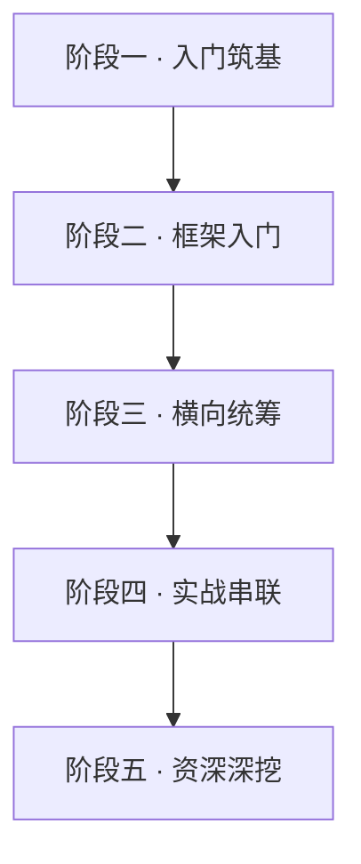

# 🖥️ 后端 / 服务端 · 学习路线总览

> 面向前端同学的全栈后端指南：Node.js 运行时 + NestJS 企业级框架。本专题按**最佳学习路线**分五个阶段组织，从运行机制 → 框架上手 → 架构统筹 → 实战串联 → 资深深挖，逐层递进。依据 **[Node.js 官方文档](https://nodejs.org/docs/latest/api/)**、**[NestJS 官方文档](https://docs.nestjs.com/)**。

---

## 🗺️ 最佳学习路线（照这个顺序读）



| 阶段 | 目标 | 学完你能 |
|------|------|----------|
| **一 · 入门筑基** | 看懂术语、搞懂 Node 运行机制 | 理解事件循环、Module、Buffer，不写低级 bug |
| **二 · 框架入门** | 用 NestJS 写出规范接口 | 独立写 Controller/Service/鉴权/缓存 |
| **三 · 横向统筹** | 建立架构心智 + 建模能力 | 设计项目结构、拆实体、画状态机 |
| **四 · 实战串联** | 做出完整可运行项目 | 从 0 到上线一个博客 API + 演进规划 |
| **五 · 资深深挖** | 扛住性能 / 规模 / 安全 | 调优、分布式、可观测、安全审计 |

!!! tip "建议路径"
    **零基础**：一 → 二 → 三 → 四（做到这步已能开发完整后端项目 MVP）。
    **想进阶资深**：继续五，并按需回看三/四。
    **赶时间**：先读[术语](terminology.md) + [实战博客 API](project-blog-api.md)，过程中缺哪补哪。

---

## 阶段一 · 入门筑基（所有人先读）

- **[后端核心术语（专业词汇速查）](terminology.md)**：28 个核心术语，从运行时、事件循环到鉴权、微服务，一看就懂、带避坑提示，统筹整个后端核心内容地图。⭐ 必读起点
- **[Node.js 基础](nodejs-basic.md)**：全局对象、模块（CJS/ESM）、`fs`、`path`、`events`、`Buffer`、`stream` 基础 API。
- **[Node.js 高级](nodejs-advanced.md)**：`http` 服务、事件循环阶段、`cluster`/`worker_threads`、`crypto`、错误处理。

## 阶段二 · 框架入门（上手 NestJS）

- **[NestJS 基础](nestjs-basic.md)**：模块/控制器/服务、路由、DTO、Provider 注入、生命周期。
- **[NestJS 高级](nestjs-advanced.md)**：管道、守卫、拦截器、异常过滤器、中间件、自定义装饰器、执行顺序。
- **[Node.js 进阶](nodejs-pro.md)**：Express/Koa、ORM、鉴权、校验、日志、测试、限流、部署。
- **[NestJS 进阶](nestjs-pro.md)**：数据库、JWT 鉴权、Redis 缓存、队列、微服务、WebSocket、配置、测试、部署。

## 阶段三 · 横向统筹（建立架构心智）

- **[后端架构模式（单体到微服务）](architecture.md)**：分层 / REST / 单体 vs 微服务 / 消息驱动，避免"会写接口不懂搭项目"。
- **[Node 最佳实践与反模式](best-practices.md)**：避坑大全 + 自查清单（goldbergyoni / 12-Factor / OWASP），适合 Code Review。
- **[部署与运维实战](deploy-ops.md)**：Docker / Nginx / CI-CD / 日志监控 / 优雅退出 / 事故速查，统筹从代码到上线全流程。
- **[业务建模实战（实体/状态机/API 设计）](domain-modeling.md)**：用订单退款案例讲清怎么拆实体、画状态机、推导 API、落表结构，是"能跑"到"能维护"的分水岭。⭐ 强烈推荐

## 阶段四 · 实战串联（做出完整项目）

- **[实战：从 0 搭完整博客 API](project-blog-api.md)**：用户+JWT+博客 CRUD+校验+缓存+限流，把前几阶段串成一个可运行项目。⭐ 最有价值
- **[从 MVP 到生产：项目演进路线](mvp-to-production.md)**：按数据量/流量节奏决策，告诉你什么阶段该上什么优化，避免提前或滞后优化。

## 阶段五 · 资深深挖（高级 → 资深）

- **[性能调优专题](performance-tuning.md)**：事件循环延迟 / 内存泄漏 / CPU profiling / 慢查询，诊断与优化。
- **[数据库进阶专题](db-advanced.md)**：索引优化 / 事务隔离 / 连接池 / 读写分离 / 分库分表。
- **[分布式与高并发专题](distributed.md)**：限流算法 / 分布式锁 / 熔断降级 / 幂等 / 缓存一致性 / 分布式事务。
- **[可观测性落地](observability.md)**：Logs / Metrics / Tracing（OpenTelemetry + Prometheus），事故定位闭环。
- **[TypeScript 深度专题](typescript-deep.md)**：装饰器原理 / tsconfig 关键项 / 泛型 / 类型体操 / TS 与运行时。
- **[测试体系深化专题](testing-deep.md)**：测试金字塔 / 单测 / 集成 / e2e / Mock 边界 / CI 门禁。
- **[后端安全专项深化](security-backend.md)**：OWASP Top 10 落地 / 密钥管理 / 审计日志 / 渗透防护清单。

---

## 一次请求在后端怎么走

```
浏览器/前端
  │  HTTP 请求
  ▼
反向代理(Nginx) ── TLS / 限流 / 转发
  ▼
Node 进程 (Express / Nest)
  ├─ Middleware → Guard → Interceptor → Pipe → Controller → Service
  ├─ 校验 / 鉴权 / 日志 / 异常过滤
  ▼
数据库 / 缓存(Redis) / 队列(BullMQ)
  ▼
JSON 响应 → 前端
```

---

## 技术选型建议

| 场景 | 推荐 |
|------|------|
| 快速原型 / 小服务 | Express + Prisma |
| 中大型 / 团队协作 | NestJS + TypeORM/Prisma |
| 高并发 I/O | Node + 连接池 + 缓存 |
| CPU 密集 | worker_threads / 拆微服务 |
| 实时 | WebSocket Gateway |

---

## 与前端安全的衔接

- 后端是 CORS、CSP、CSRF Token、鉴权、越权防护、依赖审计的**责任主体**，详见 [前端安全全集](../security/index.md)。
- 前端请求后端的最佳实践见 [给后端的前端速通](../basics/backend-to-frontend.md)。

---

## 下一步

- 零基础从这里开始 → [后端核心术语](terminology.md)。
- 想先看前端怎么和后端协作 → [给后端的前端速通](../basics/backend-to-frontend.md)。
- 想了解前端侧的接口/联调 → [前端 + AI 专题](../ai-frontend/index.md)。
