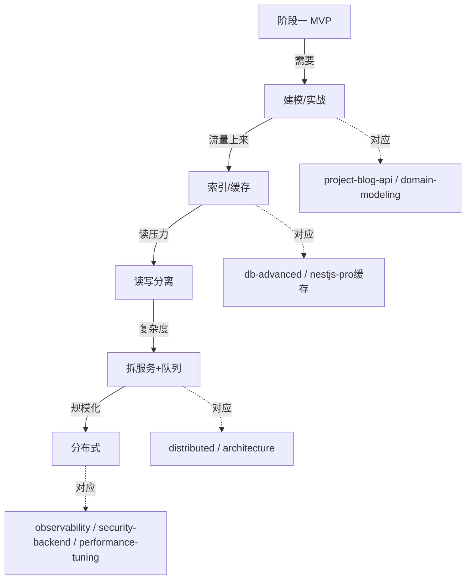

# 🚀 从 MVP 到生产：项目演进路线

> 学完[实战博客 API](project-blog-api.md)和[业务建模](domain-modeling.md)后，你已经有了一个能跑的 MVP。但"能跑"和"扛得住"之间差着一条演进路线。本章不讲具体配置，而是给你一张**按数据量 / 流量节奏决策**的演进地图：**什么阶段该上什么优化，过早和过晚都是坑**。

---

## 1. 演进总览：五个阶段


!!! tip "核心心法"
    **不要提前优化，也不要滞后优化。**
    - 提前：MVP 就上微服务，80% 精力耗在运维，业务没验证就死了。
    - 滞后：日活 10 万还单机单库，一次慢查询拖垮全站。
    - 正确姿势：**看指标触发**，不是看教程触发。

---

## 2. 阶段一：MVP 单体（0 → 1 万用户）

**目标**：最快验证业务，能跑就行。

```text
单 Node 进程 + 单 PostgreSQL + 单 Redis（可选）
```

- 所有表在一库，所有逻辑在一应用。
- 部署：[ Docker 单机 ](deploy-ops.md) + Nginx 反代。
- 重点：把[业务建模](domain-modeling.md)做对，结构清晰比性能重要。

!!! danger "MVP 别做的事"
    - 别上微服务、别分库分表、别搞事件总线。
    - 别为"未来可能"加抽象层，YAGNI（You Aren't Gonna Need It）。

!!! warning "MVP 必须做的事"
    - 接口幂等（支付/退款）。
    - 基础日志 + 错误监控（见[可观测性](observability.md)入门）。
    - 数据库**至少加正确索引**（下面阶段二）。

---

## 3. 阶段二：加缓存 + 索引（1 万 → 10 万用户）

**触发信号**：CPU 正常但 DB 连接数打满 / 慢查询变多 / 重复读压力大。

### 3.1 加索引（零成本最大收益）

```sql
-- 先找慢查询
EXPLAIN ANALYZE SELECT * FROM orders WHERE user_id = 123 ORDER BY created_at DESC;
-- 加复合索引
CREATE INDEX idx_orders_user_created ON orders(user_id, created_at DESC);
```

!!! danger "索引三坑（详见[数据库进阶](db-advanced.md)）"
    - 在**函数上建索引**失效：`WHERE DATE(created_at)=...` 用不上索引。
    - 索引过多拖慢写入，按真实查询建。
    - 联合索引顺序错：区分度高的放前面。

### 3.2 加缓存（Redis）

- 读多写少的热点（用户信息、配置、榜单）进 Redis。
- **缓存三灾难**：穿透 / 击穿 / 雪崩（见[NestJS 进阶](nestjs-pro.md)缓存章 + [数据库进阶](db-advanced.md)）。

!!! tip "何时上缓存"
    只有**同一数据被高频重复读**才值得。冷数据缓存只是增加一致性的麻烦。

---

## 4. 阶段三：读写分离 + 连接池（10 万 → 100 万用户）

**触发信号**：主库写压力尚可，但读请求把连接吃满；或报表类查询拖慢主库。

- **连接池**：Node 侧用 `pggbouncer` / TypeORM 连接池，避免每次建连（详见[数据库进阶](db-advanced.md)）。
- **读写分离**：写走主库，读走从库（一主一从起步）。
- **注意复制延迟**：刚写入立刻读可能读不到（从库延迟），关键路径（如支付后查余额）强制走主库。

!!! warning "别过早分库分表"
    读写分离能扛的量级很大，分库分表是最后手段，运维成本指数级上升。

---

## 5. 阶段四：拆服务 + 消息队列（100 万+ 或业务复杂）

**触发信号**：单体改一个模块要全量发版；某功能 CPU 密集拖垮全局；团队按业务线扩张。

- 按[业务建模](domain-modeling.md)的聚合根边界拆服务（订单服务 / 用户服务 / 支付服务）。
- 异步解耦：发邮件、记日志、统计 → 丢进消息队列（BullMQ / Kafka），主流程不等待。
- 引入[分布式与高并发](distributed.md)能力：分布式锁、幂等、熔断降级。

!!! danger "拆服务前的 prerequisites"
    没有[可观测性](observability.md)（链路追踪）不要拆微服务——否则一个请求跨 5 个服务，出问题你根本不知道卡哪。

---

## 6. 阶段五：分布式 / 高可用（规模化 / 多地域）

**触发信号**：单机房故障不可接受；跨区域用户延迟高；数据量触达单机上限。

- 多副本 + 负载均衡，消除单点。
- 数据库[分库分表](db-advanced.md)（按用户 ID 哈希）。
- 限流 / 熔断 / 降级常态化（见[分布式专题](distributed.md)）。
- 全链路[可观测性](observability.md) + [安全深化](security-backend.md)。

---

## 7. 决策速查表

| 现象 | 该做的下一步 | 别做的 |
|------|--------------|--------|
| 慢查询多 | 加索引 / 优化 SQL | 直接上缓存 |
| 连接数打满 | 连接池 / 读写分离 | 加机器堆进程 |
| 读压力大 | Redis 缓存热点 | 分库分表 |
| 发布互相影响 | 按聚合根拆服务 | 继续加 if 分支 |
| 跨服务难排查 | 上链路追踪 | 靠猜 + 加日志 |
| 单机房风险 | 多副本 + 限流熔断 | 一上来就多活 |

---

## 8. 演进路线与学习顺序呼应



> 记住：演进是**响应式**的，不是**预习式**的。先把 MVP 做对，看指标说话，再决定下一步。这也正是本专题"先筑基 → 框架 → 统筹 → 实战 → 资深深挖"路线的现实映射。
