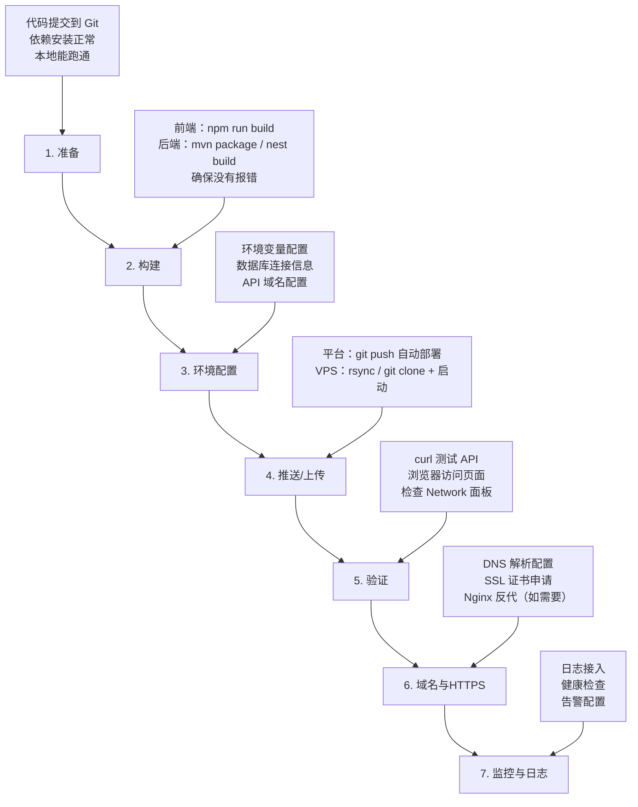

# 部署总览：把你的项目放到公网

> 面向所有学习者：无论你用的是 Vue/React/Nuxt/Next.js 做前端，还是 Node.js/NestJS/Java 做后端，本系列帮你**从 0 到 1 把项目部署上线**。

---

## 一、部署是什么

部署 = 把本地能跑的项目放到一台**公网可访问的服务器**上，让任何人都能通过域名或 IP 打开你的网站。


---

## 二、你的项目属于哪种

| 类型 | 技术栈举例 | 部署指南 |
|------|-----------|---------|
| 纯前端静态站点 | Vue / React（纯 SPA）、纯 HTML | [前端部署指南](frontend.md) |
| Node.js 后端 API | Express / Koa / Fastify | [Node.js 后端部署](backend-node.md) |
| NestJS 后端 API | NestJS + TypeORM/Prisma | [NestJS 后端部署](backend-nestjs.md) |
| Java 后端 API | Spring Boot + Maven/Gradle | [Java Spring Boot 部署](backend-java.md) |
| 前后端分离项目 | Vue + Express / React + NestJS / Vue + Spring Boot | [全栈组合部署方案](fullstack-combinations.md) |
| SSR 全栈框架 | Next.js / Nuxt 3 | 见下方"SSR 框架部署" |
| 静态博客站点 | VitePress / Hugo / Hexo | [前端部署指南](frontend.md) |

---

## 三、部署平台选型速查

### 3.1 托管平台（托管服务器）

**适合：纯前端 / SSR 全栈 / 不想管服务器的新人**

| 平台 | 适合 | 免费额度 | 特点 |
|------|------|----------|------|
| **Vercel** | 前端 / Next.js / SvelteKit | ✅ 慷慨 | 自动部署、自带 CDN、Serverless Functions |
| **Netlify** | 前端 / 静态站点 | ✅ 慷慨 | 表单处理、Functions、分支预览 |
| **Cloudflare Pages** | 前端 / 静态站点 | ✅ 非常慷慨 | 全球 CDN、Worker Functions |
| **GitHub Pages** | 纯静态站点 | ✅ 免费 | 直接关联 GitHub 仓库 |
| **Railway** | 前后端均可 | ⚠️ 试用额度 | Dockerfile / 一键部署 |
| **Render** | 前后端均可 | ⚠️ 有限 | Web Service + Static Site |

### 3.2 云服务器（自己掌控）

**适合：需要完全控制、有复杂后端、企业级项目**

| 提供商 | 特点 | 最低月费（参考） |
|--------|------|:--:|
| 阿里云 ECS | 国内首选、生态全 | ~50 元 |
| 腾讯云 Lighthouse | 轻量、适合个人项目 | ~50 元 |
| AWS EC2 / Lightsail | 全球节点、免费套餐 12 个月 | ~$3.5 |
| Azure | 学生免费额度 | ~$15 |
| 华为云 | 国内节点 | ~50 元 |

---

## 四、部署安全清单（所有项目必看）

无论用哪种方式部署，上线前必须检查以下项目：

### 4.1 前后端通用安全

| 检查项 | 说明 | 对应文档 |
|--------|------|---------|
| HTTPS | 强制使用 HTTPS，不允许 HTTP 明文 | [HTTPS 与传输安全](../security/https.md) |
| 环境变量 | API key、数据库密码等敏感信息不进代码仓库，走 `.env` + 平台环境变量 | [环境变量](../engineering/docs-and-env/index.md) |
| CORS 白名单 | 后端只允许已知域名跨域访问，不能用 `*` | [CORS 跨域资源共享](../security/cors.md) |
| CSP 头 | 防止 XSS，限制页面可加载的资源来源 | [CSP 内容安全策略](../security/csp.md) |
| 依赖审计 | `npm audit` / `mvn dependency-check` 检查已知漏洞 | [供应链安全](../security/supply-chain.md) |
| 速率限制 | API 限制单 IP 请求频率，防刷防 DDoS | 各后端部署指南含限流配置 |

### 4.2 前端额外安全

| 检查项 | 说明 |
|--------|------|
| 敏感信息不打包 | 确认 API key、token 没有硬编码到前端代码 |
| 生产环境不要 `console.log` | Vite/Webpack 自动剔除（视配置） |
| 构建产物检查 | 确保 `.map` sourcemap 不上传生产（或限制内网访问） |
| 安全头配置 | `X-Frame-Options`、`X-Content-Type-Options`、`Referrer-Policy` |

### 4.3 后端额外安全

| 检查项 | 说明 |
|--------|------|
| 数据库密码强度 | 不用默认密码、不用弱密码 |
| 数据库白名单 | 只允许应用服务器 IP 连接数据库 |
| SSH 密钥登录 | 禁止密码登录服务器 |
| 防火墙规则 | 只开放必要端口（80/443），其他端口不对外 |
| SQL 注入防护 | ORM 参数化查询，禁止拼接 SQL |
| 日志脱敏 | 用户密码、身份证等敏感信息不记日志 |

---

## 五、部署流程（无论什么技术栈都遵循此流程）



---

## 六、常见部署错误速查

| 现象 | 可能原因 | 解决思路 |
|------|---------|---------|
| 页面空白 / JS 报错 | 静态资源路径不对（`/` vs `./`） | 配置 `base`（Vite）/ `homepage`（CRA） |
| API 请求 404 | Nginx 没配置 API 代理 | 在 Nginx 中添加 `proxy_pass` |
| CORS 报错 | 后端未配置允许跨域 | 设置 CORS 白名单，不可以用 `*` |
| `npm install` 慢/失败 | 镜像源没配 | `npm config set registry https://registry.npmmirror.com` |
| 502 / 504 | 后端应用未启动或挂了 | 查看进程状态、查看日志 |
| 数据库连不上 | IP 白名单限制 | 在数据库安全组中放行应用服务器 IP |
| SSL 证书过期 | Let's Encrypt 证书 90 天有效期 | 配置自动续期 `certbot renew` 或使用平台自带 SSL |
| 内存泄漏 OOM | 应用内存持续增长 | 检查未关闭的连接、大量缓存、内存泄漏 |

---

## 七、选择你的部署路径

```
                                你的项目
                                    │
                    ┌───────────────┼───────────────┐
                    ▼               ▼               ▼
              纯前端静态站点      后端 API 服务      全栈 SSR 框架
              (Vue/React)      (Node/Nest/Java)   (Next/Nuxt)
                    │               │               │
         ┌─────────┼──────┐   ┌────┼────┐     ┌────┼────┐
         ▼         ▼      ▼   ▼    ▼    ▼     ▼    ▼
      Vercel   Netlify  Nginx VPS K8s Vercel Vercel VPS
                    │               │               │
                    └───────────────┼───────────────┘
                                    ▼
                            [前端部署指南]
                            [后端部署指南]
                            [全栈组合方案]
```

---

> **下一步**：选择你的场景
> - 纯前端 → [前端部署指南](frontend.md)
> - 后端 API → [Node.js 后端部署](backend-node.md) | [NestJS 后端部署](backend-nestjs.md) | [Java 后端部署](backend-java.md)
> - 前后端分离 → [全栈组合部署方案](fullstack-combinations.md)
> - 安全相关 → [安全与性能](../security/index.md)
