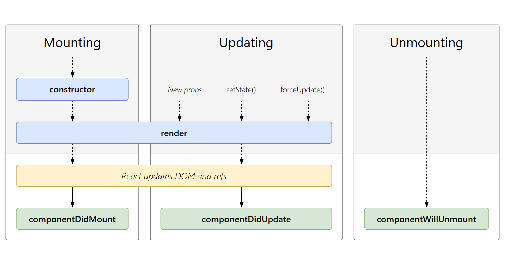

# 🧱 组件 · 通信 · 生命周期

> 组件是"可复用的 UI 单元"。本节对比三框架在 **Props 传入、事件回传、双向绑定、插槽/children、跨层传递、生命周期** 上的写法与差异。

---

## 一、基础：定义与注册组件

=== "Vue 3（SFC）"
    ```html
    <!-- Child.vue -->
    <script setup>
    const props = defineProps({ title: String })
    </script>
    <template><h3>{{ title }}</h3></template>
    ```

=== "Vue 2"
    ```html
    <script>
    export default {
      props: { title: String }
    }
    </script>
    <template><h3>{{ title }}</h3></template>
    ```

=== "React"
    ```jsx
    export function Child({ title }) {
      return <h3>{title}</h3>
    }
    ```

---

## 二、核心：父传子（Props）与子传父（事件）

=== "Vue 3"
    ```html
    <!-- 父 -->
    <Child :count="count" @change="count = $event" />
    <script setup>
    const count = ref(0)
    </script>

    <!-- 子 -->
    <script setup>
    const props = defineProps(['count'])
    const emit = defineEmits(['change'])
    </script>
    <template>
      <button @click="emit('change', props.count - 1)">-</button>
    </template>
    ```

=== "Vue 2"
    ```html
    <!-- 父 -->
    <Child :count="count" @change="count = $event" />
    <!-- 子 -->
    <script>
    export default {
      props: ['count'],
      methods: { dec() { this.$emit('change', this.count - 1) } }
    }
    </script>
    <template><button @click="dec">-</button></template>
    ```

=== "React"
    ```jsx
    // 父
    function Parent() {
      const [count, setCount] = useState(0)
      return <Child count={count} onChange={setCount} />
    }
    // 子：通过 props 回调把新值"还"给父
    function Child({ count, onChange }) {
      return <button onClick={() => onChange(count - 1)}>-</button>
    }
    ```

!!! info "范式差异"
    - **Vue** 把"子→父"做成**显式事件**（`emit`），语义清晰、可追踪。
    - **React** 没有"事件"概念，子组件通过**父传下来的回调函数**（`onChange`）把数据推回去——本质一样，只是形式不同。

---

## 三、核心：双向绑定（v-model vs 受控组件）

=== "Vue 3（v-model）"
    ```html
    <Input v-model="name" />
    <!-- 子组件 -->
    <script setup>
    const props = defineProps(['modelValue'])
    const emit = defineEmits(['update:modelValue'])
    </script>
    <template>
      <input :value="props.modelValue"
             @input="emit('update:modelValue', $event.target.value)" />
    </template>
    ```

=== "React（受控组件）"
    ```jsx
    function Input({ value, onChange }) {
      return <input value={value}
                    onChange={e => onChange(e.target.value)} />
    }
    // 使用：<Input value={name} onChange={setName} />
    ```

!!! abstract "本质一致"
    `v-model` 就是 `:value` + `@input` 的语法糖；React 受控组件就是**"值 + onChange"** 的显式写法。Vue 帮你藏了细节，React 让你手写每一步（更可控，也更易出错）。

---

## 四、核心：插槽 / Children（内容分发）

=== "Vue 3（slots）"
    ```html
    <!-- 父 -->
    <Card><template #header>标题</template>正文</Card>
    <!-- 子 -->
    <template>
      <header><slot name="header" /></header>
      <main><slot /></main>
    </template>
    ```

=== "React（children / props）"
    ```jsx
    function Card({ header, children }) {
      return <div><header>{header}</header><main>{children}</main></div>
    }
    // 使用：<Card header="标题">正文</Card>
    ```

---

## 五、高级：跨层传递（避免 prop drilling）

=== "Vue（provide / inject）"
    ```js
    // 祖先
    provide('theme', ref('dark'))
    // 后代（任意深层）
    const theme = inject('theme')
    ```

=== "React（Context）"
    ```jsx
    const ThemeCtx = createContext('dark')
    // 祖先
    <ThemeCtx.Provider value="dark">{children}</ThemeCtx.Provider>
    // 后代
    const theme = useContext(ThemeCtx)
    ```

!!! warning "两者共性陷阱"
    跨层状态变化都会让**所有消费组件重渲染**。React 可用 `useMemo`/拆分 Context 优化；Vue 3 可把 `provide` 的值设为 `ref`/`reactive` 以精准追踪。

---

## 六、核心：生命周期对照

> 生命周期描述「组件从创建 → 挂载 → 更新 → 卸载」的完整过程。三框架的**阶段顺序一致**，但**命名与 API 风格不同**：Vue 2/3 用「钩子函数」，React 类组件用「生命周期方法」，React 函数组件用 **Hooks（`useEffect`）+ 依赖数组**来描述「挂载/更新/卸载」。

### 6.1 生命周期钩子对照总表（官方级）

| 生命周期阶段 | Vue 2（Options） | Vue 3（Composition / Options） | React（类组件 / Hooks） |
|------|-------|-------|-------|
| 创建 / 初始化 | `beforeCreate` → `created` | `setup()`（取代 `beforeCreate`/`created`） | `constructor()` / 函数体执行；`useState` 初始化 |
| 挂载前 | `beforeMount` | `onBeforeMount` | `render()`、`getDerivedStateFromProps()` |
| 挂载完成（可访问 DOM） | `mounted` | `onMounted` | `componentDidMount` / `useEffect(fn, [])` |
| 更新前 | `beforeUpdate` | `onBeforeUpdate` | `shouldComponentUpdate`、`getDerivedStateFromProps` |
| 更新后 | `updated` | `onUpdated` | `componentDidUpdate` / `useEffect(fn, [deps])` |
| 卸载前 | `beforeDestroy` | `onBeforeUnmount` | `componentWillUnmount` / `useEffect` 清理函数 |
| 卸载后 | `destroyed` | `onUnmounted` | —（清理函数已执行，无对应钩子） |
| 缓存组件 激活 / 停用 | `activated` / `deactivated` | `onActivated` / `onDeactivated` | —（`<KeepAlive>` 无直接对应） |
| 错误捕获 | `errorCaptured` | `onErrorCaptured` | `componentDidCatch` / `getDerivedStateFromError` |
| 派生状态 / 计算属性 | `computed` | `computed` | `getDerivedStateFromProps` / `useMemo` |
| 监听数据变化 | `watch` / `$watch` | `watch` / `watchEffect` | `useEffect(fn, [deps])` |
| 同步 DOM 副作用 | —（用 `updated` + `nextTick`） | `onUpdated` + `nextTick` | `useLayoutEffect`（提交后同步执行） |

!!! tip "三组关键差异"
    - **Vue 3 用 `setup()` 一次性替代了 `beforeCreate`/`created`**——响应式状态、计算、侦听、生命周期钩子都在 `setup` 内同步注册。
    - **Vue 2 的 `beforeDestroy` 在 Vue 3 中更名为 `beforeUnmount`**，`destroyed` → `unmounted`（语义更贴近「卸载」而非「销毁」）。
    - **React 没有显式的「更新后」钩子**，而是用 `useEffect(fn, [deps])`：依赖数组变化即代表「本次更新后」；`[]` 等价于「仅挂载后」；返回的清理函数等价于「卸载前 / 下次更新前」。

### 6.2 官方生命周期流程图对比

下面三张图均**直接取自各框架官方文档**（React 取其社区权威生命周期对照图），可对照查看同一「创建→挂载→更新→卸载」过程在三框架中的节点命名与走向。

#### Vue 3 官方生命周期图

{: style="max-width:440px" }

> 来源：[Vue 3 官方文档 · Lifecycle Hooks](https://vuejs.org/guide/essentials/lifecycle.html)

#### Vue 2 官方生命周期图

{: style="max-width:440px" }

> 来源：[Vue 2 官方文档 · The Vue Instance](https://v2.vuejs.org/v2/guide/instance.html)

#### React 官方生命周期图（类组件）

{: style="max-width:820px" }

> 来源：[React 生命周期方法对照图（wojtekmaj）](https://projects.wojtekmaj.pl/react-lifecycle-methods-diagram/)，React 社区广泛使用的权威对照图。

!!! note "React 生命周期：新版（Hooks）vs 旧版（类组件）"
    上图（wojtekmaj）是 **React 旧版（类组件）** 的生命周期方法全景；**React 新版（函数组件 + Hooks，自 16.8 引入，当前最新为 React 19）** 已无「生命周期方法」概念，改用 Hooks 描述同一过程：

    | 阶段 | 旧版（类组件方法） | 新版（函数组件 + Hooks） |
    |------|------|------|
    | 初始化 state | `constructor` / `this.state = {}` | `useState` / `useReducer` |
    | 派生状态 | `getDerivedStateFromProps` | 在渲染中直接计算 / `useMemo` |
    | 渲染 | `render()` | 函数组件返回值（JSX） |
    | 挂载后副作用 | `componentDidMount` | `useEffect(fn, [])` |
    | 是否重渲染 | `shouldComponentUpdate` | `React.memo` / 默认浅比较 |
    | 更新后副作用 | `componentDidUpdate` | `useEffect(fn, [deps])` |
    | DOM 提交后同步副作用 | `getSnapshotBeforeUpdate` / `componentDidUpdate` | `useLayoutEffect` |
    | 卸载前清理 | `componentWillUnmount` | `useEffect` **返回的清理函数** |
    | 错误边界 | `componentDidCatch` / `getDerivedStateFromError` | **仍只能用类组件**（Hooks 无等价 API） |

    - React 19 进一步强化 Hooks 模型：`use` 可在渲染中读 Promise/Context、`useOptimistic` 做乐观更新、`useActionState` / `useFormStatus` 简化表单与 Server Actions。
    - 结论：**新项目优先用函数组件 + Hooks**；错误边界或维护极老代码时才用类组件。

### 6.3 清理副作用（定时器 / 订阅）

!!! example "在卸载 / 下次更新前释放资源"
    === "Vue 3"
        ```js
        import { onMounted, onBeforeUnmount } from 'vue'
        let timer
        onMounted(() => { timer = setInterval(fn, 1000) })
        onBeforeUnmount(() => clearInterval(timer))
        ```
    === "React（Hooks）"
        ```jsx
        useEffect(() => {
          const timer = setInterval(fn, 1000)
          return () => clearInterval(timer) // 清理函数：卸载前 / 依赖变化前执行
        }, [])
        ```
    === "Vue 2"
        ```js
        export default {
          mounted() { this.timer = setInterval(fn, 1000) },
          beforeDestroy() { clearInterval(this.timer) }
        }
        ```

---

## 七、可运行 Demo（代码 + 实时预览）

### 7.1 待办列表（列表渲染 / 事件 / 表单绑定）

<iframe src="../../demos/compare-todo.html" width="100%" height="520" style="border:1px solid #2c5364;border-radius:8px"></iframe>

### 7.2 生命周期与副作用

<iframe src="../../demos/compare-lifecycle.html" width="100%" height="480" style="border:1px solid #2c5364;border-radius:8px"></iframe>

---

## 八、真实业务场景

!!! question "场景 A：Modal 弹窗（挂载/卸载 + 跨层关闭）"
    - Vue：用 `<Teleport to="body">` + `v-if` 控制挂载；关闭事件 `emit('close')`。
    - React：条件渲染 `{open && <Modal/>}`；关闭通过 `onClose` 回调。
    - 共性：都需在卸载时清理事件监听 / 定时器（见第六节清理函数）。

!!! question "场景 B：列表项删除（key 的重要性）"
    ```jsx
    // React：务必给稳定 key，否则 Diff 错位
    {list.map(item => <li key={item.id}>{item.text}</li>)}
    ```
    ```html
    <!-- Vue：同理 -->
    <li v-for="item in list" :key="item.id">{{ item.text }}</li>
    ```

!!! danger "踩坑清单"
    - **Vue2**：`props` 是单向数据流，子组件**不要直接改 props**（会警告）；要用 `data` 或 `computed` 拷贝。
    - **Vue3**：`defineProps` 返回的是只读代理，解构会丢失响应性 → 用 `toRefs(props)`。
    - **React**：`props` 变化但组件未重渲染？检查是否被 `React.memo` 包裹且引用未变；回调要用 `useCallback` 稳定。
    - **通用**：列表 `key` 不要用数组下标（重排会出错），用稳定唯一 id。

---

[← 上一节：响应式与状态](../reactivity/index.md)  ·  [下一节：高级模式与性能 →](../advanced/index.md)
