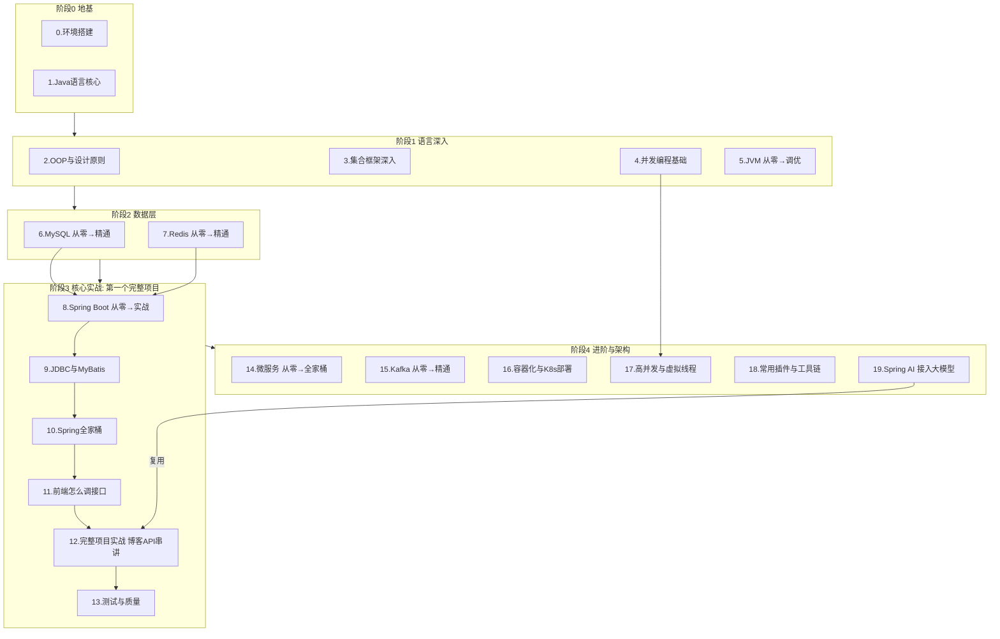

# ☕ Java 工程师 · 学习路线总览（0-1 到资深）

> 面向 **从零转行到资深** 的 Java 工程师完整路线。每一章都可独立阅读，且按"核心基础 → 进阶 → 资深/踩坑"递进，**对初级、初中级、高级、资深都有对应收获**。
> 全部资料以 **官方文档与官方社区** 为准：Oracle Java Docs、OpenJDK、Spring 官方、MySQL 官方、Redis 官方、Kafka 官方、Docker/Kubernetes 官方、Project Loom。不编造、不堆概念。
> 每篇都带"📌 适用版本"标注与"!!! 避坑"块，注重**可落地的开发注意事项与踩坑经验**。

!!! warning "本路线适用范围（先读）"
    - ✅ **主线受众**：想做 **Web 后端开发** 与 **AI 应用开发（Spring AI）** 的 Java 学习者，从完全没装过 JDK 到资深架构都覆盖。
    - ❌ **不含**：Android / 大数据（Flink·Spark）/ 桌面（Swing·JavaFX）等方向。这些方向用的 Java 技术栈与本路线（Spring Boot + MySQL + Redis + 微服务）差异很大，请勿直接套用，需另寻专项资料。
    - 📌 本知识库另有 [大前端全栈路线](../roadmap.md) 与 [面试板块](../interview/index.md)、[后端通用深度章](../backend/index.md)，可按需交叉阅读。

> 📌 **适用版本 / 更新日期**：Java 21（LTS）为主，覆盖 8/11/17 差异；最后更新 **2026-08**。

---

## 🗺️ 章节全景（5 大阶段 · 24 章，建议顺序）

> 重排逻辑：**地基 → 语言深入 → 数据层 → 核心实战（第一个完整项目） → 进阶架构**。
> 把每门技术的"从零"与"精通"两篇合并成连续阅读块，避免来回跳；把"Spring Boot 实战链路"整体前移，让 0-1 尽早跑通一个真项目；末尾补 **测试** 与 **Spring AI** 两块当前行业刚需。

| # | 章节 | 阶段 | 0-1 收获 | 资深收获 |
|---|------|------|----------|----------|
| — | **[专业术语速查（Java / Spring Boot / Spring AI）](glossary.md)** | 工具页 | 先对齐术语再学，少走弯路 | 术语对照/面试速记 |
| 0 | [环境搭建](setup-env.md) | 地基 | JDK/IDE/Maven 装好跑通 Hello World | 多版本管理/镜像/IDE 工程化配置 |
| 1 | [Java 语言核心](java-basics.md) | 地基 | 类型/字符串/OOP/集合/异常/Stream | 契约/不可变/record/反射/日期 API |
| 2 | [OOP 深入与设计原则](java-oop-design.md) | 语言深入 | 封装/继承/多态正确用法 | SOLID/设计模式/API 契约 |
| 3 | [集合框架深入](java-collections-deep.md) | 语言深入 | 扩容机制/遍历坑 | HashMap 红黑树/ConcurrentHashMap 源码 |
| 4 | [并发编程基础](java-concurrency.md) | 语言深入 | Thread/锁/线程池用法 | 锁升级/AQS/拒绝策略/CompletableFuture |
| 5 | [JVM（从零→调优）](jvm-basics.md) / [JVM](jvm.md) | 语言深入 | JVM 是什么/栈堆图/GC 直觉/内存结构 | G1/ZGC 调优、Arthas 排查、-Xmx 直觉 |
| 6 | [MySQL（从零→精通）](mysql-basics.md) / [MySQL](mysql.md) | 数据层 | 装 MySQL/建库表/CRUD/索引基础 | 执行计划/锁/分库分表/字符集规范 |
| 7 | [Redis（从零→精通）](redis-basics.md) / [Redis](redis.md) | 数据层 | 装 Redis/五结构手把手 | 集群/分布式锁/缓存三大坑 |
| 8 | [Spring Boot（从零→实战）](spring-boot-basics.md) / [Spring Boot](spring-boot.md) | 核心实战 | 建项目/第一个接口/自动配置 | 启动原理/Actuator/分层扫描避坑 |
| 9 | [JDBC 与 MyBatis 连接数据库](jdbc-mybatis.md) | 核心实战 | 手写 JDBC/MyBatis 注解版 | XML 动态 SQL/连接池/SQL 注入防 |
| 10 | [Spring 全家桶](spring-family.md) | 核心实战 | IoC/AOP/MVC | 事务传播/Security/Data |
| 11 | [前端怎么调接口](frontend-call-api.md) | 核心实战 | 浏览器/Postman/fetch 调接口 | CORS/统一返回/JSON 约定 |
| 12 | **[Spring Boot 完整项目实战（博客 API 串讲）](spring-boot-project.md)** | 核心实战 | 照做跑通一个含 CRUD/统一返回/全局异常的博客后端 | 分层规范/事务边界/Docker 部署/自测清单 |
| 13 | 测试与质量（JUnit 5 / Mockito / 集成测试） | 核心实战 | 单测示例已并入实战篇 §10 | `@SpringBootTest`/测试切片/MockMvc/覆盖率 |
| 14 | [微服务（从零→全家桶）](microservices-basics.md) / [微服务](microservices.md) | 进阶架构 | 单体vs微服务/注册中心/网关 | 注册/配置/网关/熔断/链路追踪 |
| 15 | [Kafka（从零→精通）](kafka-basics.md) / [Kafka](kafka.md) | 进阶架构 | 消息队列概念/命令行收发 | 幂等/Exactly-Once/再平衡排查 |
| 16 | [容器化与 K8s 部署](containerization.md) | 进阶架构 | Docker 镜像 | K8s 部署/资源限制/最佳实践 |
| 17 | [高并发与虚拟线程](high-concurrency.md) | 进阶架构 | 线程池 | 锁优化/Loom 虚拟线程/压测 |
| 18 | [常用插件与工具链](java-toolchain.md) | 进阶架构 | Maven/Lombok | MapStruct/Arthas/JMH/CI |
| 19 | **[Spring AI 接入大模型（入门到 RAG）](spring-ai.md)** | 进阶架构 | ChatClient 调通第一个对话 | RAG/VectorStore/流式/限流降级/Advisor链/多模型路由/Testcontainers/密钥安全 |

!!! tip "学习建议（按你的起点选一条）"
    - **纯编程小白（连变量/循环都没概念）**：先补编程思维再回 Java——读 [前端基础·HTML/CSS](../html-css/index.md) 入门篇建立"程序 = 数据 + 逻辑"的直觉，或直接看 [Java 语言核心 🟢 入门段](java-basics.md)；随后按"零基础转 Java"走。本路线不假设你已有编程经验，但默认你愿意动手敲代码。
    - **零基础转 Java（没装过 JDK）**：[环境搭建](setup-env.md) 跑通 Hello World → [Java 语言核心](java-basics.md) 🟢入门段 → 阶段1（2/3/4/5）打牢语言地基 → 阶段2（MySQL/Redis）→ 阶段3 实战。
    - **有别的语言基础（转 Java）**：扫环境搭建"最佳实践"段，从 [Java 语言核心](java-basics.md) 第 1 节进入，重点对比集合/并发差异，再读阶段1 深入篇。
    - **想做后端 / AI 应用（目标：独立交付 Spring Boot 项目）**：语言地基 → 阶段2（MySQL/Redis）→ 阶段3：第 8 章建 Spring Boot → 9（MyBatis）→ 10（全家桶）→ 11（前端调接口）→ **12（完整项目实战串讲）** 跑通全链路 → 13（测试与质量）。想接大模型直接跳 [19. Spring AI](spring-ai.md)。
    - **极速通道（两周做个 CRUD 毕设 / Demo）**：只走：第 0 章 → [12. 完整项目实战](spring-boot-project.md)（照抄跑通）→ [11. 前端调接口](frontend-call-api.md)。先能跑再回头补原理。
    - **初中级 → 高级**：补 JVM(5)、微服务(14)、Kafka(15)、高并发(17)，并把 2/3/4 三部深入篇吃透。
    - **资深 / 架构**：重点 JVM 调优、微服务治理、容器化、极限并发与虚拟线程、工程效能、Spring AI(19) 落地；2/3/4 是写出"好代码"的底层功力。
    - **校招 / 面试冲刺**：本路线补「能力」，面试另需——算法与数据结构先看 [Java 面试算法速览](../interview/java-algo.md)（含刷题策略），再刷 [LeetCode 热题 100](https://leetcode.cn/studyplan/top-100-liked/) + [剑指 Offer](https://www.nowcoder.com/)；计算机基础（网络/OS）见 [后端通用深度章·架构](../backend/architecture.md) / [分布式](../backend/distributed.md)；真题演练见 [面试板块](../interview/index.md)。

!!! success "学完能交付完整 Spring Boot 项目吗？"
    能。路线主干（语言 → MySQL/Redis → Spring Boot → MyBatis → MVC → 前端调接口）贯通后，[阶段3 完整项目实战](spring-boot-project.md) 会把知识点串成一个可运行的博客 API：建表 → Entity → Mapper → Service → Controller，并带上统一返回 `Result<T>`、全局异常处理、`@Valid` 参数校验、CORS 与 Docker 部署——避免只学零散概念、写出来却是"裸接口"。[第 13 章 测试与质量](java-toolchain.md) 再补 JUnit 5 + Mockito + 集成测试的硬技能。走完阶段3，即可独立交付一个后端。

!!! success "AI 能力（Spring AI）已就位"
    [第 19 章 Spring AI 接入大模型](spring-ai.md) 覆盖从对话到 RAG 的全链路：
    - **基础**：`ChatClient` 统一 API、接入 OpenAI / 通义千问 / 本地 Ollama 的 Starter 与配置；
    - **结构化输出**：`BeanOutputConverter` 把模型输出转 Java 对象；
    - **RAG**：`VectorStore` + `Embedding` + 文档入库（可复用已学的 MySQL/Redis）；
    - **工程化**：流式响应、限流/超时、Token 计量、模型降级；
    - **安全合规**：密钥不硬编码、内容审核、用户数据脱敏不外传；
    - **进阶**：Advisor 链（日志/脱敏/重试）、多模型路由（主→兜底）、Testcontainers 集成测试。

!!! info "本板块设计原则"
    - 每篇按 🟢入门 / 🔵进阶 / 🟣资深 分层标注，所有人都能各取所需。
    - 资料来源以 **Oracle 官方文档 / Java Language Specification / OpenJDK 源码 / Effective Java / Spring 官方** 为准，不编造。
    - 每篇含 Mermaid 图、对比表、避坑块（资深踩坑经验），形成"学—用—避坑"闭环。

---

## 资料来源（全部官方 / 官方社区）

- **Java / JVM**：[Oracle Java SE Docs](https://docs.oracle.com/en/java/) · [OpenJDK](https://openjdk.org/) · [Project Loom](https://openjdk.org/projects/loom/)
- **Spring**：[Spring Boot Docs](https://docs.spring.io/spring-boot/docs/current/reference/html/) · [Spring Framework](https://docs.spring.io/spring-framework/reference/)
- **数据**：[MySQL Reference](https://dev.mysql.com/doc/refman/8.0/en/) · [Redis Docs](https://redis.io/docs/latest/)
- **中间件**：[Apache Kafka Docs](https://kafka.apache.org/documentation/) · [Docker Docs](https://docs.docker.com/) · [Kubernetes Docs](https://kubernetes.io/docs/)

> 下一章：[Java 基础（语法/集合/并发入门）](java-basics.md)
