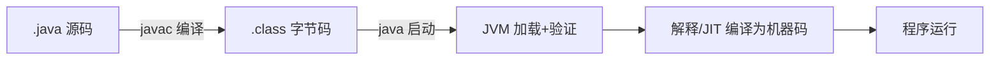
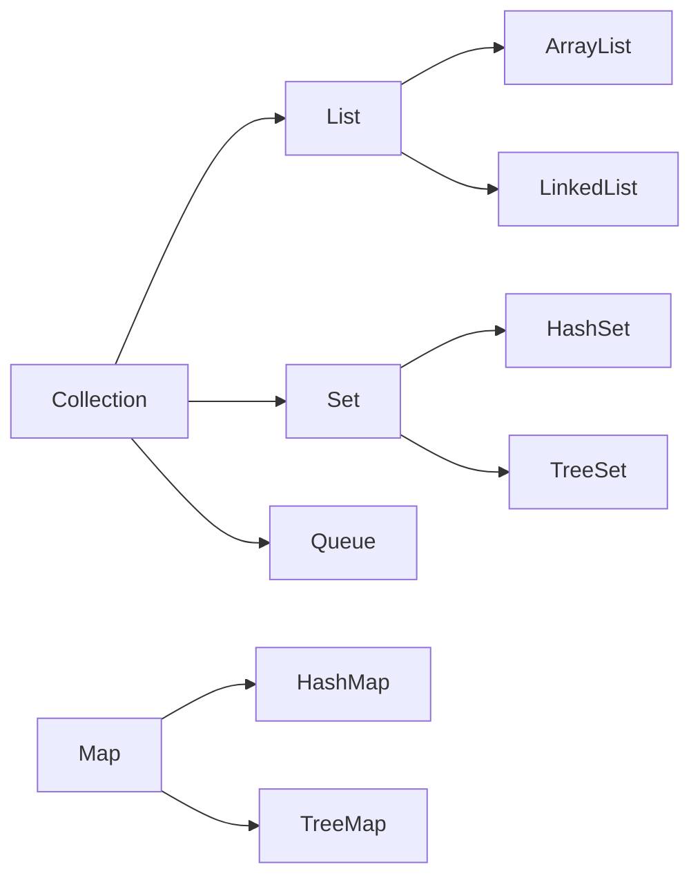

# ☕ Java 语言核心（全层次：0 基础 → 资深）

> 这是 Java 板块的**语言地基**。不论你是刚装完 JDK 的 0 基础，还是写了多年 Java 的资深，都能在本页找到对应收获：
> - 🟢 **入门**：语法、类型、字符串、流程控制，能写规范小程序。
> - 🔵 **进阶**：集合、泛型、异常、lambda/Stream、Optional、日期时间，能写健壮业务代码。
> - 🟣 **资深**：equals/hashCode 契约、不可变对象、注解、反射、record/sealed、自动拆箱陷阱，能避坑、能设计 API。
>
> 依据 **[Oracle Java Tutorials](https://docs.oracle.com/javase/tutorial/) · [Java SE 21 Spec](https://docs.oracle.com/en/java/javase/21/)**（官方为准，不编造）。

> 📌 **适用版本 / 更新日期**：Java 8 / 11 / 17 / 21；最后更新 **2026-08**。示例以 Java 21 为准，标注 LTS 差异与老写法对照。

!!! abstract "0 基础先看这里（必读）"
    - 还没装 JDK / 没跑过 Hello World？先读 [Java 开发环境搭建](setup-env.md)，能 `java -version` 出结果再回来。
    - 本章代码建议**自己敲进 IDE 跑一遍**。Java 是"编译型 + 强类型"，很多错只有编译时才暴露，动手才记得住。
    - 怎么运行：IDEA 建类贴进 `main` 方法 `Run`；或命令行 `javac Demo.java` → `java Demo`（类名=文件名）。
    - 看不懂的词（JVM/字节码/依赖）先跳对应章节或回 [路线总览](index.md)，不必逐字死磕。

---

## 0. 一行代码从写到跑，发生了什么



- `.java` 先被 `javac` 编译成平台无关的 `.class` 字节码；`java` 启动 JVM 加载、校验，再由**解释器 + JIT**（热点编译）执行。
- 这就是"一次编译，到处运行"——`.class` 不依赖具体操作系统。

!!! tip "为什么强类型重要"
    Java 变量先声明类型（`int a;`），编译期就拦住 `a = "abc"`，比 JS 运行时才崩更稳；代价是比脚本语言啰嗦，但大型项目更可控。

---

## 1. 🟢 类型与基础语法

### 1.1 八大基本类型

| 类型 | 位数 | 默认值 | 注意 |
|------|------|--------|------|
| `byte` | 8 | 0 | 网络/文件常用 |
| `short` | 16 | 0 | 少用 |
| `int` | 32 | 0 | 最常用整数 |
| `long` | 64 | 0L | 后缀 `L` |
| `float` | 32 | 0.0f | 后缀 `f` |
| `double` | 64 | 0.0d | 默认小数 |
| `char` | 16 | `\u0000` | UTF-16 单元 |
| `boolean` | 1 bit | false | **大小未精确定义**（JVM 实现相关） |

!!! danger "包装类型陷阱（高频面试）"
    - `Integer` 缓存 `-128~127`：`Integer.valueOf(1) == Integer.valueOf(1)` 为 `true`，但 `128` 超出缓存为 `false`。
    - **比较值永远用 `.equals()`**，别用 `==` 比对象。
    - 数据库查出的 `null` 赋给 `int` 会 NPE——用 `Integer` 承接可空字段。
    - 自动拆箱（如 `Integer` → `int`）遇到 `null` 直接 NPE：`int x = someInteger;` 当 `someInteger==null` 崩溃。

### 1.2 变量、常量、字面量

```java
int a = 10;                 // 变量
final int MAX = 100;        // 常量（编译期常量，命名全大写）
double d = 1_000_000.5;     // 数字可用下划线分隔，提升可读性
long ts = 1_700_000_000L;
```

!!! tip "命名规范（官方/社区共识）"
    - 类/接口：大驼峰 `OrderService`；方法/变量：小驼峰 `createOrder`；常量：全大写下划线 `MAX_RETRY`。
    - 包名：全小写反向域名 `com.company.order`，**绝不用中文/大写包名**（跨平台/工具链易炸）。

### 1.3 流程控制

```java
// if / switch（Java 14+ 可表达式，更简洁安全）
int score = 85;
String level = switch (score / 10) {
    case 10, 9 -> "A";
    case 8    -> "B";
    default   -> "C";
};

// 循环
for (int i = 0; i < 10; i++) { }
for (String s : list) { }           // 增强 for（遍历 Iterable/数组）
while (cond) { }
do { } while (cond);
```

!!! warning "switch 老写法坑"
    - 老 `switch` 忘了 `break` 会 **fall-through**（继续执行下一个 case）。表达式写法（`->`）天然不穿透，优先用。

---

## 2. 🟢 字符串：不可变与拼接

```java
String a = "abc";
String b = a + "d";        // 生成新对象，a 不变
String c = "abc".concat("d");
```

!!! tip "拼接性能（资深也常踩）"
    - 循环里用 `StringBuilder`（非线程安全）/ `StringBuffer`（线程安全），别用 `+` 产生大量中间对象。
    - `String.join()` / `String.format()` 适合一次性格式化。
    - **字符串常量池**：`String s1 = "a"; String s2 = "a";` 指向同一对象（`==` 为 `true`），但 `new String("a")` 是新对象。比较内容永远 `.equals()`。

!!! example "多行字符串（Java 15+ text blocks，资深清理 JSON/SQL 必备）"
    ```java
    String sql = """
        SELECT id, name
        FROM users
        WHERE age > ?
        """;
    ```

---

## 3. 🔵 面向对象：类、对象、封装

### 3.1 类与构造器

```java
public class User {
    private Long id;              // 字段私有，封装
    private String name;
    public User(Long id, String name) { this.id = id; this.name = name; }
    public String getName() { return name; }   // getter
    public void setName(String n) { this.name = n; }  // setter
}
```

- `private` 字段 + `getter/setter` 是 JavaBean 规范；实际项目用 **Lombok `@Data`** 自动生成（见 [工具链](java-toolchain.md)）。
- `this` 指当前对象；构造器重载支持多种初始化方式。

### 3.2 继承、多态、抽象

```java
abstract class Animal {            // 抽象类不能 new
    abstract void sound();          // 抽象方法，子类必须实现
}
class Dog extends Animal {
    void sound() { System.out.println("wang"); }   // 多态：父类引用指向子类
}
Animal a = new Dog(); a.sound();   // 输出 wang
```

- **多态**是 OOP 核心：同一接口不同实现，调用方依赖抽象不依赖具体。深入设计原则看 [OOP 与设计原则](java-oop-design.md)。
- `final` 类不可继承、`final` 方法不可重写、`final` 变量不可改。
- 组合优于继承（is-a vs has-a），避免深层继承树。

!!! danger "重写 vs 重载"
    - **重写（override）**：子类改父类方法实现，签名相同；`@Override` 注解帮你校验。
    - **重载（overload）**：同方法名不同参数列表，编译期绑定。两者易混，面试必考。

---

## 4. 🔵 集合框架（必熟，源码级深入见 [集合深入篇](java-collections-deep.md)）



| 集合 | 结构 | 查询 | 增删 | 场景 |
|------|------|------|------|------|
| `ArrayList` | 动态数组 | O(1) | 尾 O(1)/中 O(n) | 随机访问多 |
| `LinkedList` | 双向链表 | O(n) | O(1) | 头尾增删多 |
| `HashMap` | 数组+链表+红黑树 | O(1) | O(1) | KV 查找 |
| `HashSet` | 基于 HashMap | O(1) | O(1) | 去重 |
| `TreeMap` | 红黑树 | O(log n) | O(log n) | 有序 KV |
| `ConcurrentHashMap` | 分段/CAS | O(1) | O(1) | 并发 KV |

!!! danger "HashMap 并发踩坑"
    - **非线程安全**：多线程 put 可能死循环（JDK7）/数据丢失（JDK8+）。并发用 `ConcurrentHashMap`。
    - `key` 必须**不可变且正确实现 `equals/hashCode`**（别用可变对象当 key）。
    - `forEach` 遍历时**不能 remove**（抛 `ConcurrentModificationException`），用迭代器或 `removeIf`。

---

## 5. 🔵 泛型与边界

```java
List<? extends Number>  // 上界：可读取 Number，不可写入（除 null）
List<? super Integer>   // 下界：可写入 Integer，读取为 Object
```

!!! tip "PECS 原则"
    **P**roducer `extends`，**C**onsumer `super`。生产者用上界、消费者用下界，是 `Collections.copy` 等 API 的设计依据。

!!! info "类型擦除（资深必知）"
    - Java 泛型是**编译期**的，运行时 `List<String>` 和 `List<Integer>` 都是 `List`（类型擦除）。
    - 不能 `new T[]`、`instanceof List<String>`；可用 `List<?>` 通配。这是和 C++ 模板的本质区别。

---

## 6. 🔵 异常体系

```text
Throwable
 ├─ Error（不可恢复：OOM/StackOverflow，别 catch）
 └─ Exception
     ├─ RuntimeException（非受检：NullPointer/IndexOutOfBounds）
     └─ 受检异常（IOException 等，必须处理或 throws）
```

!!! warning "异常处理三不要"
    - 不要 `catch (Exception e) {}` 吞异常（问题被掩盖，日志里查不到）。
    - 不要用异常做正常流程控制（性能差、语义错）。
    - 受检异常别无脑 `throws` 一路抛到 main。

!!! tip "try-with-resources（资深必备）"
    ```java
    try (BufferedReader br = new BufferedReader(new FileReader("a.txt"))) {
        // 自动关闭，无需 finally
    } catch (IOException e) { log.error("read fail", e); }
    ```
    实现 `AutoCloseable` 的资源都用它，避免资源泄漏。

---

## 7. 🔵 Lambda、Stream 与 Optional（现代 Java 核心）

### 7.1 Lambda 表达式

```java
List<String> list = List.of("b", "a", "c");
list.forEach(s -> System.out.println(s));          // 替代匿名内部类
Runnable r = () -> System.out.println("hi");        // 函数式接口（单抽象方法）
```

- Lambda 是**函数式接口**（只有一个抽象方法的接口，如 `Runnable`/`Comparator`）的实例。Java 8+ 大量 API 接受它。
- 变量捕获：Lambda 内只能用 `final` 或"事实上 final"的外部变量。

### 7.2 Stream 流式处理

```java
List<Integer> nums = List.of(1, 2, 3, 4, 5);
List<Integer> res = nums.stream()
    .filter(n -> n % 2 == 0)        // 过滤
    .map(n -> n * n)                 // 转换
    .collect(Collectors.toList());   // [4, 16]
// 聚合
int sum = nums.stream().mapToInt(Integer::intValue).sum();
long count = nums.stream().filter(n -> n > 2).count();
```

!!! tip "Stream 最佳实践（资深）"
    - Stream 不修改源数据，是**惰性求值**：中间操作（`filter/map`）不执行，遇到终止操作（`collect/sum`）才跑。
    - 别在 `forEach` 里做有副作用的修改；大数据集考虑并行流 `parallelStream()`（但有线程安全/开销代价，慎用）。
    - 简单循环比 Stream 更快时，不必强行 Stream——可读优先。

### 7.3 Optional 告别 NPE

```java
Optional<User> u = findUser(id);
String name = u.map(User::getName).orElse("匿名");      // 不为空取名字，否则默认
u.ifPresent(user -> send(user));                         // 有值才执行
User must = u.orElseThrow(() -> new NotFoundException());// 必须有
```

!!! danger "Optional 误用"
    - **别用 `Optional` 当字段/方法参数类型**（它设计给返回值表示"可能无"）。字段用 `@Nullable` + 校验。
    - 别 `get()` 前不判空——用 `orElse/ifPresent/orElseThrow`。

---

## 8. 🟣 资深必修：契约、不可变、新特性

### 8.1 equals / hashCode 契约（高频坑）

```java
class Point {
    private final int x, y;
    Point(int x, int y) { this.x = x; this.y = y; }
    @Override public boolean equals(Object o) {
        return o instanceof Point p && p.x == x && p.y == y;
    }
    @Override public int hashCode() {
        return Objects.hash(x, y);    // 必须和 equals 一致：相等对象 hashCode 必相等
    }
}
```

!!! danger "契约被破坏的后果"
    - **若 `a.equals(b)` 为真但 `hashCode` 不同**：`HashMap`/`HashSet` 会把它们当不同 key，导致"查不到/重复"的诡异 bug。
    - 用 Lombok `@EqualsAndHashCode(onlyExplicitlyIncluded = true)` 控制参与字段，避免把关联集合卷进去。
    - `equals` 满足：自反、对称、传递、一致、对 `null` 返回 `false`。

### 8.2 不可变对象（线程安全基石）

```java
public final class Money {                 // final 类不可继承
    private final long cents;               // final 字段不可改
    public Money(long cents) { this.cents = cents; }
    public Money add(Money o) { return new Money(cents + o.cents); }  // 返回新对象
}
```

- 不可变对象天然**线程安全**（无状态修改），是并发编程首选。String、Integer 都是不可变。
- 集合不可变：`List.of(...)` / `Map.of(...)`（Java 9+）返回不可变集合，改会抛 `UnsupportedOperationException`。

### 8.3 record / sealed（Java 16/17+，API 设计利器）

```java
public record Point(int x, int y) {}        // 一行 = 字段+getter+equals/hashCode/toString+构造器
// 密封类：只允许指定子类继承，控制继承层级（领域建模友好）
public sealed interface Shape permits Circle, Rect {}
final class Circle implements Shape { /* ... */ }
```

!!! tip "何时用 record"
    - DTO、值对象、配置项、方法返回多值——凡是"纯数据载体"都用 `record`，省几十行样板，且自动不可变。

### 8.4 注解与反射（框架底层）

```java
@Override        // 编译期校验重写
@Deprecated      // 标记过时
@SuppressWarnings("unchecked")

// 反射：运行时取类信息（Spring/ORM/序列化全靠它）
Class<?> c = Class.forName("com.demo.User");
Object obj = c.getDeclaredConstructor().newInstance();
Method m = c.getDeclaredMethod("getName");
m.setAccessible(true);          // 突破 private（框架常用，但有安全限制）
```

!!! warning "反射代价（资深）"
    - 反射**慢于直接调用**（JIT 难优化），且破坏封装、绕过访问控制。
    - 框架（Spring/Hibernate）大量用反射+注解，但业务代码别滥用；优先普通多态/接口。

### 8.5 日期时间 API（Java 8+，告别 Date/Calendar）

```java
LocalDate d = LocalDate.now();                 // 日期
LocalDateTime dt = LocalDateTime.now();        // 日期+时间
Duration dur = Duration.ofHours(2);            // 时段
DateTimeFormatter fmt = DateTimeFormatter.ofPattern("yyyy-MM-dd");
String s = dt.format(fmt);
```

!!! danger "老 Date 的坑"
    - `java.util.Date` 是可变且时区混乱，`SimpleDateFormat` **非线程安全**（多线程共用会出乱数据）。
    - 一律用 `java.time`（LocalDateTime/Instant/ZonedDateTime）+ `DateTimeFormatter`（线程安全）。
    - 数据库/JSON 时区要统一：配 `spring.jackson.time-zone` 与 DB `time_zone`，否则时间错 8 小时。

---

## 9. 🟣 自动拆箱与常见 NPE 清单

```java
Integer a = null;
int b = a;                       // 自动拆箱 → NullPointerException
if (a == 1) { }                  // a 自动拆箱比较，a 为 null 即 NPE
```

!!! danger "NPE 高频来源（面试/生产常客）"
    - 自动拆箱 `null` → 基本类型。
    - 链式调用 `user.getAddress().getCity()` 中间任一为 null。
    - **根治**：用 `Optional`、判空、数据库约束非空、DTO 用 `@NotNull` 校验。

---

## 10. 自测（新手常见错）

```java
Integer x = 128, y = 128;
System.out.println(x == y);      // false（超出缓存）
System.out.println(x.equals(y)); // true

List<Integer> list = new ArrayList<>();
list.add(1); list.add(2);
for (Integer i : list) list.remove(i);  // ConcurrentModificationException
```

---

## 11. 下一步（按层次选）

- 🟢 想深挖对象/接口/设计原则 → [OOP 与设计原则](java-oop-design.md)
- 🔵 想看清集合底层（扩容/线程安全） → [集合框架深入](java-collections-deep.md)
- 🔵 想搞懂并发（线程池/锁/CompletableFuture） → [并发编程基础](java-concurrency.md)
- 语言地基稳了 → 看 [JVM](jvm.md) 理解字节码与内存，再进 Spring 体系。
