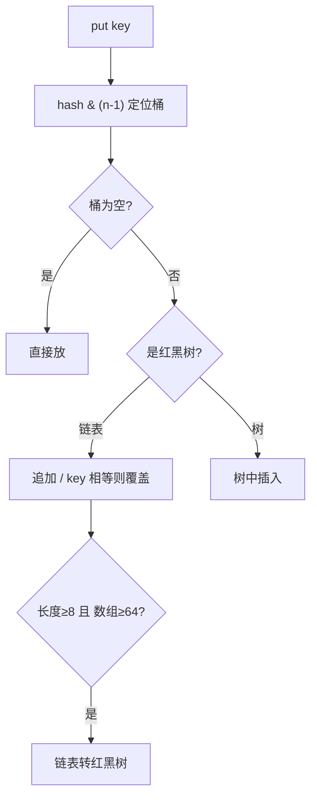

# ☕ 集合框架深入（源码级 · 进阶 → 资深）

> 上一篇 [Java 语言核心](java-basics.md) 给了集合速查表。本篇面向**要真正选对集合、避免并发与性能坑**的初中级到资深：
> - 🔵 进阶：ArrayList/HashMap 扩容机制、常见遍历坑。
> - 🟣 资深：HashMap 红黑树阈值、ConcurrentHashMap 实现演进、各结构时间复杂度与选型决策。
>
> 依据 **[OpenJDK HashMap/ArrayList 源码](https://github.com/openjdk/jdk) · [Oracle Collections Framework](https://docs.oracle.com/en/java/javase/21/docs/api/java.base/java/util/Collection.html)**（以 JDK 21 为准）。

> 📌 **适用版本 / 更新日期**：JDK 8 / 11 / 17 / 21；最后更新 **2026-08**。注意 JDK7 与 JDK8 HashMap 实现差异已标注。

---

## 1. 🔵 List：ArrayList 扩容真相

```java
List<String> list = new ArrayList<>();   // 默认空数组，首次 add 扩到 10
list.add("a");
```

- **初始容量**：JDK 7 默认 10；JDK 8+ 延迟初始化（首次 add 才 10）。
- **扩容**：满时 `newCapacity = old + (old >> 1)`（**1.5 倍**），`Arrays.copyOf` 整体拷贝——**扩容有成本**。
- **最佳实践**：预知大小用 `new ArrayList<>(initialCapacity)` 避免反复扩容。

!!! danger "遍历删除坑"
    ```java
    for (int i = 0; i < list.size(); i++) list.remove(i);  // 漏删（下标错位）
    for (String s : list) list.remove(s);                  // ConcurrentModificationException
    // 正确：
    list.removeIf(s -> s.isEmpty());                       // 推荐
    Iterator<String> it = list.iterator();
    while (it.hasNext()) { if (it.next().isEmpty()) it.remove(); }
    ```

---

## 2. 🔵/🟣 HashMap：从数组+链表到红黑树



- **定位**：`(n - 1) & hash`，n 为 2 的幂（默认 16），保证分布均匀。
- **hash 扰动**：`key.hashCode()` 高 16 位异或低 16 位，减少碰撞。
- **扩容**：负载因子默认 **0.75**，超过 `容量*0.75` 触发 2 倍扩容并 **rehash**（数据迁移有成本）。
- **链表→红黑树**：链表长度 ≥ **8** 且数组长度 ≥ **64** 转树；< 6 退化为链表（泊松分布下阈值 8 极罕见，是安全兜底）。
- **树退链**：resize 或删除后节点 ≤ 6 退化为链表。

!!! danger "JDK7 vs JDK8 关键差异（资深）"
    - JDK7：数组+链表，扩容时**头插法** → 多线程下可能**死循环**。
    - JDK8+：数组+链表+红黑树，尾插法，不再死循环，但**仍非线程安全**（数据会丢/覆盖）。并发请用 `ConcurrentHashMap`。

!!! warning "key 的两大约束"
    - key 必须**不可变且正确 `equals/hashCode`**：用 `String`/`Integer` 这类不可变类；别用会改字段的对象当 key（改了就查不到）。
    - 自定义 key：重写 `equals` 同时必须重写 `hashCode`。

---

## 3. 🟣 ConcurrentHashMap（并发 KV 首选）

| 版本 | 实现 | 写冲突处理 |
|------|------|-----------|
| JDK7 | 分段锁 Segment（16 段） | 锁段 |
| JDK8+ | `Node` 数组 + CAS + `synchronized`（只锁桶头节点） | 更细粒度，并发度更高 |

- **读几乎无锁**（volatile 保证可见性）。
- **size()** 用分段计数（`baseCount` + `CounterCell[]`）近似累加，非实时精确但高性能。
- **不支持 `null` key/value**（避免"存在但值为 null"与"不存在"歧义，并发下必需）。

!!! tip "选型决策"
    - 单线程 KV → `HashMap`；去重 → `HashSet`。
    - 并发 KV → `ConcurrentHashMap`（**别自己加 `synchronized` 包 HashMap**，既慢又易错）。
    - 有序 → `TreeMap`（红黑树，按 key 排序，O(log n)）；线程安全有序 → `ConcurrentSkipListMap`。

---

## 4. 🔵 Queue / Deque：并发与任务调度

| 实现 | 特点 | 场景 |
|------|------|------|
| `LinkedList` | 双端，非线程安全 | 本地双端队列 |
| `ArrayDeque` | 数组双端，**比 LinkedList 快** | 栈/队列首选（替代 `Stack`） |
| `PriorityQueue` | 堆，按优先级出队 | 调度/TopK |
| `ArrayBlockingQueue` | 有界阻塞 | 生产者-消费者 |
| `LinkedBlockingQueue` | 可选界阻塞 | 线程池工作队列 |
| `ConcurrentLinkedQueue` | 无锁 CAS | 高并发非阻塞 |

!!! tip "栈别用 `Stack`"
    `java.util.Stack` 继承 `Vector`（方法全 `synchronized`，慢且设计旧）。用 `ArrayDeque` 当栈：`deque.push()/pop()`。

---

## 5. 🟣 性能与内存要点

- `HashMap` 初始容量设为 `预期元素 / 0.75 + 1` 向上取 2 的幂，避免中途扩容。
- 大量小对象用 `ArrayList` 比 `LinkedList` 缓存友好（连续内存）。
- `HashSet` 本质是 `HashMap`（value 是同一个空对象），别期待它省内存。
- `subList` 返回**原列表视图**，改子列表会影响原列表，且原列表结构性修改会让子列表抛异常——别长期持有。

---

## 6. 不可变集合（Java 9+）

```java
List<String> l = List.of("a", "b");        // 不可变，改抛 UnsupportedOperationException
Map<String,Integer> m = Map.of("a", 1);     // 不可变
List<String> copy = List.copyOf(other);     // 复制为不可变
```

!!! tip "资深用法"
    - 配置项、常量表、DTO 快照用不可变集合，天然线程安全、防误改。
    - 防御性拷贝：返回内部集合前 `List.copyOf(...)`，避免外部改坏内部状态。

---

## 7. 下一步
- 想搞并发 → [并发编程基础](java-concurrency.md)
- 想看清对象如何在内存里布局 → [JVM](jvm.md)
