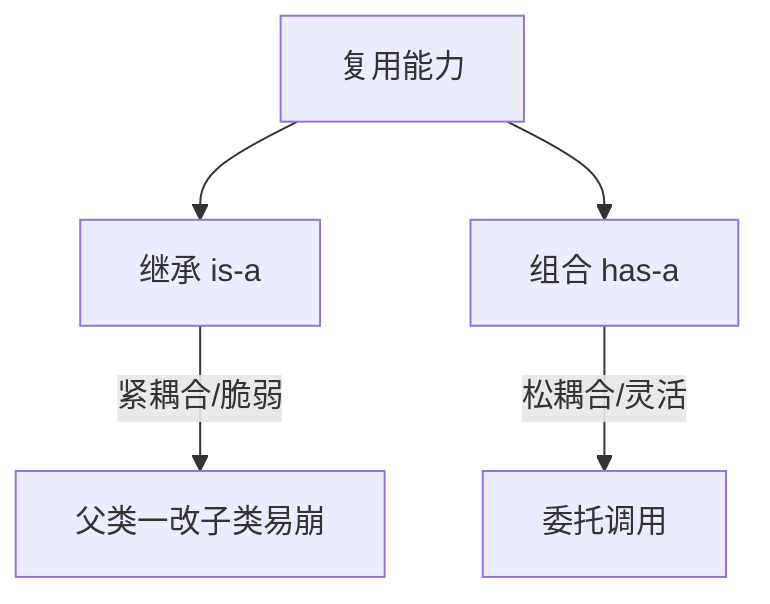

# ☕ 面向对象深入与设计原则（进阶 → 资深）

> 上一篇 [Java 语言核心](java-basics.md) 讲了 OOP 语法。本篇面向**想写"好设计"代码**的初中级到资深：
> - 🔵 进阶：搞懂封装/继承/多态的正确用法、抽象类 vs 接口、组合优于继承。
> - 🟣 资深：SOLID 五大原则、设计模式常见套路、何时不用继承、API 设计契约。
>
> 依据 **[Oracle Java Tutorials - Classes & Interfaces](https://docs.oracle.com/javase/tutorial/java/concepts/) · [Effective Java（Bloch, 官方社区权威）](https://www.oreilly.com/library/view/effective-java-3rd/9780134686097/)**。

> 📌 **适用版本 / 更新日期**：Java 8 / 11 / 17 / 21；最后更新 **2026-08**。

---

## 1. 🔵 封装：不是加 private 就够了

```java
// 反例：暴露可变内部集合，外部可破坏不变量
public class Order {
    public List<Item> items = new ArrayList<>();
}
// 正例：返回不可变视图，修改走受控方法
public class Order {
    private final List<Item> items = new ArrayList<>();
    public List<Item> getItems() { return Collections.unmodifiableList(items); }
    public void addItem(Item i) {
        Objects.requireNonNull(i);
        if (items.size() >= MAX) throw new IllegalStateException("超限");
        items.add(i);
    }
}
```

!!! tip "封装的本质"
    封装是**保护不变量（invariant）**：对象状态只能通过你允许的方法变化。直接暴露字段/可变集合等于放弃控制权。

---

## 2. 🔵 继承 vs 组合：组合优于继承



```java
// 继承（脆弱）：父类加新方法可能和你重名冲突
class MyList extends ArrayList<String> { }

// 组合（稳健）：持有 + 委托，只暴露你想要的
class BoundedList {
    private final List<String> delegate = new ArrayList<>();
    public void add(String s) { /* 加边界校验 */ delegate.add(s); }
    public int size() { return delegate.size(); }
}
```

!!! danger "继承的代价"
    - 父类变化会**破坏子类**（脆弱基类问题）。
    - 继承是白盒复用，暴露父类实现细节。
    - **经验**：只有当真的是 "is-a" 且父类稳定时才继承；否则用组合。Java 单继承限制也逼你多用组合。

---

## 3. 🔵 抽象类 vs 接口（Java 8+ 接口能默认方法）

| 维度 | 抽象类 | 接口 |
|------|--------|------|
| 能否有状态（字段） | 能（实例字段） | 只能 `static final` 常量 |
| 方法实现 | 部分抽象/部分具体 | 默认方法 `default`（Java 8+） |
| 多继承 | 单继承 | 可实现多个 |
| 语义 | "是什么"（is-a） | "能做什么"（能力） |

!!! tip "怎么选"
    - 定义**能力/契约**（可多个）：用接口（`Serializable`/`Comparable`）。
    - 共享**代码+状态**的基类：用抽象类。
    - Java 8+ 接口 `default` 方法便于 API 演进（加方法不破坏实现类），但别把接口写成"抽象类替代品"——默认方法应是可选的、非核心的。

---

## 4. 🟣 SOLID 五大原则

### S — 单一职责（SRP）
一个类只因一个理由变化。Controller 别直接写 SQL，Service 别拼 HTTP 响应。

### O — 开闭原则（OCP）
对扩展开放、对修改关闭。用策略/接口新增行为，而非改老 `if-else`。

```java
interface Discount { int apply(int price); }
class VipDiscount implements Discount { /* ... */ }   // 新增折扣只加类，不改老代码
```

### L — 里氏替换（LSP）
子类必须能替换父类且不破坏程序。子类别抛父类没声明的异常、别强化前置条件。

### I — 接口隔离（ISP）
别让客户依赖它用不到的方法。大接口拆小（如 `Runnable` vs `Callable` 各管各的）。

### D — 依赖倒置（DIP）
依赖抽象，不依赖具体。Spring 的 `@Autowired` 注入接口而非实现类，就是 DIP。

!!! example "DIP 落地（Spring 风格）"
    ```java
    @Service
    public class OrderService {
        private final PaymentGateway gateway;     // 依赖接口
        public OrderService(PaymentGateway g) { this.gateway = g; }  // 构造注入
    }
    ```
    测试时注入假实现（`Mock`），生产注入真实现——这就是依赖倒置带来的可测性。

---

## 5. 🟣 常用设计模式（Java 语境）

| 模式 | 作用 | Java 里的影子 |
|------|------|---------------|
| 单例 | 全局唯一 | Spring 默认单例 Bean（注意线程安全） |
| 工厂 | 封装对象创建 | `Executors.newFixedThreadPool()` |
| 策略 | 算法可替换 | `Comparator` / `Discount` 接口 |
| 模板方法 | 固定骨架+可变步骤 | `AbstractList`（钩子方法） |
| 观察者 | 事件通知 | `EventListener` / Spring `ApplicationEvent` |
| 建造者 | 复杂对象分步构建 | `StringBuilder` / Lombok `@Builder` |

!!! warning "模式别滥用"
    - 模式是为**解耦和演进**，不是为了炫技。一个 if-else 能解决的别上策略+工厂+配置。
    - 过度抽象（接口套接口套抽象类）反而难读。Effective Java 主张：优先简单、必要时才抽象。

---

## 6. 🟣 API 设计契约（写库/写公共模块必看）

- 返回集合优先 `List.of()`/`Collections.unmodifiableList` 不可变，或明确文档"可改"。
- 参数校验用 `Objects.requireNonNull` / Bean Validation，别让 `null` 跑到深层。
- 异常选对：编程错误用 `IllegalArgumentException`，业务用自定义受检/非受检异常。
- 别在公共 API 暴露具体实现类型（返回 `List` 而非 `ArrayList`），保留演进空间。

!!! tip "Effective Java 几条铁律"
    - 用静态工厂方法替代构造器（有名字、可缓存、可返回子类）。
    - 建造者模式适合多参数构造。
    - 优先用枚举替代 `int` 常量。
    - 重写 `equals` 必重写 `hashCode`，且让类可比较就实现 `Comparable`。

---

## 7. 下一步
- 想看清集合底层（扩容/线程安全选型） → [集合框架深入](java-collections-deep.md)
- 想搞并发 → [并发编程基础](java-concurrency.md)
- 设计稳了 → 进 [Spring 全家桶](spring-family.md) 看框架如何用这些原则。
