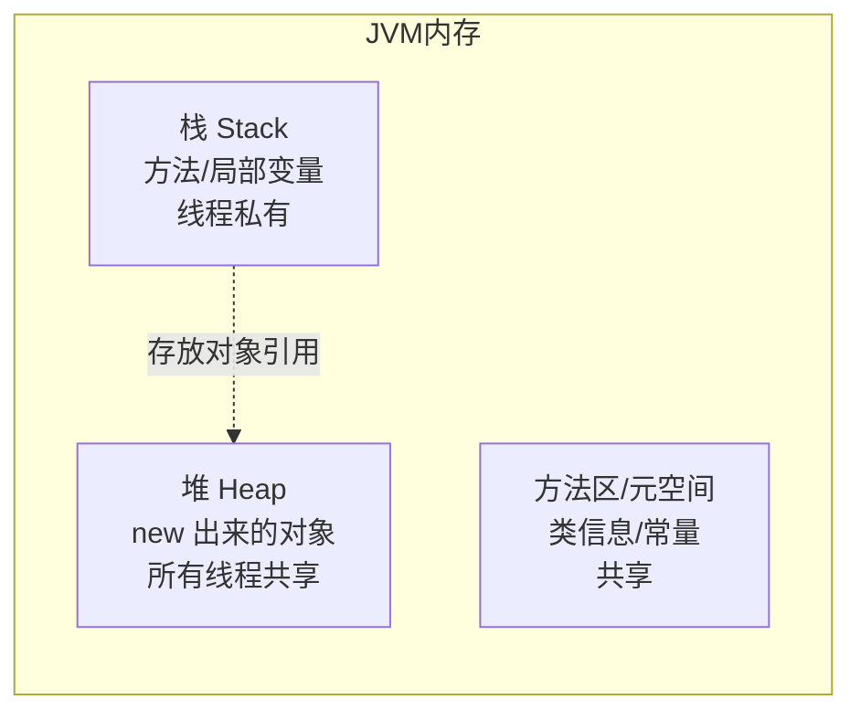
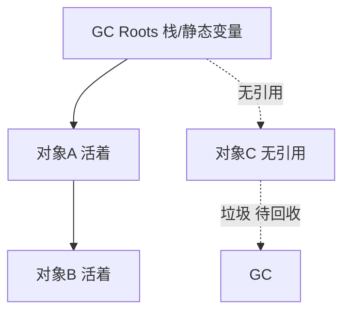

# ☕ JVM 从零开始（0 基础超详细 · JVM 是什么 / 内存直觉 / 垃圾回收直觉）

> 这是 [JVM 到精通](jvm.md) 的**前置第 0 章**，给**第一次听说 JVM** 的人。
> 目标：搞懂 JVM 是什么、为什么 Java 要它、程序运行时内存长啥样、垃圾怎么被回收、什么时候你才需要关心 JVM。
> 不要求任何底层经验，但需先会 [Java 语言核心](java-basics.md)。
>
> 依据 **[Java Virtual Machine Specification](https://docs.oracle.com/javase/specs/jvms/se21/html/) · [Oracle JVM 文档](https://docs.oracle.com/en/java/javase/21/)**（官方为准）。

> 📌 **适用版本 / 更新日期**：Java 8 / 11 / 17 / 21 HotSpot VM；最后更新 **2026-08**。

!!! abstract "读完你能做什么"
    用大白话解释 JVM 是什么、说出"一次编译到处运行"的原理、画出程序跑起来时内存的分区（栈/堆/方法区）、理解垃圾回收的直觉（哪些对象会被回收）、知道"我的代码慢/内存溢出时该想到 JVM"。之后去 [JVM 到精通](jvm.md) 学 GC 算法、调优、Arthas 排查。

---

## 1. JVM 到底是什么（大白话）

- **JVM = Java 虚拟机**：一个"模拟的计算机"，跑在你的真实电脑/服务器上。
- 你写的 `.java` 先编译成 `.class` 字节码（一种 JVM 能懂的"中间语言"），JVM 再把它**解释/编译**成你机器能跑的机器码。
- **为什么要多这一层？** 为了 **"一次编译，到处运行"**：同一份 `.class` 能在 Windows、Linux、Mac 的 JVM 上跑，不用为每种系统重新编译。

!!! tip "经典比喻"
    - JVM 像"同声传译"：你说中文（`.class` 字节码），它实时翻成当地语言（机器码）。换个国家（换操作系统）换一个翻译（对应系统的 JVM）即可，你说的话不用改。

!!! info "JVM 不止 Java"
    - Kotlin、Scala、Groovy 也都跑在 JVM 上——它们都编译成字节码。JVM 是"Java 生态"的发动机。

---

## 2. 程序跑起来时，内存长什么样（最重要的一张图）



| 区域 | 存什么 | 谁独有 | 特点 |
|------|--------|--------|------|
| **栈（Stack）** | 方法调用、局部变量（基本类型、`new` 对象的引用） | 每线程一个 | 方法结束自动释放，**快** |
| **堆（Heap）** | `new` 出来的对象、数组 | 所有线程共享 | GC 主战场，**最大** |
| **方法区/元空间** | 类的结构、常量池、静态变量 | 共享 | 类加载后放这（JDK8+ 叫元空间，用本地内存） |

!!! tip "一个例子看懂栈和堆"
    ```java
    public void foo() {
        int x = 10;                 // x 在栈里（基本类型）
        User u = new User("张三");  // u 引用在栈里，User 对象在堆里
    }
    ```
    - `foo()` 执行完，栈帧释放，`x` 和 `u` 引用消失；堆里的 `User` 对象等 GC 回收。

!!! danger "内存溢出两种（面试/生产常客）"
    - **StackOverflowError**：方法**无限递归** → 栈帧堆不下。例：`void a(){ a(); }`。
    - **OutOfMemoryError (Java Heap)**：对象创建太多、 GC 回收不掉（**内存泄漏**）→ 堆满。例：往 `static List` 无限 `add`。

---

## 3. 垃圾回收（GC）的直觉

### 3.1 哪些对象算"垃圾"

- 一个对象**没有任何引用指向它**时，就是垃圾，可以被回收。
- JVM 用 **可达性分析**：从"GC Roots"（栈里的局部变量、静态变量等）出发，顺着引用链能摸到的对象算"活着"，摸不到的就是垃圾。



### 3.2 GC 大致怎么干（直觉版）

- 新对象先放**新生代（Young）**，这里 GC 很频繁（"朝生夕死"的对象多）。
- 熬过几轮 GC 的对象晋升到**老年代（Old）**，这里 GC 少但慢。
- 回收算法（深入见 [精通篇](jvm.md)）：标记-复制、标记-清除、标记-整理。现代用 **G1** 等把堆切小块并发回收，几乎不卡顿。

!!! tip "你暂时不用懂算法细节"
    - 0 基础阶段只要记住：**JVM 会自动帮你回收没用的对象，你一般不用手动 `free`（Java 没有）**。
    - 和 C/C++ 手动 `malloc/free` 不同，Java 的"自动 GC"让开发更简单，但也意味着你要理解"为什么内存会涨/会慢"。

---

## 4. 什么时候你需要关心 JVM（而不是当它不存在）

| 场景 | 现象 | 该想什么 |
|------|------|----------|
| 接口变慢、卡顿 | 定时"抖一下" | 可能是 Full GC 停顿 → 看 GC 日志 |
| 内存溢出 | `OutOfMemoryError` | 堆太小 / 内存泄漏 → 调 `-Xmx`、查引用 |
| 启动慢/占内存多 | 容器 OOM 被杀 | 堆设太大超过容器限制 → 合理设 `-Xmx` |
| 高并发不稳定 | 响应时间飘 | GC 压力大 / 锁竞争 → 调优 |

!!! tip "日常开发 vs 上线调优"
    - **写业务时**：基本不用管 JVM，专注逻辑。JVM 默认配置对中小应用够用。
    - **上线/压测/出事故时**：才需要调堆大小、选 GC、看日志。这是 [JVM 到精通](jvm.md) 的主场。

---

## 5. 最常用的几个 JVM 参数（先有个印象）

```bash
java -Xms512m -Xmx1024m -XX:+UseG1GC -jar app.jar
```
- `-Xms512m`：初始堆大小。
- `-Xmx1024m`：**最大堆大小**（最重要，决定能用多少内存）。
- `-XX:+UseG1GC`：用 G1 垃圾回收器（JDK9+ 默认）。
- `-XX:+HeapDumpOnOutOfMemoryError`：内存溢出时自动 dump 堆，方便排查。

!!! danger "新手坑"
    - 容器里 `-Xmx` 设得比容器内存还大 → 被 Kubernetes/OOM  Killer 杀掉。一般设容器内存的 70%~80%。
    - 默认堆可能太小（老版本物理内存 1/4），大应用要显式设 `-Xmx`。

---

## 6. 自测（你学会了吗）

1. 用一句话解释"一次编译到处运行"。
2. 画出栈/堆/方法区分别存什么，并说 `new User()` 的引用在哪、对象在哪。
3. 举一个会导致 StackOverflowError 和 OOM 的代码例子。
4. 说清"可达性分析"怎么判断对象是垃圾。
5. 说出 `-Xmx` 是干嘛的，为什么容器里不能乱设。

> 入门过关。下一步去 [JVM 到精通](jvm.md) 学 GC 算法细节、G1/ZGC、调优、Arthas 在线排查、内存泄漏定位。

---

## 7. 下一步

- GC 算法 / G1 / ZGC / 调优 / Arthas → [JVM 到精通](jvm.md)
- 写代码少踩内存坑 → [Java 语言核心](java-basics.md) 的不可变对象/引用章节
- 高并发下的 JVM 表现 → [高并发与虚拟线程](high-concurrency.md)
