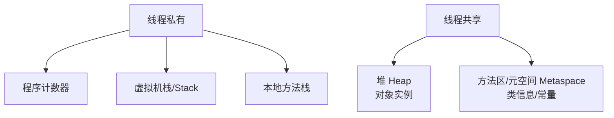

# 🔥 JVM（内存模型 / 字节码 / 垃圾回收 / 调优排查）

> Java 工程师从"会用"到"资深"的分水岭。本篇讲清：运行时数据区、类加载、字节码、GC 算法与收集器、调优参数、线上排查工具链。
> 依据 **[Oracle JVM Docs](https://docs.oracle.com/en/java/javase/21/) · [OpenJDK HotSpot](https://openjdk.org/groups/hotspot/) · [JVM Spec](https://docs.oracle.com/javase/specs/jvms/se21/html/)**。

> 📌 **适用版本 / 更新日期**：HotSpot（JDK 8/11/17/21）；最后更新 **2026-08**。GC 以 G1 默认、ZGC 低延迟为主。

---

## 1. 运行时数据区



- **堆**：对象实例与数组，GC 主战场，分新生代（Eden/S0/S1）和老年代。
- **虚拟机栈**：每个方法调用一个栈帧（局部变量表/操作数栈/返回地址），`StackOverflowError` 来自深度递归。
- **元空间（JDK8+）**：取代永久代，使用本地内存，默认无上限（要设 `-XX:MaxMetaspaceSize` 防撑爆）。

!!! danger "元空间陷阱"
    - JDK8 之前永久代在堆内易 OOM；JDK8+ 元空间在本地内存，但若类加载泄漏（如频繁热部署不卸载）仍会吃光物理内存。务必 `-XX:MaxMetaspaceSize=256m`。

---

## 2. 类加载机制

双亲委派：加载请求先委派父加载器，父找不到才自己加载。保证 `java.lang.*` 等核心类不被篡改。

!!! tip "打破双亲委派"
    - 场景：Tomcat 多应用隔离、SPI（JDBC 4）、OSGi。通过 `Thread.contextClassLoader` 或自定义 `ClassLoader` 实现。

---

## 3. 字节码与常见指令

```java
public int add(int a, int b) { return a + b; }
// 编译后（javap -c）：
// 0: iload_1    // 压入局部变量1
// 1: iload_2    // 压入局部变量2
// 2: iadd       // 栈顶两 int 相加
// 3: ireturn    // 返回
```

!!! tip "为什么懂字节码"
    - 看 `synchronized` 编译出 `monitorenter/monitorexit`；`try-finally` 用异常表保证执行；`++i` 与 `i++` 字节码不同。排错与理解语法糖（如 foreach 是 `Iterator`）很有用。

---

## 4. 垃圾回收（GC）

### 4.1 如何判定对象可回收

- **可达性分析**：从 `GC Roots`（栈帧局部变量、静态变量、JNI 引用）出发不可达即可回收。
- `finalize()` 不推荐依赖（执行时机不确定、拖慢回收）。

### 4.2 收集器对比

| 收集器 | 算法 | 特点 | 适用 |
|--------|------|------|------|
| Serial | 标记-复制 | 单线程，STW 长 | 客户端/小应用 |
| Parallel（吞吐量优先） | 标记-复制 | 多线程，关注吞吐 | 后台计算 |
| **G1（默认，JDK9+）** | 区域化分代 | 可预测停顿，Region | 大多服务端 |
| **ZGC（低延迟）** | 着色指针+读屏障 | STW < 10ms，TB 级堆 | 低延迟/大堆 |
| Shenandoah | 并发压缩 | 低延迟 | 类似 ZGC |

!!! warning "G1 调优要点"
    - `-XX:MaxGCPauseMillis` 是**目标**不是保证；设过小会频繁回收反而降吞吐。
    - 大对象（Humongous，> 一半 Region）直接进入老年代，易触发 FullGC；避免超大对象/大数组。
    - 观察 `Evacuation Failure`：Region 不够用，需调大堆或降并发。

---

## 5. 关键调优参数（JDK 21 示例）

```bash
java -Xms4g -Xmx4g            # 堆初始=最大，避免动态扩容抖动
     -XX:+UseG1GC             # 默认即 G1
     -XX:MaxMetaspaceSize=256m
     -XX:+HeapDumpOnOutOfMemoryError
     -XX:HeapDumpPath=/logs/heap.hprof
     -Xlog:gc*:file=/logs/gc.log:time,uptime:filecount=5,filesize=100M
     -XX:+UseStringDeduplication   # G1 字符串去重（省内存）
```

!!! danger "OOM 必设"
    - 生产**必须**加 `-XX:+HeapDumpOnOutOfMemoryError` + 路径，否则 OOM 后无现场可查。

---

## 6. 线上排查工具链

| 工具 | 用途 |
|------|------|
| `jps` | 列 Java 进程 |
| `jstack <pid>` | 线程栈（死锁/阻塞定位） |
| `jmap -histo` / `jmap -dump` | 堆对象统计 / 导出堆转储 |
| `jstat -gc <pid>` | 实时GC 统计 |
| **Arthas** | 线上诊断：watch/method 追踪、热改日志级别、反编译 |
| `VisualVM` / `MAT` | 堆转储分析、内存泄漏定位 |
| `async-profiler` | CPU/内存/锁火焰图 |

!!! tip "排查套路"
    1. `top -Hp <pid>` 找高 CPU 线程 → 转十六进制 → `jstack` 定位。
    2. `jstat -gcutil` 看是否频繁 FullGC。
    3. OOM 用 MAT 看 Dominator Tree 找泄漏根。
    4. 不确定方法耗时用 Arthas `trace com.x.Service method`。

---

## 7. 内存泄漏典型场景

- 静态 `Map`/`List` 只加不删（缓存无上限）。
- 线程池 `ThreadLocal` 用完未 `remove` → 线程复用串味（甚至 OOM）。
- 未关闭的资源（流/连接）导致堆外/堆内堆积。
- 监听器/回调注册后未反注册。

> 下一章：[MySQL 到精通](mysql.md)
