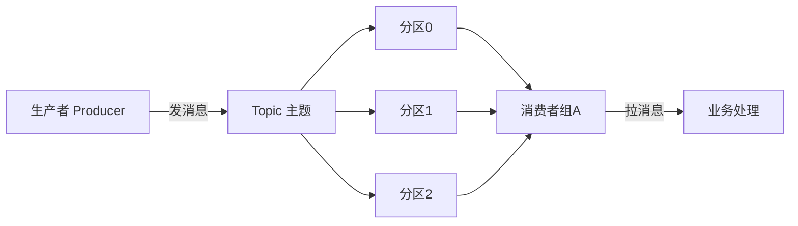

# 📨 Kafka 从零开始（0 基础超详细 · 消息队列是什么 / Kafka 概念 / 第一个收发消息）

> 这是 [Kafka 到精通](kafka.md) 的**前置第 0 章**，给**第一次听说"消息队列"** 的人。
> 目标：搞懂为什么需要消息队列、Kafka 是什么、生产者/消费者/Topic/分区是什么、装好并跑通第一个收发消息。
> 不要求分布式经验，但需先会 [Spring Boot 从零开始](spring-boot-basics.md)。
>
> 依据 **[Apache Kafka 官方文档](https://kafka.apache.org/documentation/)**（官方为准）。

> 📌 **适用版本 / 更新日期**：Apache Kafka 3.7+（KRaft 模式，去 ZooKeeper）；最后更新 **2026-08**。

!!! abstract "读完你能做什么"
    用大白话讲清"消息队列"解决什么、说出 Kafka 的 Topic/分区/生产者/消费者、装好 Kafka 并用命令行发收第一条消息、理解为什么微服务要用它解耦。之后去 [Kafka 到精通](kafka.md) 学幂等、Exactly-Once、再平衡、集群。

---

## 1. 消息队列是什么（大白话）

- 想象一个**快递柜**：A 把包裹放进去（生产消息），B 之后来取（消费消息）。A 和 B **不用同时在场**，也不直接面对面。
- **消息队列（MQ）= 系统间的"快递柜"**：一个系统把数据"丢"进队列，另一个系统稍后取走处理。两者**解耦、异步、削峰**。

!!! tip "为什么需要它（三个核心价值）"
    - **解耦**：下单后要不要立刻发短信/扣积分/通知物流？不用下单服务去调它们——下单只发一条"订单创建"消息，各系统自己订阅处理。下单服务挂了也不影响其他。
    - **异步**：用户下单瞬间返回成功，发短信等慢操作后台慢慢做，体验快。
    - **削峰**：双十一瞬间 10 万请求，系统一下处理不了 → 先全进队列，按能力慢慢消费，不被冲垮。

!!! info "常见消息队列"
    - **Kafka**：高吞吐、分布式、持久化，适合大数据/日志/事件流（本篇主角）。
    - RabbitMQ：易用、灵活路由，适合业务消息。
    - RocketMQ：阿里开源，电商场景强。先学 Kafka 概念，思想通用。

---

## 2. Kafka 核心概念（一张图记牢）



| 概念 | 是什么 | 大白话 |
|------|--------|--------|
| **Topic** | 消息的**类别/主题** | 像"订单创建"频道，同类消息放一起 |
| **Producer** | 生产者 | 发消息的系统（如下单服务） |
| **Consumer** | 消费者 | 收消息处理的系统（如短信服务） |
| **分区（Partition）** | Topic 下的并行单元 | 一个 Topic 可切多份，提高并发；**消息在分区内有序** |
| **Consumer Group** | 消费者组 | 一组消费者共同消费一个 Topic，分工不重复 |
| **Broker** | Kafka 服务节点 | 存消息的服务器，集群由多个 Broker 组成 |
| **Offset** | 消费进度 | 消费者记"我读到第几条了"，重启续读 |

!!! tip "分区与顺序"
    - 同一条业务线（如某订单的所有消息）用相同 **key**，Kafka 把它路由到同一分区 → **分区内有序**。
    - 不同分区之间不保证全局顺序（要全局顺序就只能 1 个分区，牺牲并发）。

---

## 3. 下载与安装（官方地址）

| 系统 | 官方地址 | 方式 |
|------|----------|------|
| 通用 | <https://kafka.apache.org/downloads> | 下载二进制包解压 |
| macOS/Linux | 同上或 `brew install kafka` | 解压后 `bin/` 下脚本 |
| Windows | 用 **WSL2** 按 Linux 方式装 | 官方脚本是 sh，Windows 用 WSL 最省心 |

!!! warning "新版 Kafka 用 KRaft，不再需 ZooKeeper"
    - Kafka 3.x 起可用 **KRaft** 模式，**不需要单独装 ZooKeeper**（老教程要 ZK，已过时）。
    - 新手直接下 3.7+ 用 KRaft，配置更简单。

### 3.1 启动（KRaft 单节点体验）

```bash
# 1. 生成集群 ID
KAFKA_CLUSTER_ID=$(bin/kafka-storage.sh random-uuid)
# 2. 格式化存储
bin/kafka-storage.sh format -t $KAFKA_CLUSTER_ID -c config/kraft/server.properties
# 3. 启动
bin/kafka-server-start.sh config/kraft/server.properties
```

!!! tip "Docker 更省事（推荐新手）"
    ```bash
    docker run -p 9092:9092 apache/kafka:3.7.0
    ```
    见 [容器化](containerization.md) 学 Docker。本地玩用 Docker 一键起，不用配环境。

---

## 4. 第一个消息：命令行收发

### 4.1 建 Topic

```bash
bin/kafka-topics.sh --create --topic order-created \
  --bootstrap-server localhost:9092 --partitions 3 --replication-factor 1
```

- `partitions 3`：3 个分区（并发度）。
- `replication-factor 1`：副本数 1（单节点只能 1，集群才 >1）。

### 4.2 启动消费者（先开，等着收）

```bash
bin/kafka-console-consumer.sh --topic order-created \
  --from-beginning --bootstrap-server localhost:9092
```

### 4.3 发消息（另开终端）

```bash
bin/kafka-console-producer.sh --topic order-created --bootstrap-server localhost:9092
> 订单1001已创建
> 订单1002已创建
```
- 生产者终端输入两行，消费者终端立刻打印出来 → **收发成功！**

!!! success "恭喜"
    你已经用 Kafka 让两个终端"解耦通信"——生产者不知道谁在消费，消费者不知道谁在生产。

---

## 5. Java 里怎么用（Spring Boot 集成直觉）

```java
// 生产者
@Autowired private KafkaTemplate<String, String> kafka;
kafka.send("order-created", "订单1001已创建");   // 发消息

// 消费者
@KafkaListener(topics = "order-created")
public void onOrder(String msg) {
    System.out.println("收到：" + msg);          // 处理消息
}
```

- Spring Kafka 帮你封装了连接、序列化、分区路由、消费位移提交，你只写业务。

!!! danger "新手三大坑"
    - **消息丢失**：生产者发了但没确认（ack）、消费者还没处理就提交 offset → 用 acks=all + 手动提交。
    - **重复消费**：消费者处理完崩了没提交 offset → 重启重读。业务要做**幂等**（同一条处理多次结果一致）。
    - **Topic 没建**：生产者发往不存在的 Topic（auto-create 关了）→ 报错。先建 Topic 或开自动创建（测试用）。

---

## 6. 最佳实践（新手照做）

!!! tip "官方/社区共识"
    - **Topic 按业务语义命名**：`order-created`、`user-registered`，别用 `test1`。
    - **合理分区数**：分区数 = 目标并发消费者数上限；太多分区增加开销。
    - **消息用 JSON/AVRO 等结构化格式**，别发裸字符串（难演进）。
    - **消费逻辑做幂等**：网络会重投，重复处理不能出错。
    - **生产用集群 + 副本 > 1**，单节点只用于学习（一挂全丢）。

!!! warning "消息队列不是数据库"
    - Kafka 消息默认保留一段时间（可配 retention），**不是永久存储**。重要数据最终落 MySQL/ES。
    - 别把"必须立刻处理"的逻辑放进 MQ（它是异步的）。

---

## 7. 自测（你学会了吗）

1. 用一句话说清消息队列解决哪三件事（解耦/异步/削峰）。
2. 画出 Producer → Topic(3分区) → Consumer Group 的图，标出分区。
3. 用命令行建 Topic、发两条消息、消费者收到。
4. 说出 offset 是什么、为什么消费要幂等。
5. 什么数据不该放 Kafka（不是数据库）。

> 入门过关。下一步去 [Kafka 到精通](kafka.md) 学 acks/幂等/Exactly-Once、再平衡排查、集群与副本、与 Spring Cloud Stream 整合。

---

## 8. 下一步

- 幂等/Exactly-Once/再平衡/集群 → [Kafka 到精通](kafka.md)
- Java 集成 → [Spring 全家桶](spring-family.md) 的 messaging
- 消息解耦的架构 → [微服务从零开始](microservices-basics.md)
- 用 Docker 快速起 Kafka → [容器化](containerization.md)
