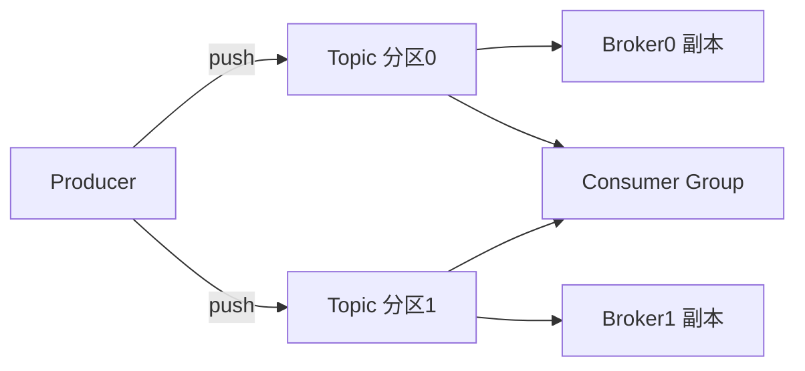

# 📨 Kafka（架构 / 生产消费 / 幂等 / Exactly-Once / 排查）

> 高吞吐分布式消息引擎。覆盖：架构与核心概念、生产者/消费者 API、分区与副本、消费者组再平衡、幂等与精确一次语义、常见故障排查。
> 依据 **[Apache Kafka Documentation](https://kafka.apache.org/documentation/)**（官方为准）。

> 📌 **适用版本 / 更新日期**：Kafka 3.7+（KRaft 取代 ZooKeeper 成为默认）；最后更新 **2026-08**。

---

## 1. 核心概念



- **Topic / Partition**：Topic 逻辑主题，分区是并行与有序单位（**分区内有序，跨分区不保证**）。
- **Offset**：消费者在分区上的进度指针。
- **Consumer Group**：同组消费者均分分区（一个分区只被组内一个消费者消费）；不同组独立消费。
- **副本（Replica）**：分区多副本，1 leader + N follower，ISR 同步集合保证不丢。

!!! tip "分区数设计"
    - 分区数 = 最大并行消费者数上限，也影响吞吐。定太高 → 文件句柄/选举开销大；定太低 → 无法横向扩消费并发。按峰值吞吐估算。

---

## 2. 生产者

```java
Properties p = new Properties();
p.put("bootstrap.servers", "k1:9092,k2:9092");
p.put("key.serializer", "org.apache.kafka.common.serialization.StringSerializer");
p.put("value.serializer", "org.apache.kafka.common.serialization.StringSerializer");
p.put("acks", "all");               // leader+ISR 都确认，最高可靠
p.put("enable.idempotence", true);  // 幂等生产者，去重重试
Producer<String,String> prod = new KafkaProducer<>(p);
prod.send(new ProducerRecord<>("order", orderId, json), (meta, ex) -> {
    if (ex != null) log.error("send fail", ex);  // 必须处理回调异常
});
```

| `acks` | 可靠性 | 吞吐 |
|--------|--------|------|
| 0 | 发就不管 | 最高 |
| 1 | leader 确认 | 中 |
| **all** | ISR 全确认 | 较低但最稳 |

!!! danger "生产踩坑"
    - 不处理 `send()` 回调异常 → 消息静默丢失。务必在 `Callback` 里处理失败（重试/落库/告警）。
    - `acks=all` 但 `min.insync.replicas=1` → 仍可能丢；设为 2（副本≥2）。
    - 同步 `send().get()` 会严重降吞吐；用异步回调。

---

## 3. 消费者

```java
p.put("enable.auto.commit", "false");   // 关自动提交，手动提交保证不丢/不重
ConsumerRecords<String,String> rs = consumer.poll(Duration.ofMillis(100));
for (ConsumerRecord<String,String> r : rs) { process(r); }
consumer.commitSync();                  // 处理完再提交 offset
```

!!! warning "提交策略"
    - 自动提交（`enable.auto.commit=true`）在处理前提交 → 崩溃则**丢消息**；处理后提交 → 重复消费。手动提交更可控。
    - **重复消费不可避免**：用业务幂等（唯一键/去重表）兜底，而非依赖"精确一次"的错觉。

---

## 4. 幂等与 Exactly-Once

- **幂等生产者**（`enable.idempotence=true`）：同分区内去重重试（PID+序列号），解决"单分区重试重复"。
- **事务 + 幂等**（EOS）：`read-committed` 隔离 + 事务性生产，实现端到端精确一次（对"消费-转换-生产"链路）。

!!! tip "现实选择"
    - 多数业务用「至少一次 + 消费幂等」即可，性价比高于重 EOS。
    - 真正 EOS 需消费端也配合事务，复杂度高。

---

## 5. 消费者组再平衡（Rebalance）

- 成员变动（扩缩容/心跳超时/处理过久）触发再平衡，分区重新分配，期间**消费暂停**。
- `max.poll.interval.ms` 太小 + 单条处理慢 → 频繁再平衡 → 消费停滞。

!!! danger "再平衡风暴"
    - 消费逻辑慢/阻塞 → 超过 `max.poll.interval.ms` 被踢出 → 再平衡 → 更慢。对策：处理与拉取解耦（异步处理+批量提交）、调大间隔、优化单条耗时。

---

## 6. 常见故障排查

| 现象 | 可能原因 | 排查 |
|------|----------|------|
| 消息堆积 | 消费慢/分区数不足 | 看 lag（`kafka-consumer-groups --describe`） |
| 消费 lag 高 | 单条耗时长 | 加分区/消费者、优化逻辑 |
| 重复消费 | 提交失败/再平衡 | 业务幂等 |
| 发送超时 | broker 不可达/网络 | 查 broker 日志、ISR 状态 |
| 乱序 | 跨分区/重试 | 同 key 路由同分区 |

!!! tip "运维命令"
    - `kafka-topics.sh --describe` 看分区/副本分布。
    - `kafka-consumer-groups.sh --describe --group g` 看 lag。
    - KRaft 模式无需 ZooKeeper，运维更简单。

> 下一章：[容器化（Docker / K8s）](containerization.md)
