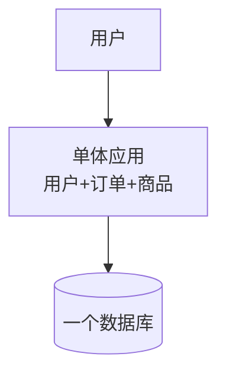
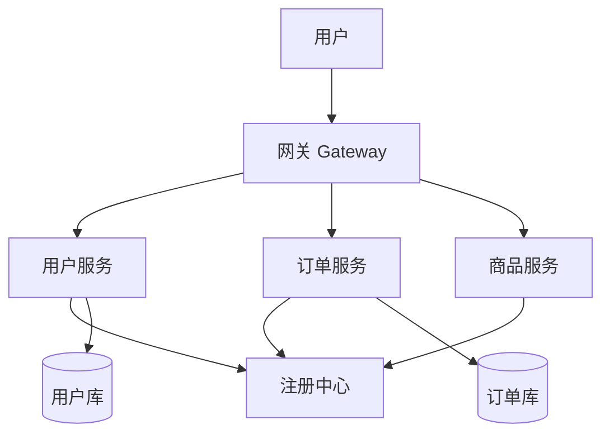
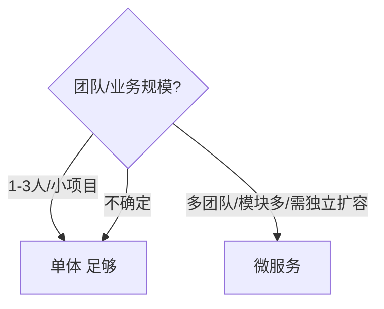

# 🧩 微服务从零开始（0 基础超详细 · 单体 vs 微服务 / 核心概念 / 何时用）

> 这是 [微服务全家桶](microservices.md) 的**前置第 0 章**，给**第一次接触"微服务"这个词**的人。
> 目标：搞懂单体架构和微服务的区别、为什么大公司要拆、微服务里那些"注册中心/网关/配置中心"到底是什么、什么时候该用/不该用。
> 不要求分布式经验，但需先会 [Spring Boot 从零开始](spring-boot-basics.md)。
>
> 依据 **[Spring Cloud 官方文档](https://spring.io/projects/spring-cloud) · [Microsoft 微服务架构指南](https://learn.microsoft.com/zh-cn/azure/architecture/microservices/)**（官方/权威社区）。

> 📌 **适用版本 / 更新日期**：Spring Cloud 2023/2024（对应 Boot 3.x）；最后更新 **2026-08**。

!!! abstract "读完你能做什么"
    用大白话讲清"单体 vs 微服务"、能画一张微服务架构图、说清注册中心/网关/配置中心各自干啥、知道微服务不是银弹（小项目别硬上）。之后去 [微服务全家桶](microservices.md) 学具体组件（Nacos/Eureka、Gateway、OpenFeign、Sentinel、链路追踪）。

---

## 1. 单体架构（你现在的项目就是这样）

- 一个项目、一个包、一个进程，所有功能（用户、订单、商品）塞一起，打成一个 `war`/`jar` 部署。
- 你用 [Spring Boot 从零开始](spring-boot-basics.md) 写的项目就是典型的单体。



!!! tip "单体的优点（小项目神器）"
    - 开发简单、部署一个包、调试容易、事务好做（一个库本地事务）。
    - **初学者/小团队/创业 MVP 就该用单体**，别一上来微服务。

!!! warning "单体变大的痛"
    - 代码越堆越大，编译慢、启动慢、牵一发动全身。
    - 一处崩全盘崩（一个模块死循环拖垮整个进程）。
    - 想给"订单"单独扩容？不行，只能整包扩容，浪费资源。

---

## 2. 微服务架构（把大应用拆成小服务）

- **微服务 = 把单体按"业务"拆成多个独立小服务**，每个服务自己跑、自己管自己的数据、通过网络（HTTP/gRPC）互相调用。
- 例：用户服务、订单服务、商品服务，各是一个独立 Spring Boot 应用。



!!! tip "微服务的收益"
    - **独立开发/部署**：订单团队改订单，不影响用户服务。
    - **独立扩容**：双十一订单压力大，只扩订单服务。
    - **技术异构**：不同服务可用不同语言/数据库（理论上）。
    - **故障隔离**：一个服务挂，不全盘崩（配合熔断）。

!!! danger "微服务的代价（新手必知）"
    - **复杂度暴涨**：网络调用、分布式事务、数据一致性、运维（几十个服务）。
    - **团队门槛高**：需要 DevOps、容器化、监控链路追踪。
    - **小项目上微服务 = 找死**：一个人维护 10 个服务不如一个单体。

---

## 3. 微服务里的"基础设施"是什么（核心概念）

### 3.1 注册中心（服务发现）

- 问题：服务 A 要调服务 B，但 B 的 IP 会变（扩缩容），A 怎么找到 B？
- **注册中心**（如 Nacos/Eureka/Consul）：所有服务启动时**上报自己的地址**；调用方去查"谁提供了订单服务"。
- 类比：公司前台通讯录，新人入职登记，找人先查通讯录。

### 3.2 网关（Gateway）

- 所有外部请求先到**网关**，由它**路由**到对应服务，并统一做：鉴权、限流、日志。
- 类比：小区大门保安，所有访客先到门卫，门卫指路 + 查身份证。

### 3.3 配置中心

- 几十个服务的配置（数据库地址、开关）集中管理，改配置不用重新打包。
- 如 Nacos / Apollo。类比：公司统一公告栏，改通知所有人即时生效。

### 3.4 服务调用（OpenFeign）

- 服务间 HTTP 调用像调本地方法一样简单：
  ```java
  @FeignClient("order-service")        // 声明调用订单服务
  public interface OrderClient {
      @GetMapping("/orders/{id}")
      OrderDTO getOrder(@PathVariable Long id);
  }
  // 使用：直接注入 OrderClient 调用，像本地方法
  ```

### 3.5 熔断/限流（Sentinel/Hystrix）

- 服务 B 挂了，A 一直等会拖垮 A → **熔断**：B 不可用时 A 快速失败/走降级。
- 流量暴涨 → **限流**：超过阈值拒绝，保护系统。

### 3.6 链路追踪（SkyWalking/Sleuth）

- 一个请求穿过 5 个服务，哪一步慢？链路追踪把整条调用链串起来看耗时。

!!! info "一张表速记"
    | 组件 | 解决什么 | 常见实现 |
    |------|----------|----------|
    | 注册中心 | 服务在哪 | Nacos / Eureka |
    | 网关 | 统一入口/路由/鉴权 | Spring Cloud Gateway |
    | 配置中心 | 配置集中管理 | Nacos / Apollo |
    | 服务调用 | 服务间通信 | OpenFeign + Ribbon |
    | 熔断限流 | 防雪崩 | Sentinel |
    | 链路追踪 | 查慢/查错 | SkyWalking |

---

## 4. 什么时候该用微服务（别盲目）



!!! tip "决策建议"
    - **初创 / 个人 / 小项目**：**单体优先**（[Spring Boot](spring-boot.md) 就够），先活下来。
    - **团队 > 10 人、模块耦合痛、需独立扩容**：考虑微服务。
    - 微服务是**组织架构问题**多过技术问题：康威定律——系统结构会复制团队结构。

!!! danger "新手最大误区"
    - "微服务更高级，我也要用" → 错。微服务解决的是**组织/规模**问题，小项目用它只会累死自己。
    - 先写好单体 + 良好分层（[Spring Boot 从零开始](spring-boot-basics.md) 的分层），规模上来再拆，比一上来微服务顺得多。

---

## 5. 最佳实践（新手照做）

!!! tip "如果真要做微服务"
    - **按业务边界拆**，不是按技术层拆（别拆成 controller 服务 / dao 服务）。
    - **每个服务独享数据库**，别多个服务共用一个库（否则又耦合回去了）。
    - **API 先契约**（OpenAPI），服务间用 Feign 调。
    - **必须有监控/链路追踪**，否则出问题两眼一抹黑。
    - 配合 **Docker/K8s** 部署（见 [容器化](containerization.md)）。

---

## 6. 自测（你学会了吗）

1. 用一句话说清单体和微服务的区别。
2. 画出"用户→网关→订单服务"的图，标出注册中心在哪起作用。
3. 说出注册中心、网关、配置中心各自解决什么。
4. 什么规模的项目不该上微服务？为什么？
5. 微服务之间怎么通信（Feign 是什么）？

> 入门过关。下一步去 [微服务全家桶](microservices.md) 学 Nacos/Eureka、Gateway 路由、OpenFeign、Sentinel 熔断、SkyWalking 链路、分布式事务。

---

## 7. 下一步

- 具体组件（Nacos/Gateway/Feign/Sentinel） → [微服务全家桶](microservices.md)
- 服务部署 → [容器化](containerization.md)
- 服务间异步解耦 → [Kafka 从零开始](kafka-basics.md)
- 先把单体写好 → [Spring Boot 从零开始](spring-boot-basics.md)
