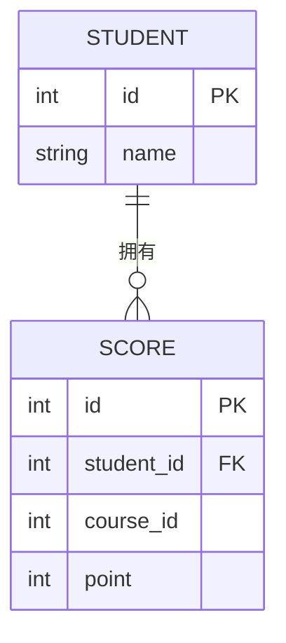

# 🐬 MySQL 从零开始（0 基础超详细 · 安装 → 第一个库表 → CRUD）

> 这是 [MySQL 到精通](mysql.md) 的**前置第 0 章**，专门给**完全没碰过数据库**的人。
> 目标：搞懂"数据库是什么"、装好 MySQL、用命令行和图形工具建库建表、写出第一条增删改查 SQL、知道基本配置和坑。
> 不论你是转行、在校、还是想系统学 Java 后端——从这里起步，不要求任何前置经验。
>
> 依据 **[MySQL 8.0 Reference Manual](https://dev.mysql.com/doc/refman/8.0/en/)**（官方权威）。

> 📌 **适用版本 / 更新日期**：MySQL 8.0（LTS，当前主流）/ 8.4；最后更新 **2026-08**。

!!! abstract "读完你能做什么"
    装好 MySQL → 建一个 `school` 库 → 建 `student` 表 → 插入/查询/修改/删除数据 → 理解表/字段/主键这些词。之后再去 [MySQL 到精通](mysql.md) 学索引、事务、优化。

---

## 1. 数据库到底是什么（先用大白话）

- **数据库（Database）**：一个按规则组织的"电子文件柜"，用来**长期、安全、高效地存数据**。比 Excel 强在：支持多人并发、数据一致、海量、可复杂查询。
- **MySQL**：最流行的**开源关系型数据库**。"关系型"= 数据以"表（table）"存储，表与表之间可以关联（如订单表关联用户表）。
- **表（table）= Excel  sheet**：行是记录，列是字段。
- **SQL**：操作数据库的统一语言（Structured Query Language）。增删改查都靠它。

!!! tip "为什么 Java 后端必学 MySQL"
    你写的程序（用户、订单、文章）数据总得有个地方存。MySQL 是 Java 生态最常用、面试必问、资料最多的关系型数据库。学会它，等于拿到了"后端存数据"的钥匙。

---

## 2. 下载与安装（官方地址）

### 2.1 官方下载

| 系统 | 官方地址 | 推荐方式 |
|------|----------|----------|
| Windows | <https://dev.mysql.com/downloads/installer/> | 下载 **MySQL Installer（mysql-installer-community）**，图形化一步步装 |
| macOS | <https://dev.mysql.com/downloads/mysql/> | 下载 `.dmg`；或 `brew install mysql` |
| Linux（Ubuntu/Debian） | 同上或用 apt | `sudo apt install mysql-server` |

!!! warning "别踩的坑"
    - 下载选 **MySQL Community Server**（免费开源版），不是 MySQL Enterprise（商业版，要钱）。
    - Windows 装的时候会让你设 **root 密码**——**一定记牢**！忘了找回很麻烦。
    - 安装类型选 **Developer Default**（开发默认），会自动装 MySQL Server + Workbench（图形工具）。
    - 编码务必选 **UTF-8（utf8mb4）**，否则中文会乱码（见下节配置）。

### 2.2 验证安装

```bash
mysql -u root -p
# 输入密码后进入 mysql> 命令行，看到 mysql> 提示符即成功
mysql> SELECT VERSION();
# 输出 8.0.x
```

!!! danger "mysql 不是内部命令"
    - Windows 没把 MySQL 的 `bin` 加进 `PATH`：把安装目录下的 `MySQL\MySQL Server 8.0\bin` 加进系统 `Path` 环境变量，重开终端。
    - macOS/Linux 用 brew/apt 装的通常已配好。

---

## 3. 图形工具（新手强烈推荐 Workbench）

命令行对新手不友好，用 **MySQL Workbench**（安装时自带，或单独下 <https://dev.mysql.com/downloads/workbench/>）：
1. 打开 → 左侧 **MySQL Connections** → 点 `+` 新建连接。
2. Connection Name 随便填（如 `local`），Hostname `127.0.0.1`，Port `3306`，用户名 `root`，密码填安装时设的。
3. 双击连接 → 进入操作界面，左边能看到所有数据库。

!!! tip "其他可选工具"
    - **DBeaver**（免费、跨库通用）：<https://dbeaver.io/>
    - **Navicat**（好用但收费）
    - 新手用 Workbench 或 DBeaver 即可，别在命令行硬磕。

---

## 4. 第一个库和第一张表（手把手）

### 4.1 建库

```sql
CREATE DATABASE school CHARACTER SET utf8mb4 COLLATE utf8mb4_unicode_ci;
USE school;   -- 切换到这个库，后续操作都在它里面
```

!!! tip "为什么指定 utf8mb4"
    - MySQL 的 `utf8` 是"假 UTF-8"（只支持 3 字节），存不了 emoji 和部分生僻字。
    - **永远用 `utf8mb4`**（真 4 字节 UTF-8），这是官方推荐的最佳实践。

### 4.2 建表

```sql
CREATE TABLE student (
    id        INT PRIMARY KEY AUTO_INCREMENT,   -- 主键，自增，唯一标识一行
    name      VARCHAR(50) NOT NULL,             -- 姓名，不可为空，最长50
    age       INT,                              -- 年龄，可空
    email     VARCHAR(100) UNIQUE,              -- 邮箱，唯一（不重复）
    created_at DATETIME DEFAULT CURRENT_TIMESTAMP  -- 创建时间，默认当前时间
) ENGINE=InnoDB DEFAULT CHARSET=utf8mb4;
```

**逐列解释（0 基础必懂）**：

| 写法 | 含义 |
|------|------|
| `INT` | 整数类型 |
| `VARCHAR(50)` | 可变长度字符串，最长 50 |
| `PRIMARY KEY` | 主键：唯一、非空，用来定位一行（如学号） |
| `AUTO_INCREMENT` | 自增：插入时不填，MySQL 自动 +1 |
| `NOT NULL` | 这一列不能填空 |
| `UNIQUE` | 这一列值不能重复 |
| `DEFAULT` | 不填时的默认值 |
| `ENGINE=InnoDB` | 存储引擎（默认就是它，支持事务） |

!!! danger "新手三大坑"
    - 表名/字段名用中文或保留字（如 `order`、`user`）→ 报错。用全小写英文 + 下划线（`student`、`created_at`）。
    - `VARCHAR` 必须指定长度（`VARCHAR(50)`），不能只写 `VARCHAR`。
    - 忘记设主键 → 表没有唯一标识，查询/关联会出问题。

---

## 5. CRUD：增删改查（最核心的 4 句话）

### 5.1 增（INSERT）

```sql
INSERT INTO student (name, age, email) VALUES ('张三', 20, 'zhangsan@x.com');
INSERT INTO student (name, age, email) VALUES ('李四', 22, 'lisi@x.com');
```

### 5.2 查（SELECT）

```sql
SELECT * FROM student;                      -- 查所有列所有行
SELECT name, age FROM student;              -- 只查姓名和年龄
SELECT * FROM student WHERE age > 21;       -- 条件查询：年龄大于21
SELECT * FROM student ORDER BY age DESC;    -- 按年龄倒序
SELECT * FROM student LIMIT 5;              -- 只取前5条
```

!!! tip "SELECT 口诀"
    `SELECT 列 FROM 表 WHERE 条件 ORDER BY 列 LIMIT 条数`——这就是 80% 查询的骨架。

### 5.3 改（UPDATE）

```sql
UPDATE student SET age = 21 WHERE name = '张三';
```

!!! danger "UPDATE 忘了 WHERE = 灾难"
    - `UPDATE student SET age = 21;`（没 WHERE）会把**全表**年龄改成 21！
    - **生产环境 UPDATE/DELETE 必须带 WHERE**，且先 `SELECT` 确认影响范围再改。

### 5.4 删（DELETE）

```sql
DELETE FROM student WHERE name = '李四';
```

!!! danger "DELETE 忘了 WHERE = 删库"
    - `DELETE FROM student;`（没 WHERE）清空整张表！
    - 更狠的 `DROP TABLE student;` 直接删表结构。生产慎用，操作前先备份。

---

## 6. 表与表的关系（为什么叫"关系型"）



- **一对多**：一个学生有多条成绩 → `score` 表用 `student_id` 关联 `student.id`。
- **外键（FOREIGN KEY）**：`score.student_id` 指向 `student.id`，保证数据不"孤儿"。
- 关联查询用 `JOIN`：

```sql
SELECT s.name, c.point
FROM student s
JOIN score c ON s.id = c.student_id;
```

!!! tip "0 基础先记住"
    关系型数据库的核心是"用主键(id)和外键(别的表的id)把多张表连起来"。JOIN 是精髓，[精通篇](mysql.md) 会细讲。

---

## 7. 基础配置与最佳实践（新手照做）

### 7.1 字符集（最重要）

```ini
# my.cnf / my.ini 关键配置（确保全程 UTF-8）
[client]
default-character-set = utf8mb4
[mysqld]
character-set-server = utf8mb4
collation-server = utf8mb4_unicode_ci
```

!!! warning "中文乱码自查"
    - 库、表、连接三层都要 utf8mb4。连接时指定：`jdbc:mysql://localhost:3306/school?useUnicode=true&characterEncoding=utf8mb4`。

### 7.2 命名规范

- 表名/字段名：**全小写 + 下划线**（`user_order`、`created_at`）。
- 主键统一叫 `id`，外键叫 `关联表_id`（`user_id`）。
- 布尔用 `is_xxx`（`is_deleted` 软删除）。

!!! tip "软删除最佳实践"
    - 别物理 `DELETE`，加 `is_deleted TINYINT DEFAULT 0` 字段，查询时 `WHERE is_deleted = 0`。数据不丢、可恢复、审计友好。

### 7.3 其他好习惯

- 每张表都加 `id` 主键 + `created_at` / `updated_at` 时间字段。
- 字段类型选最合适最小：`年龄`用 `TINYINT` 够，`金额`用 `DECIMAL(10,2)`（**别用 FLOAT/DOUBLE 存钱**，有精度误差）。
- 学会用 `EXPLAIN` 看 SQL 慢不慢（[精通篇](mysql.md) 讲）。

---

## 8. 自测（你学会了吗）

```sql
-- 1. 建一个 book 表（id/书名/价格/上架时间）
-- 2. 插入 3 本书
-- 3. 查出价格 > 50 的书，按价格倒序
-- 4. 把其中一本涨价 10 元
-- 5. 删除最便宜的一本
```

> 能独立写完上面 5 步，0 基础入门就过关了。接下来去 [MySQL 到精通](mysql.md) 学索引为什么让查询快 100 倍、事务怎么保证钱不丢、锁和分库分表。

---

## 9. 下一步

- 想深挖索引/事务/锁/SQL 优化 → [MySQL 到精通](mysql.md)
- 程序怎么连 MySQL（JDBC/MyBatis）→ 看 [Spring 全家桶](spring-family.md) 的 Data 部分
- 配合缓存 → [Redis 从零开始](redis-basics.md)
