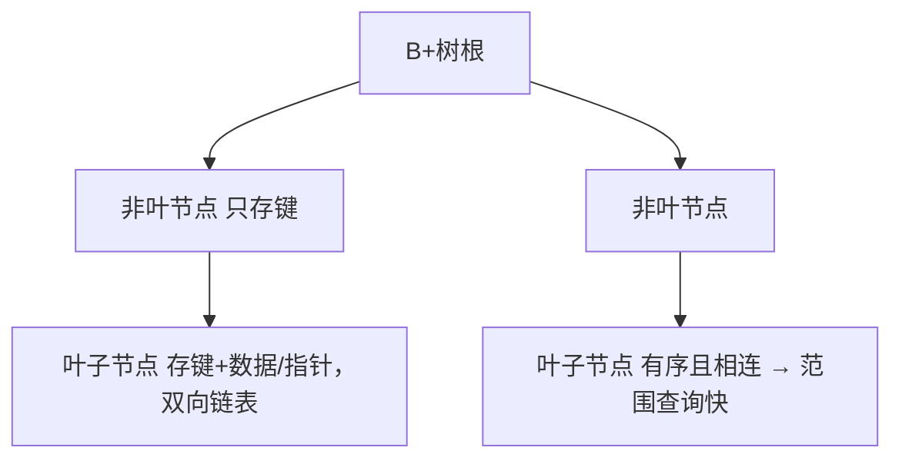

# 🐬 MySQL 到精通（索引 / 事务 / 锁 / 优化）

> 后端存储基石。从建表规范 → 索引原理 → 事务隔离 → 锁机制 → SQL 优化 → 分库分表，逐层到"精通"。
> 依据 **[MySQL 8.0 Reference Manual](https://dev.mysql.com/doc/refman/8.0/en/)**（官方权威，不照搬二手博客）。

> 📌 **适用版本 / 更新日期**：MySQL 8.0（LTS）/ 8.4；最后更新 **2026-08**。以下以 InnoDB 引擎为准。

---

## 1. 架构与存储引擎

- **InnoDB**（默认）：支持事务、行锁、外键、MVCC、崩溃恢复。
- **MyISAM**：表锁、无事务，仅读多写少且不用事务时考虑（已少用了）。

!!! danger "引擎选型"
    - 需要事务/并发写 → **必须用 InnoDB**。MyISAM 在崩溃后可能表损坏且不支持行锁。

---

## 2. 索引（核心中的核心）

### 2.1 数据结构：B+ 树



- 所有数据在**叶子节点**，且叶子间双向链表 → 范围查询/排序极快。
- 树高通常 3~4 层 → 一次查询约 3~4 次磁盘 IO。

### 2.2 索引类型与最左前缀

- **聚簇索引**（主键）：InnoDB 表数据即按主键 B+ 树排列。主键用自增 `BIGINT` 最优（避免 UUID 导致页分裂/碎片化）。
- **二级索引**：叶子存主键值，回表查聚簇索引取其他列。
- **联合索引**遵守**最左前缀**：`(a,b,c)` 能命中 `a`、`a,b`、`a,b,c`，但 `b`、`b,c` 用不上。

!!! danger "索引失效高频场景"
    - 对索引列做函数/运算：`WHERE YEAR(create_time)=2026` → 失效；改成范围 `create_time >= '2026-01-01'`。
    - 隐式类型转换：`WHERE phone = 13800138000`（phone 是 varchar）→ 转数字导致失效，应 `'13800138000'`。
    - 前导模糊：`LIKE '%abc'` 失效；`LIKE 'abc%'` 可用。
    - `OR` 连接非索引列会全表。
    - 使用 `!=` / `NOT IN` / `IS NULL` 多数情况走全表（视版本/统计）。

### 2.3 覆盖索引与回表

```sql
-- idx_user_age_name (age, name)
SELECT name FROM user WHERE age = 18;  -- 命中覆盖索引，无需回表
SELECT * FROM user WHERE age = 18;      -- 需回表取其他列
```

!!! tip "设计原则"
    - 高区分度列放联合索引前面（如 `status` 只有 0/1 区分度低，不宜前置）。
    - 利用覆盖索引减少回表；但索引不是越多越好（拖慢写、占空间）。

---

## 3. 事务与隔离级别

| 隔离级别 | 脏读 | 不可重复读 | 幻读 | 说明 |
|----------|------|-----------|------|------|
| READ UNCOMMITTED | ❌可能 | ❌ | ❌ | 几乎不用 |
| READ COMMITTED | ✅避免 | ❌ | ❌ | 多数库默认 |
| **REPEATABLE READ** | ✅ | ✅ | ✅(MVCC+Next-Key) | **MySQL 默认** |
| SERIALIZABLE | ✅ | ✅ | ✅ | 串行，性能差 |

- **MVCC**（多版本并发控制）：每行隐藏 `trx_id`/`roll_pointer`，读不加锁，靠 undo log 快照实现"可重复读"。
- MySQL 在 RR 下用 **Next-Key Lock** 解决幻读。

!!! warning "长事务是毒药"
    - 长事务持有 undo log 不释放 → 版本链膨胀、回滚段暴涨；且占锁。务必缩小事务边界，避免事务里调远程接口。

---

## 4. 锁机制

| 锁 | 范围 | 触发 |
|----|------|------|
| 行锁（Record） | 单行 | 等值命中索引的写 |
| 间隙锁（Gap） | 区间 | 防止插入（RR） |
| Next-Key Lock | 行+间隙 | RR 默认，防幻读 |
| 意向锁 | 表级 | 表锁与行锁协调 |

!!! danger "死锁与锁升级"
    - 两事务交叉更新不同行顺序相反 → 死锁；InnoDB 检测到后回滚代价小的一方。规避：统一更新顺序、缩短事务。
    - `UPDATE` 没走索引 → **锁升级为表锁**（5.6+ 为"全表行锁扫描"但实质上阻塞全部写）→ 务必保证 where 走索引。

---

## 5. SQL 优化与执行计划

```sql
EXPLAIN SELECT * FROM order WHERE user_id = 1 AND status = 'PAID';
```

关注 `EXPLAIN` 字段：
- `type`：`const`/`ref`/`range` 优，`ALL`（全表）差。
- `key`：实际用的索引，NULL=没用。
- `rows`：预估扫描行数，越小越好。
- `Extra`：`Using filesort`/`Using temporary` 需优化（加索引或改排序）。

!!! tip "慢查询治理"
    - 开慢查询日志：`slow_query_log=1`，`long_query_time=1`。
    - 用 `pt-query-digest` 聚合 Top SQL。
    - 深分页 `LIMIT 100000,20` 慢 → 用游标/延迟关联：`WHERE id > 100000 LIMIT 20`。

---

## 6. 分库分表（资深）

- **垂直拆分**：按业务/列拆分（大字段独立表）。
- **水平拆分**：按 `user_id % N` 或范围/雪花 id 路由。注意：跨片 JOIN、分布式事务、全局唯一 id（雪花/号段）。
- 中间件：ShardingSphere（官方社区）。**能不分就不分**，先垂直+索引+缓存。

!!! danger "分表的代价"
    - 跨分片查询/事务复杂、运维成本陡增。分表前先确认 QPS/数据量真的到瓶颈，且已用完单机优化手段。

---

## 7. 自测

```sql
-- 哪种会走索引？(a,b,c) 联合索引
WHERE a=1 AND b=2 AND c=3;  -- ✅ 全命中
WHERE a=1 AND c=3;          -- ⚠️ 只用 a，c 失效（缺 b）
WHERE b=2 AND c=3;          -- ❌ 全表（无最左 a）
```

> 下一章：[Redis](redis.md)
