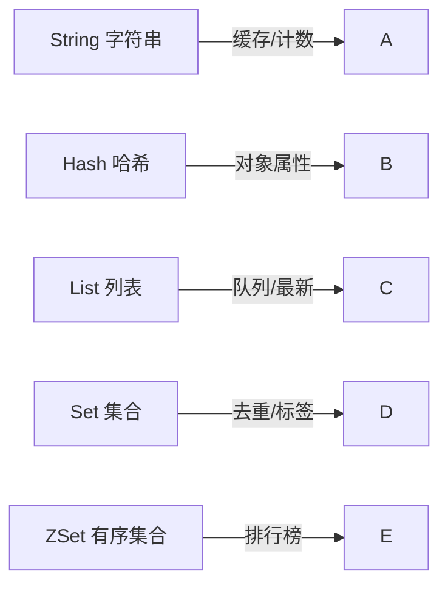

# 🔴 Redis 从零开始（0 基础超详细 · 是什么 → 安装 → 五种结构手把手）

> 这是 [Redis 到精通](redis.md) 的**前置第 0 章**，给**完全没用过 Redis** 的人。
> 目标：搞懂 Redis 是什么、为什么比 MySQL 快、装好它、用命令行玩转五种核心数据结构、理解典型用途和坑。
> 不论你转行、在校、还是想系统学 Java 后端——从零开始，不要求任何前置。
>
> 依据 **[Redis Official Docs](https://redis.io/docs/latest/)**（官方为准）。

> 📌 **适用版本 / 更新日期**：Redis 7.x（含 7.4 LTS 思路）；最后更新 **2026-08**。

!!! abstract "读完你能做什么"
    装好 Redis → 用 `redis-cli` 连上 → 用 String/Hash/List/Set/ZSet 五种结构存取值 → 理解"缓存"是什么、为什么快 → 知道基本配置和坑。之后去 [Redis 到精通](redis.md) 学持久化、集群、缓存三大坑、分布式锁。

---

## 1. Redis 到底是什么（大白话）

- **Redis = 内存数据库**：数据主要存在**内存**里（不是硬盘），所以读写极快（微秒级），是 MySQL 的**加速层**。
- 官方定义：Remote Dictionary Server，一个**键值（key-value）型**的 NoSQL 数据库。
- **和 MySQL 的区别**：

| 对比 | MySQL | Redis |
|------|-------|-------|
| 存哪 | 硬盘 | 内存（快，但贵、重启可能丢） |
| 结构 | 表/行/列（关系型） | 键值 + 五种数据结构 |
| 速度 | 慢些（毫秒） | 极快（微秒） |
| 用途 | 持久存储"真数据" | 缓存、计数器、排行榜、锁 |

!!! tip "为什么 Java 后端要学 Redis"
    - **缓存**：把热点数据放 Redis，请求不用每次查 MySQL，系统快十倍。
    - **计数器**：文章阅读量、点赞数（`INCR` 原子自增）。
    - **排行榜**：游戏分数榜（ZSet 有序集合）。
    - **分布式锁**：多台服务器抢资源时加锁（[精通篇](redis.md) 讲）。
    - 面试后端必问，生产高频。

!!! warning "Redis 不是 MySQL 的替代品"
    - Redis 数据在内存，**贵且可能丢**（虽然能持久化）。真数据（订单、用户）仍在 MySQL。
    - 典型架构：**MySQL 存真数据 + Redis 做缓存加速**。

---

## 2. 下载与安装（官方地址）

| 系统 | 官方地址 | 推荐方式 |
|------|----------|----------|
| Linux | <https://redis.io/downloads/> | 下载源码编译，或 `apt install redis` / `brew install redis` |
| macOS | `brew install redis` | 然后 `brew services start redis` |
| Windows | 官方不原生支持，用 **WSL2**（推荐）或 <https://github.com/microsoftarchive/redis> 旧版 | 建议 WSL2 里按 Linux 方式装 |

!!! warning "Windows 用户注意"
    - Redis 官方**不支持原生 Windows**（旧版微软移植已停更）。最佳：开 **WSL2**（Windows 自带 Linux 子系统）装 Ubuntu，再按 Linux 装 Redis。
    - 别在百度随便下"Redis Windows 版"，版本老旧且不安全。

### 2.1 启动与验证

```bash
redis-server                # 启动服务端（默认端口 6379）
# 另开一个终端
redis-cli                   # 启动客户端命令行
127.0.0.1:6379> ping
PONG                        # 返回 PONG 即成功
```

!!! tip "后台运行（Linux/macOS）"
    ```bash
    redis-server --daemonize yes     # 后台启动
    redis-cli ping                   # 测试
    ```

---

## 3. 第一个 Key-Value（String）

Redis 最基础：**一个 key 对应一个 value**。

```bash
127.0.0.1:6379> SET name "张三"
OK
127.0.0.1:6379> GET name
"张三"
127.0.0.1:6379> EXISTS name
(integer) 1
127.0.0.1:6379> DEL name
(integer) 1
127.0.0.1:6379> GET name
(nil)                       # 已删除
```

!!! tip "String 不止能存文字"
    - 能存**数字**，配合 `INCR` 做原子计数器（并发安全）：
    ```bash
    127.0.0.1:6379> SET views 0
    OK
    127.0.0.1:6379> INCR views      # 自增1，返回1
    (integer) 1
    127.0.0.1:6379> INCR views      # 并发下也安全，不会漏算
    (integer) 2
    ```
    - 还能存 JSON 字符串（对象序列化后）、二进制。

---

## 4. 五种核心数据结构（手把手）



### 4.1 String（字符串）
见上节。最常用：**缓存 JSON、计数器**。

### 4.2 Hash（哈希：存对象属性）

```bash
127.0.0.1:6379> HSET user:1 name "张三" age 20
(integer) 2
127.0.0.1:6379> HGET user:1 name
"张三"
127.0.0.1:6379> HGETALL user:1
1) "name"
2) "张三"
3) "age"
4) "20"
```

!!! tip "Hash 适合存对象"
    - 一个用户 `user:1` 的多个字段（name/age/email）放一个 Hash，改某个字段不影响其他，比整个 String 重存省内存。

### 4.3 List（列表：队列/最新列表）

```bash
127.0.0.1:6379> LPUSH news "标题A"     # 左侧插入
(integer) 1
127.0.0.1:6379> LPUSH news "标题B"
(integer) 2
127.0.0.1:6379> LRANGE news 0 -1      # 取全部（0到末尾）
1) "标题B"
2) "标题A"
127.0.0.1:6379> RPOP news             # 右侧弹出（队列消费）
"标题A"
```

!!! tip "List 典型用途"
    - **消息队列**：`LPUSH` 生产、`RPOP` 消费。
    - **最新列表**：最新 N 条微博/日志（`LPUSH` + `LTRIM` 保留前 100 条）。

### 4.4 Set（集合：去重）

```bash
127.0.0.1:6379> SADD tags "java" "redis" "java"   # 重复 java 只存一次
(integer) 2
127.0.0.1:6379> SMEMBERS tags
1) "java"
2) "redis"
127.0.0.1:6379> SISMEMBER tags "java"
(integer) 1                                   # 是否存在
```

!!! tip "Set 典型用途"
    - 点赞/收藏用户去重、共同关注（交集 `SINTER`）、抽奖（随机 `SRANDMEMBER`）。

### 4.5 ZSet（有序集合：排行榜）

```bash
127.0.0.1:6379> ZADD rank 100 "张三" 200 "李四" 150 "王五"
(integer) 3
127.0.0.1:6379> ZREVRANGE rank 0 -1 WITHSCORES   # 按分数倒序
1) "李四"  2) "200"
3) "王五"  4) "150"
5) "张三"  6) "100"
```

!!! tip "ZSet 典型用途"
    - **排行榜**（游戏分数、热度榜）、**延迟队列**（score 用执行时间戳）。

---

## 5. 设置过期时间（缓存核心）

```bash
127.0.0.1:6379> SET code "123456" EX 60    # 60秒后自动消失（验证码场景）
OK
127.0.0.1:6379> TTL code                   # 看剩余秒数
(integer) 58
127.0.0.1:6379> EXPIRE name 300            # 给已有 key 设过期
(integer) 1
```

!!! danger "缓存三大坑（先有个印象）"
    - **缓存穿透**：查不存在的数据，绕过缓存打挂 DB → 用空值缓存/布隆过滤器。
    - **缓存击穿**：热点 key 过期瞬间大量请求打 DB → 互斥锁/逻辑过期。
    - **缓存雪崩**：大量 key 同时过期 → 过期时间加随机值。
    - 详细解法见 [Redis 到精通](redis.md)。

---

## 6. 基础配置与最佳实践

### 6.1 关键配置（redis.conf）

```ini
bind 127.0.0.1            # 只允许本机连（生产别暴露公网！）
port 6379
requirepass yourpassword # 设密码（生产必须！否则被裸连删库）
maxmemory 512mb          # 最大内存，超过按策略淘汰
maxmemory-policy allkeys-lru   # 内存满时淘汰最久未用
appendonly yes           # 开启 AOF 持久化（防重启丢数据）
```

!!! danger "Redis 暴露公网 = 裸奔"
    - 不设密码 + 暴露公网 → 黑客 `FLUSHALL` 清空你所有数据，甚至勒索。
    - **生产：bind 内网 + 强密码 + 防火墙**，绝不直接暴露 6379 到公网。

### 6.2 命名规范

- key 用 `对象:id:字段` 风格：`user:1:name`、`order:1001:status`。
- 别用超长 key、别存超大 value（如整个商品详情 JSON > 10KB 考虑拆）。

!!! tip "key 设计最佳实践"
    - 统一前缀方便管理：`cache:user:{id}`、`lock:order:{id}`。
    - 给缓存 key 都设 TTL，避免"脏数据永久驻留"。

---

## 7. 自测（你学会了吗）

```bash
# 1. 用 Hash 存一个用户 user:100（name/age/email）
# 2. 用 INCR 做一个阅读量计数器 article:100:views
# 3. 用 ZAdd 做一个排行榜，查前3名
# 4. 给验证码 SET code XXX EX 60
# 5. 给某个 key 设 300 秒过期，用 TTL 看剩余
```

> 能独立写完上面 5 步，0 基础入门过关。下一步去 [Redis 到精通](redis.md) 学持久化、集群、缓存三大坑、分布式锁。

---

## 8. 下一步

- 持久化/集群/缓存坑/分布式锁 → [Redis 到精通](redis.md)
- Java 程序怎么用 Redis（Spring Data Redis） → [Spring 全家桶](spring-family.md)
- 配合 MySQL 做缓存架构 → [MySQL 从零开始](mysql-basics.md)
