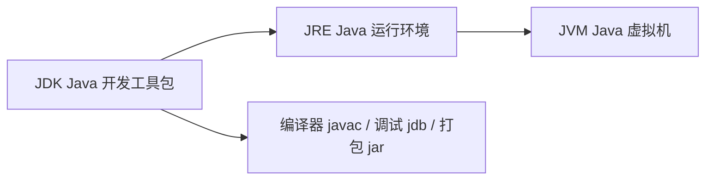

# ☕ Java 开发环境搭建（0 基础第一步 · 下载地址 + 最佳配置 + 最佳实践）

> 这是 Java 板块真正的**第 0 章**。如果你从没装过 Java、没写过一行代码，从这开始。
> 目标：装好 JDK、选好 IDE、跑通第一个 `Hello World`、会用 Maven/Gradle 管依赖，并知道**官方推荐的配置和最佳实践**。
> 全部下载地址指向**官方**，不瞎推荐来路不明的镜像站。

> 📌 **适用版本 / 更新日期**：JDK 21（LTS，当前主流）；兼容 8/11/17。最后更新 **2026-08**。

---

## 1. 先搞清楚：JDK / JRE / JVM 是什么关系



- **JVM**：真正跑字节码（`.class`）的虚拟机。一次编译、到处运行靠它。
- **JRE**：JVM + 基础类库，能**运行** Java 程序（不能编译）。
- **JDK**：JRE + 编译器 `javac` + 工具，**开发必须装 JDK**（装 JRE 不够）。
- **JDK 发行商**：Oracle JDK（商业生产需授权）、**Eclipse Temurin（Adoptium，免费 LTS，官方社区首选）**、Amazon Corretto、Azul Zulu。学习/生产免费首选 **Temurin**。

!!! tip "0 基础选哪个版本"
    直接装 **JDK 21 LTS**（2023 发布，长期支持，特性最新且稳定）。老项目可能是 8/11/17，面试常问差异，但你自己学用 21 即可。

---

## 2. JDK 下载与安装（附官方地址）

### 2.1 官方下载地址（不要搜"JDK 下载"点广告）

| 发行商 | 官网地址 | 说明 |
|--------|----------|------|
| **Eclipse Temurin（推荐）** | <https://adoptium.net/temurin/releases/> | 免费 LTS，官方社区维护，一键选版本/系统 |
| Oracle JDK | <https://www.oracle.com/java/technologies/downloads/> | 个人学习免费，生产商用需看 Oracle 授权 |
| Amazon Corretto | <https://aws.amazon.com/corretto/> | AWS 维护，免费，云上友好 |
| Azul Zulu | <https://www.azul.com/downloads/> | 免费，支持老系统 |

!!! warning "别踩的坑"
    - 不要在百度搜出来的"XX 软件园/绿色版"下载 JDK——可能捆绑木马或版本老旧。
    - Windows 注意选对架构：**x64**（大多数笔记本）还是 **aarch64**（M 系列 Mac / 骁龙本）。装错架构跑不起来。
    - macOS 选 `.pkg` 双击装；Linux 选 `.deb`/`.rpm` 或压缩包解压。

### 2.2 安装后验证

```bash
# Windows / macOS / Linux 通用
java -version
javac -version
```

正常应显示类似：

```text
openjdk version "21.0.5" 2024-10-15 LTS
OpenJDK Runtime Environment Temurin-21.0.5+11 (build 21.0.5+11-LTS)
OpenJDK 64-Bit Server VM Temurin-21.0.5+11 (build 21.0.5+11-LTS, mixed mode)
```

!!! danger "装了却 `java 不是内部或外部命令`"
    - **没配环境变量**：把 JDK 的 `bin` 目录加进 `PATH`（见下节）。
    - Windows 装了却提示版本不对：可能装了多个 JDK，`PATH` 里旧的在前。用 `where java` 看实际指向，调整顺序。
    - 用包管理器（见 5 节）可自动配好 PATH，省心。

---

## 3. 环境变量配置（Windows 重点）

### 3.1 Windows（手动装 .zip 时需要）

1. 复制 JDK 安装目录，如 `C:\Java\jdk-21.0.5+11`（含 `bin` 子目录）。
2. 系统变量新建 `JAVA_HOME` = `C:\Java\jdk-21.0.5+11`。
3. 编辑 `Path`，新增两条：
   - `%JAVA_HOME%\bin`
   - （可选）`%JAVA_HOME%\jre\bin`
4. 重新打开终端，`java -version` 验证。

!!! tip "最佳实践"
    - 用 `JAVA_HOME` 而不是把绝对路径写死进 `PATH`——以后升级 JDK 只改 `JAVA_HOME` 一处。
    - 一台机器有多个 JDK（8/17/21）时，用 `JAVA_HOME` 切换 + 改 `PATH` 顺序，或装 [`jenv`](https://www.jenv.be/)（macOS/Linux）/ [`jabba`](https://github.com/shyiko/jabba) 管理多版本。

### 3.2 macOS / Linux

用包管理器（Homebrew / apt / yum）安装会自动配 `PATH`，无需手动。手动解压版：

```bash
# 编辑 ~/.zshrc 或 ~/.bashrc
export JAVA_HOME=/usr/local/jdk-21.0.5+11
export PATH=$JAVA_HOME/bin:$PATH
```

---

## 4. 选 IDE（官方下载 + 最佳配置）

Java 主流 IDE 两个：**IntelliJ IDEA**（最主流，智能最强）、**Eclipse**（免费老牌）。初学者首选 **IntelliJ IDEA Community（免费）**。

| IDE | 官方下载 | 免费版 | 说明 |
|-----|----------|--------|------|
| **IntelliJ IDEA** | <https://www.jetbrains.com/idea/download/> | Community（社区版，够用） | 智能提示/重构最强，Spring Boot 友好 |
| **Eclipse** | <https://www.eclipse.org/downloads/packages/> | 全免费 | 老牌，Spring Tools Suite(STS) 是其定制版 |
| **VS Code + Extension** | <https://code.visualstudio.com/> + 扩展 "Extension Pack for Java" | 免费 | 轻量，适合已在用 VS Code 的人 |

### 4.1 IntelliJ IDEA 最佳初始配置（新手照做）

1. **装完先装插件**：`Chinese (Simplified) Language Pack`（中文界面，可选）、`Lombok`、`Maven Helper`、`Spring Boot Helper`（Ultimate 才有，Community 用 `Spring Boot` 基础支持）。
2. **SDK 指向 JDK 21**：`File → Project Structure → SDKs` 添加你装的 JDK；新建项目选它。
3. **字符编码统一 UTF-8**（避免中文乱码）：
   - `File → Settings → Editor → File Encodings`：`Global / Project Encoding` 都设 `UTF-8`，勾 `Transparent native-to-ascii conversion`。
4. **换行符统一 LF**（团队协作防差异）：
   - `Settings → Editor → Code Style`：Line separator 设 `Unix and macOS (\n)`。
5. **自动导包**：`Settings → Editor → General → Auto Import`：勾 `Add unambiguous imports on the fly`、`Optimize imports`。
6. **开启注解处理**（用 Lombok 必须）：`Settings → Build → Compiler → Annotation Processors` 勾 `Enable annotation processing`。

!!! danger "新手三大 IDE 坑"
    - **Lombok 不生效**：没装 Lombok 插件 / 没开注解处理 → `get/set` 报红。按上面两步搞定。
    - **JDK 版本不匹配**：项目设了 Java 21 但 SDK 指向 8 → 语法报错。统一版本。
    - **Maven 依赖下不下来**：公司内网或镜像没配，卡在 `Downloading`。配置国内**官方镜像仓库**见下节（注意用官方/知名镜像，勿用不明源）。

---

## 5. 构建工具：Maven / Gradle（管依赖、打包）

> 真实项目不会手动 `javac`，用 **Maven** 或 **Gradle** 管理依赖、编译、测试、打包。初学者先学 **Maven**（资料最多、公司最常用）。

### 5.1 Maven 下载与安装

- 官方下载：<https://maven.apache.org/download.cgi>（下 `apache-maven-3.9.x-bin.zip`）
- 解压到如 `C:\maven`，配 `MAVEN_HOME` + `PATH`：`%MAVEN_HOME%\bin`
- 验证：`mvn -v`

```bash
mvn -v
# Apache Maven 3.9.9 ...  Java version: 21
```

!!! tip "最佳实践：用国内官方镜像加速（阿里云 Maven 中央镜像，知名可信）"
    编辑 `~/.m2/settings.xml`（没有就新建）：

    ```xml
    <settings>
      <mirrors>
        <mirror>
          <id>aliyun-maven</id>
          <name>Aliyun Maven</name>
          <url>https://maven.aliyun.com/repository/public</url>
          <mirrorOf>central</mirrorOf>
        </mirror>
      </mirrors>
    </settings>
    ```

    !!! warning "注意"
        - 仅镜像 `central`（中央仓库），不要把 `mirrorOf` 设成 `*`（会拦截你公司私服）。
        - 生产/公司环境优先用 **Nexus / Artifactory 私服**，不要直连公网。

### 5.2 Gradle（备选，Kotlin/Android 常用）

- 官方：<https://gradle.org/releases/>，或项目里用 `gradlew`（Wrapper，团队版本统一，推荐）。
- 验证：`gradle -v` 或 `./gradlew -v`。
- **最佳实践**：项目必带 `gradlew`/`gradlew.bat`（Wrapper），新人 clone 下来直接 `./gradlew build`，无需先装 Gradle。

---

## 6. 第一个程序：Hello World（两种跑法）

### 6.1 纯命令行（理解原理）

新建 `Hello.java`：

```java
public class Hello {
    public static void main(String[] args) {
        System.out.println("Hello, Java!");
    }
}
```

```bash
# 编译：生成 Hello.class（字节码）
javac Hello.java
# 运行：JVM 解释执行字节码
java Hello
# 输出：Hello, Java!
```

!!! tip "原理一句话"
    `javac` 把 `.java` 源码编译成 `.class` 字节码 → `java` 让 JVM 加载并运行。**一次编译，到处运行**指的就是 `.class` 跨平台。

!!! danger "初学者高频错"
    - **类名和文件名必须一致**：`public class Hello` 必须放在 `Hello.java` 里，否则编译报错。
    - `java Hello.class` 报错：运行只需 `java Hello`（写类名，不写 `.class`）。
    - 中文乱码：`javac -encoding UTF-8 Hello.java` 指定编码。

### 6.2 在 IDEA 里跑（日常方式）

1. `New Project → Java → 选 JDK 21 → 建类 Hello`，粘贴上面代码。
2. 点左边绿色箭头 `Run 'Hello.main()'`，或右键 `Run`。
3. 下方 `Run` 窗口看到输出。

---

## 7. 最佳实践清单（从第一天就养成）

!!! tip "官方/社区共识的最佳实践"
    - **一个项目一个 JDK 版本**，用 `JAVA_HOME` + 构建工具锁定，不在机器上乱切全局版本。
    - **依赖用构建工具管**，绝不手动把 `.jar` 拖进项目 `lib/`（无法追溯版本、易冲突）。
    - **`pom.xml` / `build.gradle` 提交仓库**，但 `target/`、`*.class`、`*.iml` 进 `.gitignore`（IDEA 会自动生成 `.gitignore`）。
    - **统一 UTF-8 + LF**，团队不出乱码、不出无意义 diff。
    - **JDK 21 优先用新特性**：`var` 局部类型推断、`record`（不可变数据类）、`switch` 表达式、`text blocks`（多行字符串）、`StringBuilder` 拼接，写起来更短更安全。
    - **包名全小写反向域名**：`com.yourcompany.order`，别用中文/大写包名。
    - **main 方法只做启动**，业务逻辑放类里，方便测试和复用。

!!! example "现代 Java 21 写法示例（对比老写法）"
    ```java
    // 老写法：又长又易错
    public class Point {
        private final int x, y;
        public Point(int x, int y){ this.x=x; this.y=y; }
        public int getX(){ return x; }
        // ... equals/hashCode/toString 一大堆
    }

    // Java 16+ record：一行等价上面全部
    public record Point(int x, int y) {}

    // 多行字符串（SQL/JSON 不再拼 + 换行）
    String json = """
        {
          "name": "java",
          "lts": 21
        }
        """;
    ```

---

## 8. 下一步去哪

- 环境好了 → 看 [Java 基础（语法/集合/并发）](java-basics.md)，正式学语言。
- 想直接看整体路线 → [Java 学习路线总览](index.md)。
- 工具链进阶（MapStruct/Arthas/JMH）→ [Java 常用插件与工具链](java-toolchain.md)。

> 📌 记住：装环境卡住，90% 是 **PATH / JAVA_HOME 没配或版本不对**，先 `java -version` / `mvn -v` 验证，再往下走。
