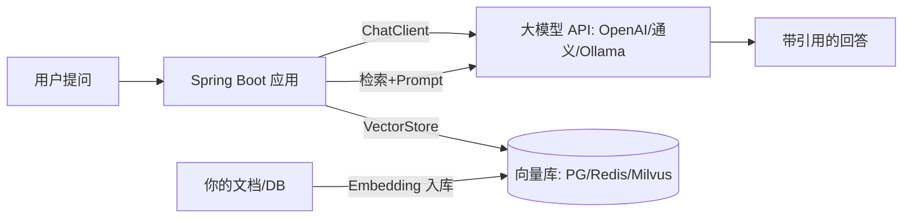

# 🤖 Spring AI 接入大模型（入门到 RAG）

> 这是 [Java 学习路线](index.md) **阶段4（进阶架构）** 的 **Spring AI 章**，也是补齐"0-1 到资深"路线里当前完全空白的 AI 能力。
> 前置建议：先完成 [Spring Boot 完整项目实战](spring-boot-project.md)（本篇的"AI 摘要"示例直接复用那套文章 CRUD）。
> 依据 **[Spring AI 官方文档](https://docs.spring.io/spring-ai/reference/index.html)**（1.0 GA，2025-05 发布，API 稳定）。
>
> 📌 **适用版本 / 更新日期**：Spring AI 1.0.x / Spring Boot 3.3 / Java 17；最后更新 **2026-08**。

!!! abstract "读完你能做什么"
    1. 用 `ChatClient` 三行代码跑通第一个对话
    2. 结构化输出：把 LLM 文本变 Java 对象（`BeanOutputConverter`）
    3. RAG：把文档灌进向量库，让模型"基于你的资料回答"
    4. 流式响应、限流降级、密钥安全（生产必备）
    —— 给你的博客加一个"AI 自动生成文章摘要"功能。

---

## 0. 全景：Spring AI 在你应用里的位置



| 能力 | 核心类 | 你什么时候用 |
|------|--------|--------------|
| 对话 | `ChatClient` | 聊天、摘要、改写 |
| 结构化 | `BeanOutputConverter` | 让模型返回可解析对象 |
| 嵌入 | `EmbeddingModel` | 把文本变向量 |
| 检索 | `VectorStore` | RAG 知识库 |
| 编排 | `Advisor` | 日志/重试/限流/脱敏 |

---

## 1. 加依赖

`pom.xml`：

```xml
<dependency>
    <groupId>org.springframework.ai</groupId>
    <artifactId>spring-ai-spring-boot-starter</artifactId>
</dependency>
<!-- 选一个模型：OpenAI / 通义千问 / Ollama -->
<dependency>
    <groupId>org.springframework.ai</groupId>
    <artifactId>spring-ai-openai-spring-boot-starter</artifactId>
</dependency>
```

!!! warning "版本管理"
    Spring AI 1.0 起版本号独立于 Spring Boot，用官方 BOM 锁版本，别手写 `<version>` 撞错。详见 [Spring AI 官方](https://docs.spring.io/spring-ai/reference/index.html)。

---

## 2. 第一个对话（ChatClient）

```java
@RestController
@RequiredArgsConstructor
public class ChatController {
    private final ChatClient chatClient;   // 注入 Builder 即可自动配好

    public ChatController(ChatClient.Builder builder) {
        this.chatClient = builder.build();
    }

    @GetMapping("/ai/chat")
    public Result<String> chat(@RequestParam String msg) {
        String answer = chatClient.prompt()
                .user(msg)
                .call()
                .content();
        return Result.ok(answer);
    }
}
```

`application.yml`（**密钥走环境变量，绝不硬编码**）：

```yaml
spring:
  ai:
    openai:
      api-key: ${OPENAI_API_KEY}        # 启动: export OPENAI_API_KEY=sk-xxx
      chat:
        options:
          model: gpt-4o-mini
```

!!! danger "密钥安全（必看）"
    - 永不把 `sk-xxx` 提交到 Git（[配置踩坑](spring-boot.md) / [认证与授权](../security/auth.md)）。
    - 生产用 KMS/配置中心下发；前端永远不能直接持有模型密钥，必须经你后端转发。

---

## 3. 结构化输出（让模型返回 Java 对象）

```java
record ArticleSummary(String title, String summary, List<String> tags) {}

@GetMapping("/ai/summary")
public Result<ArticleSummary> summary(@RequestParam Long id) {
    ArticleDTO a = articleService.detail(id);    // 复用实战篇的 Service
    var converter = new BeanOutputConverter<>(new ParameterizedTypeReference<ArticleSummary>() {});
    ArticleSummary s = chatClient.prompt()
            .user(u -> u.text("""
                为下面文章生成一句话摘要和 3 个标签，用 JSON 输出：
                {format}
                标题：{title}
                正文：{content}
                """)
                .param("format", converter.getFormat())
                .param("title", a.getTitle())
                .param("content", a.getContent()))
            .call()
            .entity(ArticleSummary.class);        // 直接拿到对象
    return Result.ok(s);
}
```

!!! tip "为什么结构化输出重要"
    - 前端要的是 `{title, summary, tags}` 而不是一段自由文本；`BeanOutputConverter` 让模型严格按格式输出，省去手写正则解析（[Spring AI 官方·输出转换](https://docs.spring.io/spring-ai/reference/api/chatclient.html)）。

---

## 4. RAG：让模型"基于你的资料回答"

> 思路：把文档切块 → `EmbeddingModel` 向量化 → 存 `VectorStore` → 用户提问时先检索相关块 → 拼进 Prompt 让模型作答。

```java
@Configuration
public class RagConfig {
    @Bean
    public CommandLineRunner loadDocs(VectorStore store, EmbeddingModel embed) {
        return args -> {
            // 真实项目从文件/DB 读；这里是示例文档
            store.add(List.of(
                new Document("Spring Boot 自动配置靠 @EnableAutoConfiguration 与条件注解", Map.of("src","doc1")),
                new Document("MyBatis 用 #{} 预编译防 SQL 注入", Map.of("src","doc2"))
            ));
        };
    }
}

@RestController
@RequiredArgsConstructor
public class RagController {
    private final ChatClient chatClient;
    private final VectorStore vectorStore;

    @GetMapping("/ai/rag")
    public Result<String> rag(@RequestParam String q) {
        List<Document> docs = vectorStore.similaritySearch(SearchRequest.builder(q).topK(3).build());
        String context = docs.stream().map(Document::getContent).collect(Collectors.joining("\n"));
        String ans = chatClient.prompt()
                .system("你只能根据下面资料回答，资料没有就回答'不知道'：\n" + context)
                .user(q)
                .call()
                .content();
        return Result.ok(ans);
    }
}
```

`application.yml` 向量库（以 Redis 为例，复用 [Redis 从零](redis-basics.md)）：

```yaml
spring:
  ai:
    vectorstore:
      redis:
        uri: redis://localhost:6379
        index: blog-rag
```

!!! tip "RAG 能复用你已学的东西"
    - 向量库可落在 **MySQL / Redis / PG**（你路线里都有），不必另起一套。
    - 切块粒度、topK、重排序是效果关键，属于"调参"不是"换框架"。

---

## 5. 流式响应（打字机效果）

```java
@GetMapping(value = "/ai/stream", produces = MediaType.TEXT_EVENT_STREAM_VALUE)
public Flux<String> stream(@RequestParam String msg) {
    return chatClient.prompt()
            .user(msg)
            .stream()
            .content();
}
```

!!! warning "流式前提"
    - 流式返回 `Flux<String>`，命令式应用需引入 `spring-boot-starter-webflux`（[官方说明](https://docs.spring.io/spring-ai/reference/api/chatclient.html)）。
    - 前端用 `EventSource` / `fetch` 流式读取，体验更好但超时处理要更稳。

---

## 6. 生产化：限流、超时、降级

```java
@Configuration
public class AiConfig {
    @Bean
    public ChatClient chatClient(ChatClient.Builder b, RestClient.Builder rc) {
        return b.defaultOptions(ChatOptions.builder().timeout(Duration.ofSeconds(20)).build())
                .build();
    }
}
```

| 问题 | 做法 |
|------|------|
| 模型超时/挂了 | `@Retryable`（spring-retry）或 Advisor 重试；失败返回兜底文案 |
| 被刷接口 | 网关/拦截器限流（结合 [高并发](high-concurrency.md)） |
| Token 费用失控 | 估算字数、限制 `maxTokens`、缓存高频问题结果到 Redis |
| 内容合规 | 输入/输出做敏感词与内容审核（结合 [安全](../security/index.md)） |

!!! danger "合规红线"
    - 用户 PII（手机号/身份证）**不要原样传第三方模型**；脱敏后再发（[认证与授权](../security/auth.md)）。
    - 模型输出不可直接当事实展示，关键场景需人工复核。

---

## 7. 自测清单

- [ ] 配好密钥环境变量，跑通 `/ai/chat`
- [ ] 结构化输出拿到 `ArticleSummary` 对象
- [ ] 向量库灌入文档，`/ai/rag` 能基于资料作答
- [ ] 流式接口前端能渲染打字机效果
- [ ] 模型超时时有降级兜底，密钥不在代码里

---

## 8. Advisor 链（日志 / 脱敏 / 重试）

> `Advisor` 是 Spring AI 的请求/响应拦截链，类似 Servlet `Filter` 或 AOP，贯穿每次 `ChatClient` 调用。来源 **[Spring AI · Advisor API](https://docs.spring.io/spring-ai/reference/api/advisors.html)**。

```java
// 自定义 Advisor：请求前脱敏手机号，响应后打日志
public class MaskingAndLogAdvisor implements Advisor {
    private static final Pattern PHONE = Pattern.compile("1[3-9]\\d{9}");

    @Override
    public AdvisedResponse adviseCall(AdvisedRequest request, CallAdvisorChain chain) {
        // 1. 入参脱敏（绝不让 PII 直传第三方模型，[合规红线](#_6-生产化限流超时降级)）
        String masked = PHONE.matcher(request.userText()).replaceAll("138****0000");
        AdvisedRequest maskedReq = request.mutate().userText(masked).build();
        // 2. 放行
        AdvisedResponse resp = chain.nextCall(maskedReq);
        // 3. 响应后日志
        log.info("ai resp: {}", resp.response().getResult().getOutput().getText());
        return resp;
    }

    @Override public String getName() { return "masking-log"; }
}
```

```java
// 串成链：日志 → 脱敏 → 重试
@Bean
public ChatClient chatClient(ChatClient.Builder b) {
    return b.defaultAdvisors(
            new LoggingAdvisor(),                 // 官方日志 Advisor
            new MaskingAndLogAdvisor(),           // 自定义脱敏
            new RetryAdvisor(3, Duration.ofSeconds(1))  // 失败重试（需 spring-retry）
    ).build();
}
```

| 内置/常用 Advisor | 作用 |
|-------------------|------|
| `LoggingAdvisor` | 打印请求/响应，调试用 |
| `QuestionAnswerAdvisor` | RAG 检索并拼上下文（§4 底层用的就是这个） |
| `RetryAdvisor` | 调用失败自动重试 |
| 自定义 | 脱敏/审计/限流/注入系统提示 |

!!! tip "Advisor 价值"
    - 把"脱敏、日志、重试、限流、审计"从业务代码里抽离，可复用可组合。
    - 顺序敏感：脱敏必须在"发往模型"之前，日志可在前后。

---

## 9. 多模型路由（主模型 + 兜底）

> 生产不把鸡蛋放一个篮子：主模型（如 OpenAI）超时/限流时，切到通义或本地 Ollama 兜底。来源 **[Spring AI · ChatClient](https://docs.spring.io/spring-ai/reference/api/chatclient.html)**。

```java
@Configuration
public class MultiModelConfig {
    @Bean ChatClient openAi(ChatClient.Builder b) {
        return b.build();                       // 默认 OpenAI（application.yml 配好）
    }
    @Bean ChatClient qwen(ChatClient.Builder b) {
        return b.build();                       // 另配通义 Starter 时区分
    }
    @Bean ChatClient ollama(ChatClient.Builder b) {
        return b.build();                       // 本地 Ollama，离线兜底
    }
}

@Service
@RequiredArgsConstructor
public class ResilientChatService {
    private final ChatClient openAi, qwen, ollama;

    public String ask(String msg) {
        // 主 → 通义 → 本地，逐级降级
        return tryModel(openAi, msg)
            .or(() -> tryModel(qwen, msg))
            .or(() -> tryModel(ollama, msg))
            .orElse("服务暂时不可用，请稍后再试");   // 兜底文案
    }

    private Optional<String> tryModel(ChatClient c, String msg) {
        try { return Optional.ofNullable(c.prompt().user(msg).call().content()); }
        catch (Exception e) { return Optional.empty(); }   // 失败即切下一个
    }
}
```

!!! warning "成本与延迟权衡"
    - 本地 Ollama 免费但能力弱/慢，只作兜底；主模型按质量选。
    - 路由逻辑可下沉到网关或用 Advisor 统一封装，避免散落业务。

---

## 10. 工程化测试：Testcontainers 集成测试

> 单测用 `@MockBean` 隔离（[实战篇 §10](spring-boot-project.md)），但 RAG/VectorStore 必须连**真向量库**才测得准。来源 **[Spring AI · Testing](https://docs.spring.io/spring-ai/reference/testing.html) · [Testcontainers](https://java.testcontainers.org/)**。

`pom.xml` 加：

```xml
<dependency>
    <groupId>org.testcontainers</groupId>
    <artifactId>junit-jupiter</artifactId>
    <scope>test</scope>
</dependency>
<dependency>
    <groupId>org.testcontainers</groupId>
    <artifactId>postgres</artifactId>      <!-- 或 redis，看你用的 VectorStore -->
    <scope>test</scope>
</dependency>
```

```java
@SpringBootTest
@Testcontainers
class RagServiceIT {
    @Container
    static PostgreSQLContainer<?> pg = new PostgreSQLContainer<>("pgvector/pgvector:pg16")
            .withDatabaseName("rag").withUsername("u").withPassword("p");

    @DynamicPropertySource
    static void props(DynamicPropertyRegistry r) {
        r.add("spring.datasource.url", pg::getJdbcUrl);
        r.add("spring.datasource.username", pg::getUsername);
        r.add("spring.datasource.password", pg::getPassword);
    }

    @Autowired VectorStore vectorStore;
    @Autowired ChatClient chatClient;

    @Test
    void rag_shouldAnswerFromDocs() {
        vectorStore.add(List.of(new Document("Spring AI 用 Advisor 做拦截链")));
        String ans = chatClient.prompt()
                .advisors(new QuestionAnswerAdvisor(vectorStore))
                .user("Spring AI 用什么做拦截链？")
                .call().content();
        assertTrue(ans.contains("Advisor"));
    }
}
```

!!! tip "为什么用 Testcontainers"
    - 测试时拉起**真实**数据库/向量库容器，跑完自动销毁，CI 可复现，告别"我本地能过"。
    - 与 `@MockBean` 分层：单测 mock、集成测试用真实容器。

---

## 11. 自测清单

- [ ] 配好密钥环境变量，跑通 `/ai/chat`
- [ ] 结构化输出拿到 `ArticleSummary` 对象
- [ ] 向量库灌入文档，`/ai/rag` 能基于资料作答
- [ ] 流式接口前端能渲染打字机效果
- [ ] 模型超时时有降级兜底，密钥不在代码里
- [ ] Advisor 链实现脱敏/日志/重试
- [ ] 多模型路由主→兜底可切换
- [ ] Testcontainers 集成测试连真向量库通过

---

## 12. 下一步

- 把 RAG 接到 [博客实战](spring-boot-project.md) 做"站内知识问答"
- 多模型路由下沉到 Advisor / 网关统一封装
- 用 `Evaluation` API 做回答质量评测
- 接 `spring-ai-mcp` 让模型调用你的业务工具（MCP）
