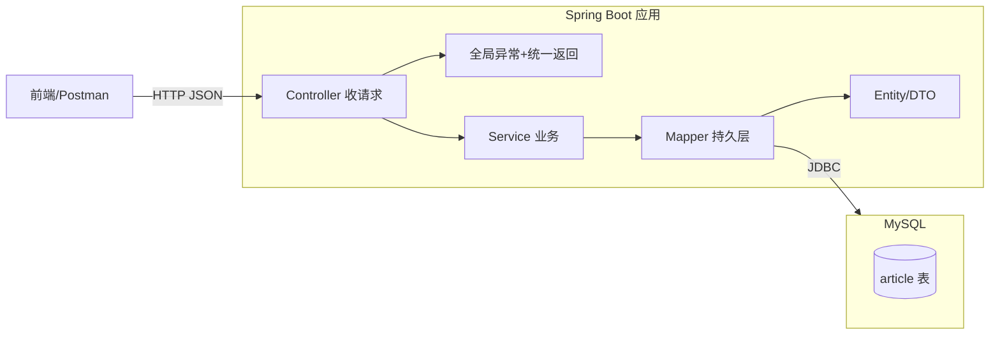

# 🚀 Spring Boot 完整项目实战（从 0 跑通一个博客 API）

> 这是 [Java 学习路线](index.md) **阶段3（核心实战）** 的**压轴串讲篇**。
> 前面的 [Spring Boot 从零开始](spring-boot-basics.md)、[JDBC/MyBatis](jdbc-mybatis.md)、[Spring 全家桶](spring-family.md)、[前端调接口](frontend-call-api.md) 各讲一个点，本篇把它们**串成一个能跑、能测、能部署的完整项目**。
> 目标：你照着做，最终拥有一个"文章（Article）增删改查 + 统一返回 + 全局异常 + 参数校验 + 跨域 + 单元测试"的博客后端，并能让前端调到。
>
> 依据 **[Spring Boot Reference](https://docs.spring.io/spring-boot/docs/current/reference/html/) · [MyBatis 官方文档](https://mybatis.org/mybatis-3/zh/index.html)**（官方为准）。

> 📌 **适用版本 / 更新日期**：Spring Boot 3.3 / Java 17 / MyBatis 3.5 / MySQL 8；最后更新 **2026-08**。

!!! abstract "读完你能交付什么"
    一个标准分层（`controller / service / mapper / entity / dto / config`）的 Maven 项目：
    - `GET /api/articles` 分页列表、`GET /api/articles/{id}` 详情
    - `POST /api/articles` 新增（带 `@Valid` 参数校验）、`PUT /api/articles/{id}` 改、`DELETE /api/articles/{id}` 删（软删除）
    - 统一返回 `Result<T>`、全局异常处理、`@Valid` 校验、`CORS` 放开、JUnit 5 单测、`docker` 可构建
    —— 即一个"面试能讲、生产能用"的最小完整后端。

---

## 0. 项目全景（一次看全）



| 层 | 职责 | 本篇文件 |
|----|------|----------|
| `entity` | 与表一一对应的持久化对象 | `Article` |
| `dto` | API 出入参（与表解耦，防字段泄露） | `ArticleDTO` / `CreateArticleCMD` |
| `mapper` | MyBatis 数据访问接口 | `ArticleMapper` |
| `service` | 业务逻辑（事务边界） | `ArticleService` |
| `controller` | 接收 HTTP、返回 `Result<T>` | `ArticleController` |
| `config` | 全局异常、CORS、统一返回装配 | `GlobalExceptionHandler` / `CorsConfig` |
| `test` | 单元测试 / 集成测试 | `ArticleServiceTest` |

!!! tip "为什么用 DTO 而不是把 Entity 直接返回"
    见 [Spring Boot 十大坑](spring-boot.md)：不要用实体类直接当 API 出入参（耦合 DB + 字段泄露）。Entity 可能含 `password`、`isDeleted` 等不该暴露的字段。

---

## 1. 用脚手架建项目

打开 <https://start.spring.io/>：

- **Project** Maven · **Language** Java · **Spring Boot** 3.3.x · **Java** 17
- **Group** `com.yuying` · **Artifact** `blog`
- **Dependencies**：`Spring Web`、`MyBatis Framework`、`MySQL Driver`、`Validation`、`Lombok`、`Spring Boot Actuator`、`Test`

下载解压，IDEA 打开，确认 `DemoApplication`（建议改名为 `BlogApplication`）能启动。

!!! warning "包结构铁律"
    所有类放在启动类**同包或子包**下（`com.yuying.blog.xxx`），否则 Spring 扫描不到 Bean（[新手坑](spring-boot-basics.md)）。

---

## 2. 数据库与表（对应 [MySQL 从零开始](mysql-basics.md)）

```sql
CREATE DATABASE blog CHARACTER SET utf8mb4 COLLATE utf8mb4_unicode_ci;
USE blog;

CREATE TABLE article (
    id          BIGINT PRIMARY KEY AUTO_INCREMENT,
    title       VARCHAR(200) NOT NULL,
    content     TEXT NOT NULL,
    author      VARCHAR(50)  NOT NULL,
    view_count  INT          NOT NULL DEFAULT 0,
    is_deleted  TINYINT      NOT NULL DEFAULT 0,        -- 软删除（[最佳实践](mysql-basics.md)）
    created_at  DATETIME     NOT NULL DEFAULT CURRENT_TIMESTAMP,
    updated_at  DATETIME     NOT NULL DEFAULT CURRENT_TIMESTAMP ON UPDATE CURRENT_TIMESTAMP
) ENGINE=InnoDB DEFAULT CHARSET=utf8mb4;
```

!!! tip "命名与字段规范（来自 [MySQL 从零](mysql-basics.md)）"
    - 全小写 + 下划线；主键 `id`，软删除 `is_deleted`，时间 `created_at`/`updated_at`。
    - 金额/计数用合适类型，别用 `FLOAT` 存钱。

---

## 3. 数据源与 MyBatis 配置（对应 [JDBC/MyBatis](jdbc-mybatis.md)）

`src/main/resources/application.yml`：

```yaml
server:
  port: 8080

spring:
  application:
    name: blog
  datasource:
    url: jdbc:mysql://localhost:3306/blog?useUnicode=true&characterEncoding=utf8mb4&serverTimezone=Asia/Shanghai
    username: ${DB_USER:root}
    password: ${DB_PWD:123456}        # 生产用环境变量，别提交明文（[配置踩坑](spring-boot.md)）
    hikari:
      maximum-pool-size: 10

mybatis:
  mapper-locations: classpath:mapper/*.xml
  configuration:
    map-underscore-to-camel-case: true   # user_name → userName（[MyBatis 最佳实践](jdbc-mybatis.md)）

management:
  endpoints:
    web:
      exposure:
        include: health,info            # 只暴露健康/信息，别全开（[Actuator](spring-boot.md)）
```

!!! danger "时区坑"
    MySQL 8 必须加 `serverTimezone=Asia/Shanghai`，否则启动报时区错误（[JDBC/MyBatis](jdbc-mybatis.md)）。

---

## 4. Entity 与 DTO（分层解耦）

```java
// entity/Article.java —— 与表一一对应
@Data                                 // Lombok，省 getter/setter（[工具链](java-toolchain.md)）
public class Article {
    private Long id;
    private String title;
    private String content;
    private String author;
    private Integer viewCount;
    private Integer isDeleted;
    private LocalDateTime createdAt;
    private LocalDateTime updatedAt;
}

// dto/ArticleDTO.java —— 返回给前端的视图（不含 isDeleted 等内部字段）
@Data
public class ArticleDTO {
    private Long id;
    private String title;
    private String content;
    private String author;
    private Integer viewCount;
    private LocalDateTime createdAt;
}

// dto/CreateArticleCMD.java —— 新增请求入参，带校验
@Data
public class CreateArticleCMD {
    @NotBlank(message = "标题不能为空")
    private String title;
    @NotBlank(message = "内容不能为空")
    private String content;
    @NotBlank(message = "作者不能为空")
    private String author;
}
```

!!! tip "为什么 CreateArticleCMD 单独写"
    新增的参数约束（校验）和查询返回字段不同；入参用 `CMD`（命令）、出参用 `DTO`，是清晰的分层习惯。

---

## 5. Mapper（MyBatis 持久层，对应 [JDBC/MyBatis](jdbc-mybatis.md)）

```java
@Mapper
public interface ArticleMapper {
    @Insert("INSERT INTO article(title, content, author) VALUES(#{title}, #{content}, #{author})")
    @Options(useGeneratedKeys = true, keyProperty = "id")
    int insert(Article a);

    @Update("UPDATE article SET title=#{title}, content=#{content}, author=#{author} WHERE id=#{id} AND is_deleted=0")
    int update(Article a);

    @Update("UPDATE article SET is_deleted=1 WHERE id=#{id} AND is_deleted=0")
    int deleteLogic(@Param("id") Long id);

    @Select("SELECT * FROM article WHERE id=#{id} AND is_deleted=0")
    Article selectById(@Param("id") Long id);

    @Select("SELECT * FROM article WHERE is_deleted=0 ORDER BY id DESC LIMIT #{limit} OFFSET #{offset}")
    List<Article> selectPage(@Param("offset") int offset, @Param("limit") int limit);

    @Select("SELECT COUNT(*) FROM article WHERE is_deleted=0")
    int count();
}
```

!!! danger "SQL 注入与软删除"
    - 一律用 `#{}` 预编译参数（[JDBC/MyBatis](jdbc-mybatis.md)），绝不用 `${}` 拼字符串。
    - 所有查询/更新带 `is_deleted=0`，实现软删除（[MySQL 最佳实践](mysql-basics.md)）。

---

## 6. Service（业务 + 事务，对应 [Spring 全家桶·事务](spring-family.md)）

```java
@Service
@RequiredArgsConstructor              // Lombok 构造器注入（优于字段注入，[全家桶 IoC](spring-family.md)）
public class ArticleService {
    private final ArticleMapper mapper;

    public ArticleDTO create(CreateArticleCMD cmd) {
        Article a = new Article();
        a.setTitle(cmd.getTitle());
        a.setContent(cmd.getContent());
        a.setAuthor(cmd.getAuthor());
        mapper.insert(a);
        return toDTO(a);
    }

    public ArticleDTO update(Long id, CreateArticleCMD cmd) {
        Article existing = mapper.selectById(id);
        if (existing == null) throw new BizException("文章不存在");
        existing.setTitle(cmd.getTitle());
        existing.setContent(cmd.getContent());
        existing.setAuthor(cmd.getAuthor());
        mapper.update(existing);
        return toDTO(existing);
    }

    public void delete(Long id) {
        if (mapper.selectById(id) == null) throw new BizException("文章不存在");
        mapper.deleteLogic(id);
    }

    public ArticleDTO detail(Long id) {
        Article a = mapper.selectById(id);
        if (a == null) throw new BizException("文章不存在");
        return toDTO(a);
    }

    public PageResult<ArticleDTO> list(int page, int size) {
        int offset = (page - 1) * size;
        List<Article> rows = mapper.selectPage(offset, size);
        int total = mapper.count();
        return new PageResult<>(rows.stream().map(this::toDTO).toList(), total, page, size);
    }

    private ArticleDTO toDTO(Article a) {
        ArticleDTO d = new ArticleDTO();
        d.setId(a.getId()); d.setTitle(a.getTitle());
        d.setContent(a.getContent()); d.setAuthor(a.getAuthor());
        d.setViewCount(a.getViewCount()); d.setCreatedAt(a.getCreatedAt());
        return d;
    }
}
```

!!! warning "事务边界"
    - 单条写操作 MyBatis 默认自动提交即可；涉及**多表/多步**时加 `@Transactional(rollbackFor = Exception.class)`（[事务致命坑](spring-family.md)）。
    - 自调用 `this.xxx()` 上的 `@Transactional` 不生效，需拆 Service 或注入代理。

---

## 7. Controller（接口 + 统一返回，对应 [前端调接口](frontend-call-api.md)）

```java
@RestController
@RequestMapping("/api/articles")
@RequiredArgsConstructor
public class ArticleController {
    private final ArticleService service;

    @GetMapping
    public Result<PageResult<ArticleDTO>> list(
            @RequestParam(defaultValue = "1") int page,
            @RequestParam(defaultValue = "10") int size) {
        return Result.ok(service.list(page, size));
    }

    @GetMapping("/{id}")
    public Result<ArticleDTO> detail(@PathVariable Long id) {
        return Result.ok(service.detail(id));
    }

    @PostMapping
    public Result<ArticleDTO> create(@Valid @RequestBody CreateArticleCMD cmd) {  // @Valid 触发校验
        return Result.ok(service.create(cmd));
    }

    @PutMapping("/{id}")
    public Result<ArticleDTO> update(@PathVariable Long id, @Valid @RequestBody CreateArticleCMD cmd) {
        return Result.ok(service.update(id, cmd));
    }

    @DeleteMapping("/{id}")
    public Result<Void> delete(@PathVariable Long id) {
        service.delete(id);
        return Result.ok(null);
    }
}
```

统一返回与分页包装：

```java
// dto/Result.java
public record Result<T>(int code, String message, T data) {
    public static <T> Result<T> ok(T data) { return new Result<>(0, "ok", data); }
    public static <T> Result<T> fail(int code, String msg) { return new Result<>(code, msg, null); }
}

// dto/PageResult.java
@Data
public class PageResult<T> {
    private List<T> list; private long total; private int page; private int size;
    public PageResult(List<T> list, long total, int page, int size) { ... }
}
```

---

## 8. 全局异常处理 + 参数校验（补上"工程规范缺口"）

```java
// config/GlobalExceptionHandler.java
@RestControllerAdvice                // 全局捕获 Controller 层异常，统一转 Result
public class GlobalExceptionHandler {

    // @Valid 校验失败 → 400
    @ExceptionHandler(MethodArgumentNotValidException.class)
    public Result<Void> handleValid(MethodArgumentNotValidException e) {
        String msg = e.getBindingResult().getFieldErrors().stream()
                .map(f -> f.getField() + ":" + f.getDefaultMessage())
                .collect(Collectors.joining("; "));
        return Result.fail(400, msg);
    }

    // 业务异常 → 用对应 code
    @ExceptionHandler(BizException.class)
    public Result<Void> handleBiz(BizException e) {
        return Result.fail(400, e.getMessage());
    }

    // 兜底 → 500（真实项目记日志 + 给前端通用提示，不暴露堆栈）
    @ExceptionHandler(Exception.class)
    public Result<Void> handleOther(Exception e) {
        return Result.fail(500, "服务器内部错误");
    }
}

// 自定义业务异常
public class BizException extends RuntimeException {
    public BizException(String msg) { super(msg); }
}
```

!!! tip "为什么必须全局异常"
    - 否则校验失败抛 `400` + 一大段堆栈、业务异常变 `500`，前端无法稳定解析。
    - 统一 `Result` 后，前端永远拿到 `{code,message,data}` 结构（[前端调接口·统一返回](frontend-call-api.md)）。

---

## 9. CORS 跨域（对应 [前端调接口·CORS](frontend-call-api.md)）

```java
@Configuration
public class CorsConfig {
    @Bean
    public WebMvcConfigurer cors() {
        return new WebMvcConfigurer() {
            @Override
            public void addCorsMappings(CorsRegistry reg) {
                reg.addMapping("/api/**")
                   .allowedOriginPatterns("http://localhost:3000")  // 写具体前端域名，别用 *（[CORS 安全](frontend-call-api.md)）
                   .allowedMethods("GET","POST","PUT","DELETE")
                   .allowCredentials(true);
            }
        };
    }
}
```

---

## 10. 单元测试（对应路线第 12 章：测试与质量）

```java
@SpringBootTest
class ArticleServiceTest {
    @Autowired ArticleService service;
    @MockBean ArticleMapper mapper;     // 把 Mapper 换成 mock，不连真库

    @Test
    void create_shouldReturnDTO() {
        when(mapper.insert(any(Article.class))).thenReturn(1);
        CreateArticleCMD cmd = new CreateArticleCMD();
        cmd.setTitle("t"); cmd.setContent("c"); cmd.setAuthor("a");
        ArticleDTO dto = service.create(cmd);
        assertNotNull(dto);
        assertEquals("t", dto.getTitle());
    }

    @Test
    void detail_notFound_shouldThrow() {
        when(mapper.selectById(999L)).thenReturn(null);
        assertThrows(BizException.class, () -> service.detail(999L));
    }
}
```

!!! tip "测试分层"
    - **单元测试** `@MockBean` 隔离数据库，跑得快、可重复。
    - **集成测试** `@SpringBootTest` + `@Transactional` 真连库（测试后回滚）。
    - Controller 可用 `MockMvc` 测 HTTP 层（见 [测试与质量](java-toolchain.md) 规划）。

---

## 11. 跑起来 + 前端联调（对应 [前端调接口](frontend-call-api.md)）

```bash
# 启动
mvn spring-boot:run
# 自测（Postman 或 curl）
curl -X POST localhost:8080/api/articles -H 'Content-Type: application/json' \
  -d '{"title":"Hello","content":"World","author":"yuying"}'
# 返回：{"code":0,"message":"ok","data":{"id":1,...}}
```

前端（localhost:3000）用 `axios.post('http://localhost:8080/api/articles', {...})` 调，遇到 CORS 看第 9 节。

---

## 12. 打包与部署（对应 [容器化](containerization.md)）

`Dockerfile`：

```dockerfile
FROM eclipse-temurin:17-jdk
WORKDIR /app
COPY target/blog-0.0.1-SNAPSHOT.jar app.jar
ENTRYPOINT ["java","-jar","app.jar"]
```

```bash
mvn package -DskipTests
docker build -t yuying/blog .
docker run -e DB_PWD=*** -p 8080:8080 yuying/blog
```

!!! tip "部署要点"
    - 密码走 `-e DB_PWD=***` 环境变量，镜像里不含明文（[配置踩坑](spring-boot.md)）。
    - K8s 用 `/actuator/health` 做探针（[Actuator](spring-boot.md)）。

---

## 13. 自测清单（你真的做完一个完整项目了吗）

- [ ] 项目能从脚手架建起并启动
- [ ] MySQL 建库建表，连接池配好时区
- [ ] 实现文章 CRUD（含软删除、分页）
- [ ] 接口统一返回 `Result<T>`，参数校验生效
- [ ] 业务异常被全局处理器捕获，返回 400 而非 500
- [ ] 前端跨域调通
- [ ] 至少 2 个 Service 单测通过
- [ ] `mvn package` 出 jar，`docker build` 成功

> 全部打勾 = 你已具备**独立交付一个 Spring Boot 后端**的能力。下一步补 [测试与质量](java-toolchain.md)、[Spring AI 接入大模型](spring-ai.md)、[容器化](containerization.md) 深入。

---

## 14. 下一步

- 测试体系深入（覆盖率/集成测试/MockMvc）→ [测试与质量](java-toolchain.md)
- 给文章加缓存扛量 → [Redis 从零开始](redis-basics.md)
- 加登录鉴权 → [Spring Security](spring-family.md) · [认证与授权](../security/auth.md)
- 接大模型做"AI 写文章摘要" → [Spring AI 接入大模型](spring-ai.md)
- 上云部署 → [容器化](containerization.md)
