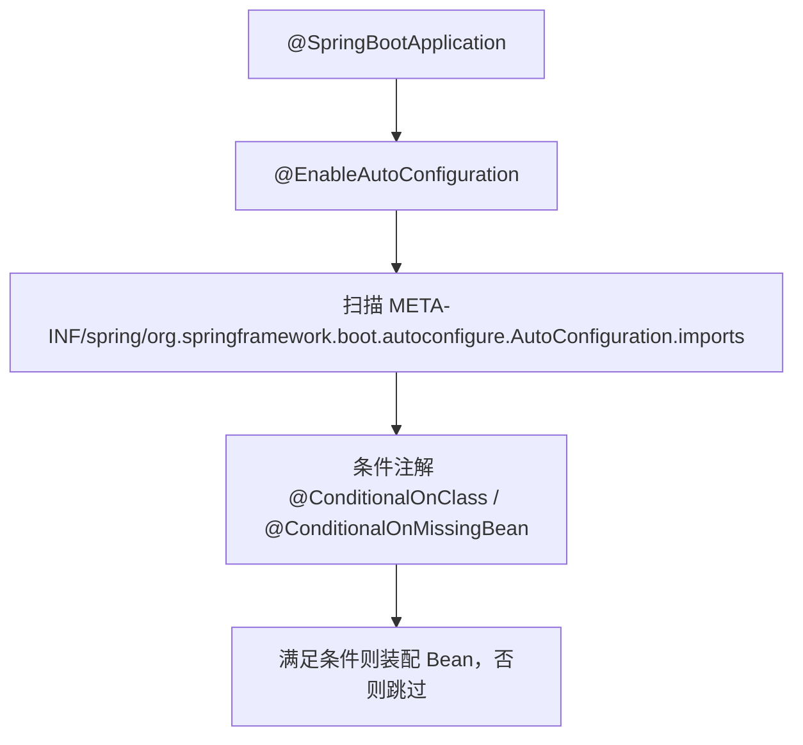

# 🍃 Spring Boot（自动配置 / 启动原理 / 常用 Starter / 踩坑）

> 现代 Java 服务端事实标准。本篇讲清：约定优于配置、自动配置原理、`@SpringBootApplication` 启动流程、常用 Starter、配置文件、Actuator、以及高频踩坑。
> 依据 **[Spring Boot Reference (current)](https://docs.spring.io/spring-boot/docs/current/reference/html/)**（官方为准）。

> 📌 **适用版本 / 更新日期**：Spring Boot 3.2 / 3.3（基于 Spring 6、Java 17+）；最后更新 **2026-08**。注意 Boot 2.x 与 3.x 差异（Jakarta 命名空间）。

---

## 1. 约定优于配置

Spring Boot 解决"Spring 配置地狱"：内嵌 Tomcat、自动装配、起步依赖（Starter），开箱即用。

```xml
<!-- 起步依赖：一个 dependency 拉齐常用传递依赖 -->
<dependency>
  <groupId>org.springframework.boot</groupId>
  <artifactId>spring-boot-starter-web</artifactId>
</dependency>
```

---

## 2. 自动配置原理（核心）



- **关键**：`spring.factories`（2.x）/ `AutoConfiguration.imports`（3.x）列出候选自动配置类。
- `@ConditionalOnClass`：类路径有某类才装配；`@ConditionalOnMissingBean`：你没自定义 Bean 才用默认的。

!!! tip "想看装配了什么"
    - 启动加 `--debug` 或配置 `debug=true`，控制台打印 **Positive/Negative matches**（哪些自动配置生效/未生效及原因）。

---

## 3. 启动流程要点

1. `SpringApplication.run()` → 创建 `ApplicationContext`。
2. 推断应用类型（Servlet/Reactive/None）。
3. 加载 `ApplicationContextInitializer` / `ApplicationListener`。
4. 准备环境（读 `application.yml`）→ 刷新上下文 → 调用 `BeanFactoryPostProcessor` / `BeanPostProcessor`。
5. 执行 `CommandLineRunner` / `ApplicationRunner`。

!!! danger "Bean 生命周期坑"
    - 在 `@PostConstruct` 或构造器里调 `@Autowired` 的**其他 Bean 方法**可能拿不到（依赖未注入完）。重 Bean 间初始化顺序用 `@DependsOn` 或 `SmartInitializingSingleton`。
    - 循环依赖：Spring 用三级缓存解决单例 setter/字段注入；**构造器注入循环会启动失败**（优先用构造器注入，发现环就及早暴露）。

---

## 4. 常用 Starter 速查

| Starter | 作用 |
|---------|------|
| `spring-boot-starter-web` | Web MVC + Tomcat |
| `spring-boot-starter-data-jpa` | JPA / Hibernate |
| `spring-boot-starter-data-redis` | Redis（Lettuce） |
| `spring-boot-starter-security` | 安全 |
| `spring-boot-starter-validation` | JSR-303 校验 |
| `spring-boot-starter-actuator` | 监控端点 |
| `spring-boot-starter-test` | 测试 |

---

## 5. 配置与多环境

```yaml
spring:
  profiles:
    active: ${ENV:dev}      # 用环境变量切换，避免提交敏感配置
---
spring:
  config:
    activate:
      on-profile: prod
  datasource:
    url: ${DB_URL}          # 敏感信息走环境变量/配置中心
```

!!! warning "配置踩坑"
    - 不要把密码写进 `application.yml` 提交仓库；用环境变量、`*ConfigServer` 或 KMS。
    - `@Value("${x}")` 找不到会启动失败；给默认值 `@Value("${x:default}")`。

---

## 6. Actuator 监控

```yaml
management:
  endpoints:
    web:
      exposure:
        include: health,info,metrics,prometheus
  endpoint:
    health:
      show-details: when-authorized
```

!!! tip "生产必备"
    - 暴露 `/actuator/health` 给 K8s 探针；`/metrics` 接 Prometheus；但**别暴露全部端点**（如 `env`、`heapdump` 有泄露风险）。

---

## 7. 高频踩坑清单

!!! danger "Spring Boot 十大坑（精选）"
    - `@Transactional` 加在**私有/静态/非 Spring 代理对象调用的内部方法**上不生效（自调用失效）。
    - 事务方法抛**受检异常默认不回滚**，需 `rollbackFor=Exception.class`。
    - 异步 `@Async` 同类内调用不生效（需代理调用）；且要 `@EnableAsync` + 自定义线程池。
    - JPA/`MyBatis` 的 `findAll()` 一次性加载大表 → OOM；分页或流式。
    - 内嵌 Tomcat 默认最大线程 200，压测陡增需调 `server.tomcat.threads.max`。
    - `Jackson` 序列化循环引用（双向关联）→ `@JsonIgnore` 或 DTO 隔离实体。
    - 不要用实体类直接当 API 出入参（耦合 DB + 字段泄露）→ 用 DTO/VO。
    - 注入 `ApplicationContext` 存静态字段做"工具类取 Bean"易在启动早期 NPE。
    - `Lombok @Data` 在 `@Entity` 上会生成 `equals/hashCode` 含关联集合 → 用 `@EqualsAndHashCode(onlyExplicitlyIncluded=true)`。
    - 时区：`Date`/`Timestamp` 默认 UTC，应用/DB/序列化时区不一致 → 统一 `spring.jackson.time-zone` 与 DB `time_zone`。

> 下一章：[Spring 全家桶（IoC/AOP/MVC/Security/Data/事务）](spring-family.md)
