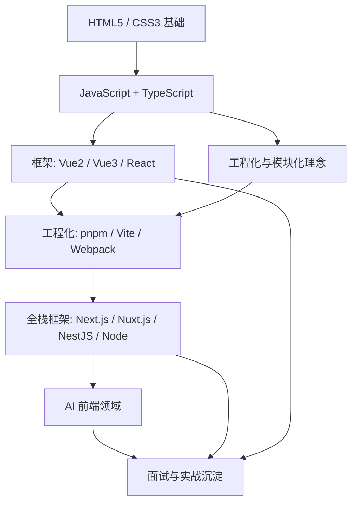
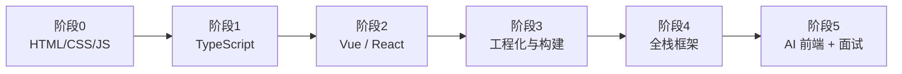

# 🗺️ 知识库大纲与学习路线

> 面向现代大学毕业生的大前端全栈学习大纲。内容依据 **ECMA-262（JavaScript 语言标准）**、**MDN Web Docs** 与 **W3C** 规范编写，强调"对比学习 + 可运行示例"。

---

## 一、能力模型（视觉总览）

---

## 二、学习路线（阶段路线图）

| 阶段 | 主题 | 核心交付物 |
|------|------|-----------|
| 0 | HTML5 / CSS3 | 语义化页面、响应式布局 |
| 1 | JavaScript + TypeScript | 语言基础、类型系统 |
| 2 | Vue2 / Vue3 / React | 框架对比、组件化思维 |
| 3 | 包管理 / 构建 / 模块化 | Vite/Webpack、ESM、规范 |
| 4 | Next / Nuxt / Nest / Node | 全栈项目实战 |
| 5 | AI 前端 / 面试 | LLM 接入、真题演练 |

---

## 三、菜单规划（板块结构）

每个板块统一采用 **基础 → 进阶 → 实战 → 踩坑 → 学习经验 → 总结** 的结构；框架类语法采用 **Tab 对比** 展示，Demo 同样以 Tab 切换。

### 📌 0. 开篇
- 知识库大纲与路线（本文）
- 技术栈决策（见 `tech-stack/`）
- 环境搭建记录（见 `setup/`）

### 📌 1. 基础语法（框架对比）
- 响应式与数据绑定
- 组件与 Props
- 条件 / 列表渲染
- 事件处理
- 生命周期
- 状态管理

### 📌 2. 进阶
- 组合式 API vs Options API
- React Hooks
- 渲染机制 / 虚拟 DOM / Diff
- 性能优化
- TypeScript 深入
- SSR / SSG

### 📌 3. 工程化
- 包管理器对比：pnpm / npm / yarn
- 构建工具对比：Vite / Webpack / esbuild / Rspack
- 模块化：ESM / CJS / 模块联邦
- 代码规范：ESLint / Prettier / Stylelint / Commitlint
- Monorepo：pnpm workspace / Turborepo / Nx
- CI/CD

### 📌 4. 全栈框架实战
- Node 基础
- NestJS 实战
- Next.js（App Router / Pages Router）
- Nuxt.js（Vue3）

### 📌 5. HTML5 / CSS3
- 语义化标签
- Flex / Grid 布局
- 动画与过渡
- 响应式与媒体查询
- 新特性（自定义元素、Web Components 等）

### 📌 6. AI 前端领域（最新）
- AI 辅助编码工作流
- 前端接入大模型（LLM）
- Vercel AI SDK 实战
- 低代码 + AI
- 实战：AI 聊天界面

### 📌 7. 面试专题
- JavaScript / TS 真题
- Vue 真题
- React 真题
- 工程化 / 网络真题
- 算法与手写题

### 📌 8. 踩坑与经验沉淀
- 各板块注意事项汇总
- 学习路径复盘

---

## 四、内容规范

- **权威来源**：语法与 API 以 ECMA-262、MDN、W3C 为准。
- **对比写法**：同类概念以 Vue2 / Vue3 / React / Next / Nuxt 同屏 Tab 对比。
- **可运行**：核心示例提供浏览器可直接运行的 Demo（iframe 嵌入）。
- **结构统一**：基础 / 进阶 / 实战 / 踩坑 / 学习经验 / 总结。

> 下一步：进入 [基础 · 框架对比](basics/syntax-framework-compare.md) 板块。
